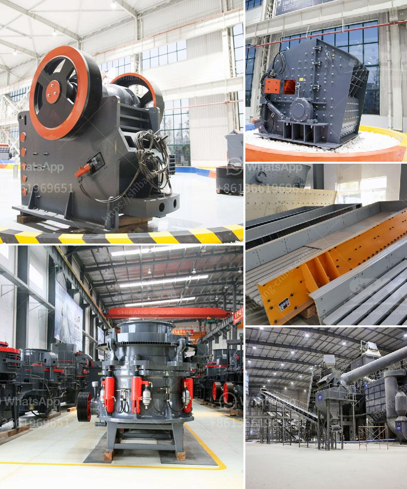

<h3>مواصفات معدات مصنع طحن الحجر</h3>
يعتبر مصنع طحن الحجر من الصناعات الهامة التي تتعامل في تحويل الحجر الخام إلى مسحوق ناعم يستخدم في مجالات متعددة مثل الصناعات الكيماوية، وصناعة الطلاء، والصناعات الزراعية. ولتحقيق هذا الهدف، يتطلب المصنع استخدام معدات متطورة تضمن الحصول على منتجات ذات جودة عالية وتحقيق أقصى استفادة من الحجر الخام.

أحد المعدات الأساسية في مصنع طحن الحجر هو كسارة الحجر، وتعتبر هذه المعدة بمثابة الجهاز الأولي في عملية التحضير وتقوم بسحق الحجر الخام إلى حجم صغير يمكن طحنه بسهولة في المعدات اللاحقة. تختلف مواصفات كسارة الحجر باختلاف الحجم والصلابة المطلوبة للمنتج النهائي.

ثانياً، يتطلب مصنع طحن الحجر استخدام مطحنة الحجر. تعتبر المطحنة الأولية الرئيسية في هذا المصنع وتعمل على طحن الحجر الخام إلى مسحوق ناعم. يجب أن تتوفر في هذه المطحنة مواصفات معينة مثل القوة والكفاءة العالية وقدرتها على تحمل الأحمال الثقيلة وضمان عملية الطحن بشكل مستمر ومستدام.

ثالثاً، يتطلب المصنع استخدام غربال الحجر، وهو عبارة عن جهاز يقوم بفصل المنتج النهائي الناعم عن الشوائب والحصى الصغيرة غير المرغوب فيها. يجب أن يكون الغربال مصنوعًا من مواد تتحمل الاحتكاك ومتينة لتحمل الشروط الصعبة في عملية الفصل.

رابعًا، يجب وجود معدات لنقل المنتج النهائي إلى مكان التخزين أو المعالجة اللاحقة. قد تشمل هذه المعدات أنظمة السيور الناقلة أو الرافعات أو النقل الميكانيكي الآخر الذي يتوافق مع حجم ونوعية المنتج النهائي.

تختلف مواصفات معدات مصنع طحن الحجر حسب حجم وقدرة المصنع وعمليات الإنتاج المطلوبة. يجب أن تكون هذه المعدات مصنوعة من مواد عالية الجودة ومتينة لتحمل الإجهادات المستمرة وضمان الاستدامة في الإنتاج.

باختصار، فإن مصنع طحن الحجر يتطلب معدات متطورة وذات جودة عالية لضمان الحصول على منتج نهائي ذو جودة عالية وتحقيق أقصى استفادة من الحجر الخام. يجب أن تتوافق مواصفات هذه المعدات مع متطلبات الإنتاج وتكنولوجيا المصنع لتحقيق أفضل النتائج في عملية الطحن.
<h3>Contact us</h3><ul><li><strong>Whatsapp:&nbsp;<a href="https://wa.me/8613661969651">+8613661969651</a></strong></li><li><a href="https://swt.shibang-china.com/?git&amp;zhl&amp;مواصفات معدات مصنع طحن الحجر"><strong>Online Service(chat now)</strong></a></li></ul><h3>Related</h3><ul><li><a href='كسارة الأسطوانة PG 610 x 400.md'>كسارة الأسطوانة PG 610 x 400</a></li><li><a href='كسارة الفك bb 50 من ريتش.md'>كسارة الفك bb 50 من ريتش</a></li><li><a href='كسارات الحجر في كاليفورنيا.md'>كسارات الحجر في كاليفورنيا</a></li><li><a href='طاحونة الكرة 800 طن يومياً.md'>طاحونة الكرة 800 طن يومياً</a></li><li><a href='مصنع تكسير الحجر في نيجيريا.md'>مصنع تكسير الحجر في نيجيريا</a></li></ul>