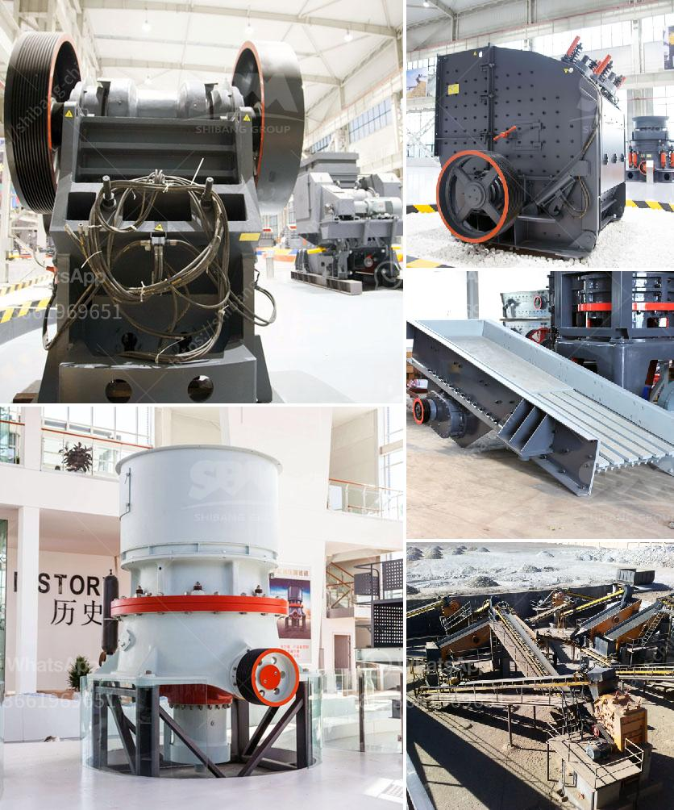

<h3>مورد آلة صنع الرمل</h3>
يُعد الرمل من أهم الموارد الطبيعية في العالم، حيث يُستخدم في العديد من الصناعات مثل البناء والمعادن والزجاج والإلكترونيات والكيماويات. ولتلبية الطلب المتزايد على الرمل، تطورت التكنولوجيا في مجال آلات صنع الرمل.

تستخدم آلة صنع الرمل لتحويل الصخور الكبيرة إلى حبيبات رملية صغيرة. تُستخدم في هذه العملية أنواع مختلفة من الصخور مثل الحجر الجيري والكوارتز والجرانيت والبازلت. وهي تعمل بواسطة تاثير الصخور عن طريق المطرقة الدوارة فوق الصخور مما يؤدي إلى تفتيتها وتحويلها إلى رمل.

تحتوي مورد آلة صنع الرمل على عدة مكونات رئيسية. فهي تتألف من قطعة رئيسية تُعرف باسم "الدوار" وهي التي تُستخدم في تحطيم الصخور. وثمة قطعة ثانوية تعرف بـ"الدوار الثابت" وهي التي تُستخدم في تثبيت الصخور وتحديد اتجاه الحركة للدوار الرئيسي. وهناك أيضًا نظام للتزييت يحافظ على سلامة الآلة ويضمن تشغيلها السلس.

تعمل آلة صنع الرمل على إنتاج رمل ذو حبيبات ناعمة ومتجانسة. تستخدم الآلة أيضًا تكنولوجيا العجلة والحزام لنقل الصخور داخل الآلة وخروج الرمل الناتج. بفضل الآلية المتقدمة والتحكم الآلي، يمكن ضبط حجم الرمل المنتج وتشكيله حسب الاحتياجات المطلوبة.

تتميز مورد آلة صنع الرمل بعدة مزايا. فهي تعتبر عملية سهلة وسريعة وذات كفاءة عالية. وبفضل التكنولوجيا المستخدمة فيها، فإنها تُنتج رملًا ذو جودة عالية وحبيبات متجانسة، مما يجعلها مثالية للاستخدام في مجموعة واسعة من الصناعات.

وبالإضافة إلى ذلك، فإن استخدام آلة صنع الرمل يعزز الاستدامة البيئية. فهي تساهم في تقليل الاعتماد على استخراج الرمل من الأنهار والأنهار، مما يحافظ على التوازن البيئي ويحمي النظم البيئية المائية. كما أنها تساعد في تقليل تكاليف الإنتاج والنقل والتخلص من النفايات.

في الختام، يُعد مورد آلة صنع الرمل حلاً فعالًا لتلبية الطلب المتزايد على الرمل في الصناعات المختلفة. فهي تجمع بين الكفاءة والجودة والاستدامة، وتساهم في تحسين العمليات الصناعية وحماية البيئة. إنها تكنولوجيا مبتكرة نُظرًا لأهميتها في تلبية احتياجاتنا الحالية والمستقبلية للرمل.
<h3>Contact us</h3><ul><li><strong>Whatsapp:&nbsp;<a href="https://wa.me/8613661969651">+8613661969651</a></strong></li><li><a href="https://swt.shibang-china.com/?git&amp;zhl&amp;مورد آلة صنع الرمل"><strong>Online Service(chat now)</strong></a></li></ul><h3>Related</h3><ul><li><a href='آلة مسحوق الدولوميت في سريلانكا.md'>آلة مسحوق الدولوميت في سريلانكا</a></li><li><a href='تكلفة الآلات لمصنع الأسمنت.md'>تكلفة الآلات لمصنع الأسمنت</a></li><li><a href='تبيع شاشات الاهتزاز للحصى والرمل.md'>تبيع شاشات الاهتزاز للحصى والرمل</a></li><li><a href='مصنعين كسارات في روسيا.md'>مصنعين كسارات في روسيا</a></li><li><a href='بيع كسارة الصخور.md'>بيع كسارة الصخور</a></li></ul>