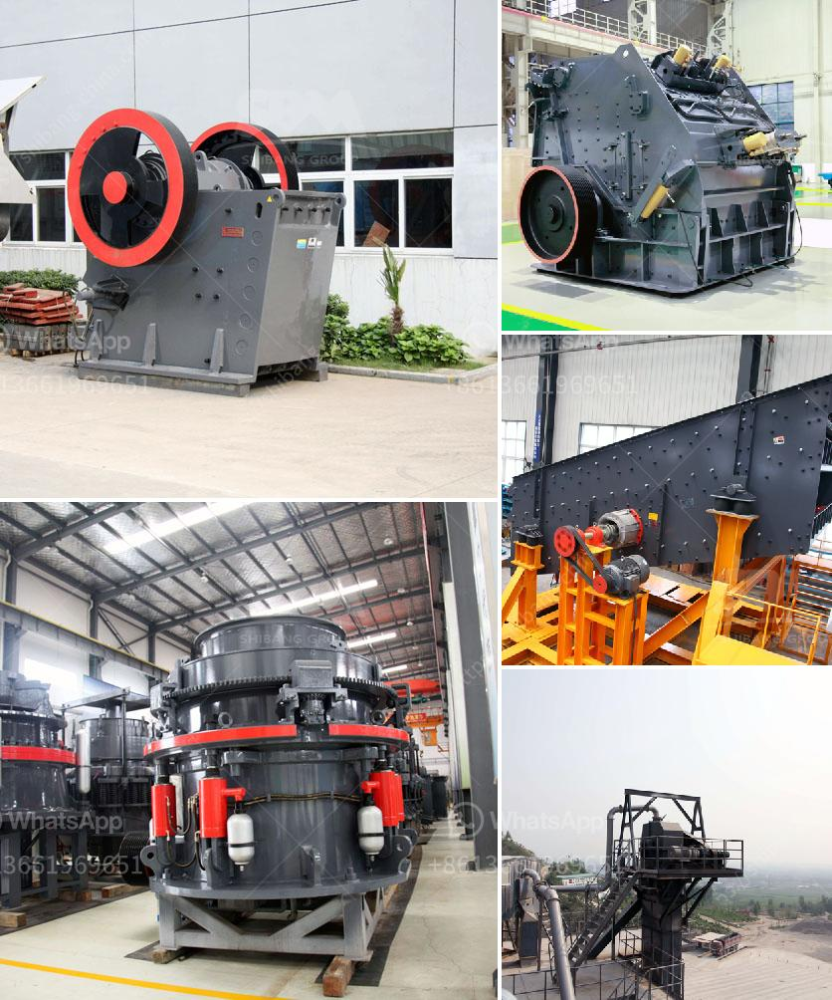

<h3>مورد آلة طحن التنتالوم على نطاق صغير</h3>
يعتبر التنتالوم واحدًا من المعادن الثمينة والنادرة التي تستخدم في العديد من التطبيقات الصناعية. يعد آلة طحن التنتالوم على نطاق صغير أداة ضرورية لاستخراج وتحضير هذه المعدن الثمين بكفاءة عالية. سنتحدث في هذه المقالة عن فوائد هذه الآلة وطرق استخدامها.

تعتبر آلة طحن التنتالوم على نطاق صغير استثمارًا مهمًا لعمليات استخلاص وتحضير هذا المعدن الثمين. تعمل الآلة على طحن خامات التنتالوم المستخرجة من المناجم الأرضية إلى حجم الجسيمات المطلوب، مما يساعد في إعدادها للاستخدام في العديد من التطبيقات المتنوعة.

تتميز آلة طحن التنتالوم على نطاق صغير بعدة مزايا. أولاً، فإنها تساعد على زيادة الكفاءة في استخلاص المعدن من خاماته. حيث يتم طحن الخامات إلى حجم الجسيمات المثلى، مما يزيد من كفاءة وسرعة عملية الاستخلاص. بالإضافة إلى ذلك، فإن الآلة تتيح تحكمًا دقيقًا في حجم الجسيمات المطلوب، مما يساعد في تحسين جودة المنتج النهائي.

بوجود آلة طحن التنتالوم على نطاق صغير، يمكن توفير العديد من المزايا الاقتصادية والبيئية. فعملية الطحن تقلل من حجم المواد الخام المطلوبة للاستخلاص، مما ينعكس على توفير التكاليف. كما أنها تسمح بتقليل كمية المنتجات الفاسدة أو الضائعة نتيجة لعمليات استخلاص غير فعالة، مما يحسن استخدام الموارد والحد من التلوث.

من أجل استخدام آلة طحن التنتالوم على نطاق صغير بكفاءة، يجب اتباع بعض الإرشادات. على سبيل المثال، يجب تنظيف الآلة بانتظام وفحصها لضمان عملها السليم. كما يجب الحفاظ على طرق الصيانة المناسبة واستخدام الأدوات الملائمة لتشغيل الآلة بكفاءة وسلامة.

في الختام، تعد آلة طحن التنتالوم على نطاق صغير أداة ضرورية لمعالجة هذا المعدن الثمين. تعزز الكفاءة والجودة في عملية استخلاص التنتالوم وتقلل من التلوث والمخلفات. وبالتالي، يمكن القول إن استخدام هذه الآلة يساهم في تحقيق نتائج إيجابية من حيث الكفاءة والاقتصاد والبيئة.
<h3>Contact us</h3><ul><li><strong>Whatsapp:&nbsp;<a href="https://wa.me/8613661969651">+8613661969651</a></strong></li><li><a href="https://swt.shibang-china.com/?git&amp;zhl&amp;مورد آلة طحن التنتالوم على نطاق صغير"><strong>Online Service(chat now)</strong></a></li></ul><h3>Related</h3><ul><li><a href='بيع كسارة حجر في ماهاراشترا.md'>بيع كسارة حجر في ماهاراشترا</a></li><li><a href='مطحنة ريموند 4 أسطوانات.md'>مطحنة ريموند 4 أسطوانات</a></li><li><a href='شركة تبيع كسارة الحجر في كينيا.md'>شركة تبيع كسارة الحجر في كينيا</a></li><li><a href='آلات كسارة الحجر الكوارتز.md'>آلات كسارة الحجر الكوارتز</a></li><li><a href='كسارة الحجر المحمولة اللوحة المزدوجة.md'>كسارة الحجر المحمولة اللوحة المزدوجة</a></li></ul>