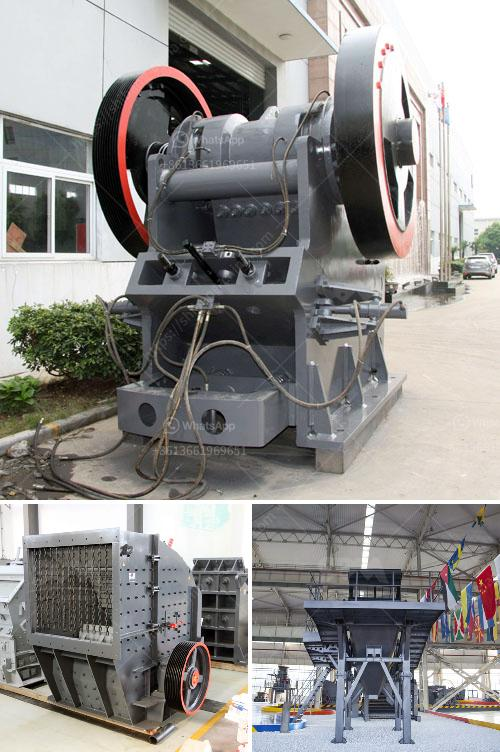

<h3>مورد آلة طحن الكرة في إندونيسيا</h3>
إن مورد آلة طحن الكرة في إندونيسيا يعد عنصرًا أساسيًا في صناعة التعدين في هذا البلد. تُستخدم آلة طحن الكرة بشكل واسع لطحن المواد الخام في عملية الإنتاج ، وتستخدم أيضًا لطحن الخامات المعدنية والسيراميك ومواد البناء والمنتجات الكيميائية. وهي موجودة في العديد من شركات التعدين والمصانع الصناعية في إندونيسيا.

تُستخدم آلة طحن الكرة لطحن المواد الخام بواسطة عملية الاحتكاك والتأثير بين الجسيمات والكرات المعدنية داخل الآلة. تراوح حجم الكرات المعدنية عادة بين 20 و 125 ملم وتعتمد على نوع المواد المطحونة وحجم الحبيبات المطلوبة كمنتج نهائي. يتم تحميل المواد الخام في الآلة ، ويتم تشغيلها عن طريق دوران الأسطوانة الأفقية أو المائلة الدائرية ، مما يتسبب في طحن المواد الخام إلى حجم نهائي.

تعد إندونيسيا واحدة من أكبر منتجي الفحم في العالم ، حيث يعد الفحم من أهم الموارد الطبيعية في البلاد. وبالتالي ، يعتبر قطاع التعدين من أهم القطاعات الاقتصادية في البلاد. تعمل آلة طحن الكرة على طحن خامات الفحم وتحويلها إلى مسحوق ناعم ، وذلك لإعدادها لعمليات الاحتراق في محطات توليد الكهرباء أو الصناعات الأخرى التي تستخدم الفحم كوقود.

إضافة إلى ذلك ، يتم استخدام آلة طحن الكرة أيضًا في صناعة الأسمدة في إندونيسيا. تستخدم الأسمدة الكيميائية لتحسين النمو الزراعي وزيادة إنتاجية المحاصيل. تحتوي هذه الأسمدة في الغالب على مواد معدنية مثل الفوسفور والبوتاسيوم والنيتروجين ، والتي يتم طحنها بواسطة آلة طحن الكرة للحصول على توزيع جيد للمواد الكيميائية داخل الأسمدة.

كما يتم استخدام آلة طحن الكرة في صناعة السيراميك في إندونيسيا. تعتبر السيراميك منتجًا شائعًا في العديد من التطبيقات مثل التجارية والسكنية والصناعية. تعتمد جودة السيراميك على حجم وتوزيع الحبيبات في المادة الخام المستخدمة. لذلك تقوم آلة طحن الكرة بدور حيوي في هذه الصناعة ، حيث يمكن أن تطحن المواد الخام إلى حجم يلبي متطلبات جودة السيراميك.

لتلبية احتياجاتها من آلات طحن الكرة ، تعمل العديد من الشركات المصنعة في إندونيسيا على تطوير وتصنيع وتوريد هذه الآلات. وتوفر المنافسة المتزايدة بين هذه الشركات نطاقًا واسعًا من المنتجات بجودة عالية وأسعار تنافسية للشركات التعدينية والصناعات المختلفة في البلاد.

باختصار ، يُعَدّ آله طحن الكرة في إندونيسيا من العناصر المهمة في قطاع التعدين والصناعة في البلاد. يستخدم لطحن المواد الخام ، بما في ذلك الفحم والمعادن والسيراميك والأسمدة الكيميائية. ومع توافر العديد من المنتجين والشركات المصنعة ، يمكن للشركات في إندونيسيا الحصول على آلات طحن الكرة عالية الجودة لتلبية احتياجاتها المتنوعة.
<h3>Contact us</h3><ul><li><strong>Whatsapp:&nbsp;<a href="https://wa.me/8613661969651">+8613661969651</a></strong></li><li><a href="https://swt.shibang-china.com/?git&amp;zhl&amp;مورد آلة طحن الكرة في إندونيسيا"><strong>Online Service(chat now)</strong></a></li></ul><h3>Related</h3><ul><li><a href='مطاحن للبيع في هراري.md'>مطاحن للبيع في هراري</a></li><li><a href='سعر مطحنة ليما.md'>سعر مطحنة ليما</a></li><li><a href='مصنع تكسير الدولوميت في تركيا.md'>مصنع تكسير الدولوميت في تركيا</a></li><li><a href='آلة تكسير وطحن مناجم الذهب.md'>آلة تكسير وطحن مناجم الذهب</a></li><li><a href='آلة غسيل الرمل للبيع في سريلانكا.md'>آلة غسيل الرمل للبيع في سريلانكا</a></li></ul>