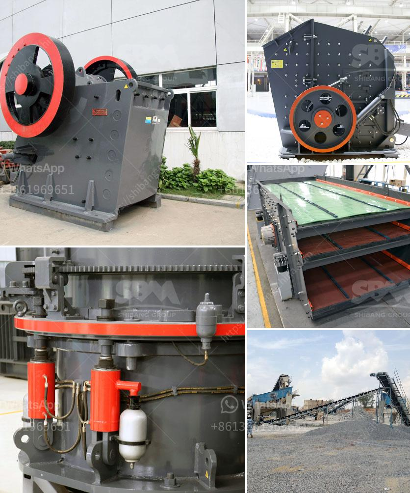

<h3>مورد آلة كسارة الأسطوانة</h3>
تعد آلة كسارة الأسطوانة واحدة من أهم الآلات المستخدمة في صناعة التعدين والبناء، حيث يتم استخدامها لسحق المواد الصلبة بفعالية وكفاءة عالية. تحتوي هذه الآلة على اثنين من الأسطوانات الثابتة والمتحركة التي توضع بشكل متوازي، وتقوم بضغط المواد بينهما لتهرسها وتفتيتها إلى أجزاء صغيرة.

يمتاز مورد آلة كسارة الأسطوانة بأنه قوي ومتين، حيث يتم تصنيعها من مواد ذات جودة عالية مثل الصلب المقاوم للصدأ والحديد الصب. يتمتع هذا المورد بقدرة عالية على تحمل الصدمات والاهتزازات التي تحدث أثناء عمل الآلة، مما يضمن استخدامها لفترة طويلة دون حدوث أي مشاكل.

تتميز آلة كسارة الأسطوانة بأداء سريع وفعال، حيث تستطيع سحق الصخور والمواد الأخرى بمعدلات عالية وبأحجام تتراوح بين بضعة ميليمترات إلى عدة سنتيمترات. كما يعتبر التحكم في حجم الانتاج من خلال ضبط المسافة بين الأسطوانات أمرًا سهلاً ويسيرًا.

تتوفر آلة كسارة الأسطوانة بعدة موديلات وأحجام مختلفة، مما يسمح للمستخدمين باختيار النموذج الأنسب وفقًا لاحتياجاتهم المحددة. كما يمكن تخصيص المورد وفقًا لمتطلبات العميل ومواصفات المشروع المحدد.

بشكل عام، آلة كسارة الأسطوانة تعتبر اختيارًا ممتازًا للاستخدام في صناعة التعدين والبناء، حيث توفر سحقًا سريعًا وفعالًا للمواد الصلبة. بفضل توفرها بأحجام وموديلات مختلفة، يمكن استخدامها في مجموعة متنوعة من التطبيقات، بدءًا من سحق الصخور الكبيرة إلى سحق الحصى والحجارة الصغيرة.

في النهاية، يعد مورد آلة كسارة الأسطوانة أداة ضرورية للعديد من الصناعات، حيث تساهم في تحسين كفاءة العمل وتقليل تكلفة الإنتاج. تظل هذه الآلة قوية ومتينة، مما يجعلها خيارًا موثوقًا للمستخدمين الذين يبحثون عن معدات قوية تلبي احتياجاتهم.
<h3>Contact us</h3><ul><li><strong>Whatsapp:&nbsp;<a href="https://wa.me/8613661969651">+8613661969651</a></strong></li><li><a href="https://swt.shibang-china.com/?git&amp;zhl&amp;مورد آلة كسارة الأسطوانة"><strong>Online Service(chat now)</strong></a></li></ul><h3>Related</h3><ul><li><a href='موردين رمل السيليكا في زيمبابوي.md'>موردين رمل السيليكا في زيمبابوي</a></li><li><a href='مصنعي كسارات الصدم في ألمانيا.md'>مصنعي كسارات الصدم في ألمانيا</a></li><li><a href='كسارة الحجر غانا.md'>كسارة الحجر غانا</a></li><li><a href='معدات تعدين مستعملة للبيع في غانا.md'>معدات تعدين مستعملة للبيع في غانا</a></li><li><a href='مصنع معالجة ملح الصخور.md'>مصنع معالجة ملح الصخور</a></li></ul>