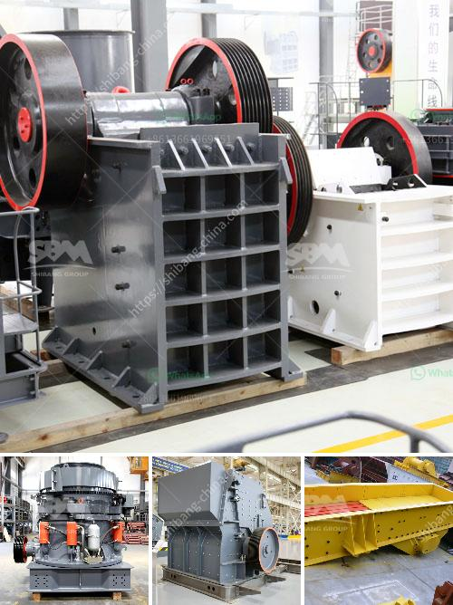

<h3>مورد آلة كسارة الفك</h3>
مورد آلة كسارة الفك هي واحدة من المعدات الحديثة المستخدمة في صناعة التكسير والطحن، وتستخدم بشكل رئيسي في معالجة المواد الصلبة والمتوسطة في صناعة التعدين والمحاجر والبناء والصناعات الأخرى. تستخدم آلة كسارة الفك لسحق المواد عن طريق تطبيق قوة الضغط والقوة التصادمية بين الفك الثابت والفك المتحرك.

تتكون آلة كسارة الفك من إطار رئيسي والأجزاء الأخرى مثل الفك الثابت والفك المتحرك والطويق والعتلة والفك المتحكم بهيدروليكيًا وآلية التعديل والنظام الهيدروليكي الخ. تتميز هذه الآلة بقوة الضغط العالية وقوة التكسر الكبيرة، مما يجعلها قادرة على سحق المواد بكفاءة عالية وإنتاجية كبيرة.

تتوفر آلة كسارة الفك بأحجام مختلفة وقدرات متنوعة، ويمكن تعديل حجم الفتحة بسهولة لتناسب متطلبات معالجة المواد المختلفة. بالإضافة إلى ذلك، فإن الآلة مزودة بنظام تشحيم مركزي لضمان تشحيم الجزء الحركي بشكل جيد، وتتميز بتوفير الطاقة والصيانة المنخفضة.

يمكن استخدام آلة كسارة الفك في تكسير العديد من المواد المختلفة مثل خام الحديد والحجر الجيري والجرانيت والكوارتز والصخور الصلبة الأخرى. وبالإضافة إلى ذلك، يمكن استخدامها أيضًا في طحن المواد الخام وتجهيزها في صناعات أخرى مثل صناعة الأسمنت والكيماويات وصناعة البناء.

من الجوانب الإيجابية الأخرى لآلة كسارة الفك أنها توفر تشغيلًا سهلاً ومريحًا، حيث يمكن التحكم بها بسهولة من خلال وحدة التحكم الهيدروليكية المتقدمة. كما توفر آلة كسارة الفك أيضًا نسبة تقسيم جيدة للمواد المكسورة، مما يمكن من إنتاج منتج نهائي جيد الشكل ومناسب للاستخدام في الصناعات المختلفة.

في النهاية، تعتبر آلة كسارة الفك موردًا مهمًا في صناعة التعدين والبناء والصناعات الأخرى، وتستخدم على نطاق واسع في معالجة المواد الصلبة والمتوسطة. تتميز بالقوة والمتانة والكفاءة في الأداء، وتساعد في زيادة إنتاجية العملية وتحسين جودة المنتج النهائي.
<h3>Contact us</h3><ul><li><strong>Whatsapp:&nbsp;<a href="https://wa.me/8613661969651">+8613661969651</a></strong></li><li><a href="https://swt.shibang-china.com/?git&amp;zhl&amp;مورد آلة كسارة الفك"><strong>Online Service(chat now)</strong></a></li></ul><h3>Related</h3><ul><li><a href='تقرير المشروع حول استخدام رمل السحق.md'>تقرير المشروع حول استخدام رمل السحق</a></li><li><a href='آلة معالجة الجبس بسعة طن واحد.md'>آلة معالجة الجبس بسعة طن واحد</a></li><li><a href='تأجير كسارة تأجير في غانا.md'>تأجير كسارة تأجير في غانا</a></li><li><a href='مطحنة الكرة للجبس.md'>مطحنة الكرة للجبس</a></li><li><a href='سعر كسارة مخروطية هيدروليكية.md'>سعر كسارة مخروطية هيدروليكية</a></li></ul>