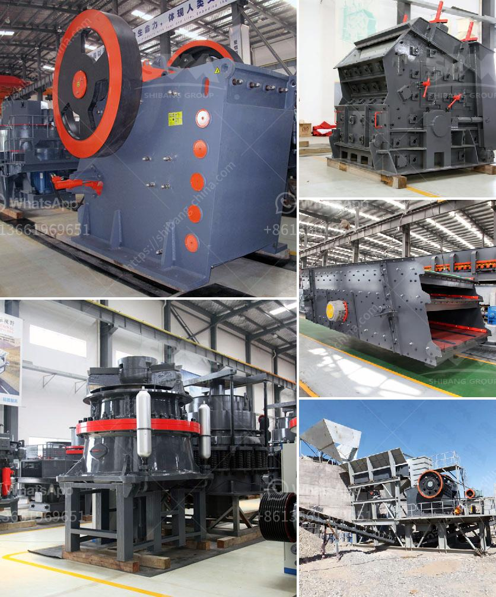

<h3>مورد آلة كسارة النفايات الفلبين</h3>
تعتبر مشكلة إدارة النفايات من أكبر التحديات التي تواجهها الدول في العصر الحديث. تتعامل العديد من الدول مع تراكم النفايات بشكل غير فعال، مما يؤدي إلى تأثيرات بيئية سلبية وتلوث. واحدة من الحلول الكفيلة بالتخلص من تلك المشكلة هي استخدام آلات الكسارة.

تُعد آلة كسارة النفايات من أفكار الابتكار المبتكرة للتخلص من النفايات بشكل صحي وفعال. اخترع روبرت لويس فيلاردي آلة الكسارة في الفلبين عام 2010. وهي آلة تقوم بفرم النفايات وتحويلها إلى مادة قابلة لإعادة التدوير أو طاقة قابلة للاستفادة.

تتميز آلة كسارة النفايات بعدة مزايا رئيسية. أولاً، تقوم بتقليل حجم النفايات، مما يساهم في تقليل مساحة تخزينها. وبالتالي، يمكن توفير مساحة أكبر لاستخدامها في أغراض مختلفة. ثانيًا، تُحول النفايات إلى شكل يمكن إعادة تدوير أو استخدامه في إنتاج الطاقة. وهذا يُساهم في تقليل استخدام الموارد الطبيعية وحماية البيئة. وثالثًا، يمكن استخدام الآلة لمختلف أنواع النفايات، بما في ذلك البلاستيك والورق والمعادن والزجاج والكائنات العضوية.

تُستخدم آلة كسارة النفايات في الفلبين بشكل واسع، خاصة في المناطق الحضرية حيث يكون تراكم النفايات أكبر. تعمل الحكومة الفلبينية على تعزيز استخدام هذه الآلة عبر منح المزيد من التراخيص للشركات والمنظمات لتثبيتها وتشغيلها. وقد أظهرت دراسات أن استخدام آلة كسارة النفايات يؤدي إلى تقليل تكلفة إدارة النفايات وتأثيراتها البيئية على المدى الطويل.

بشكل عام، فإن آلة كسارة النفايات تعد ابتكارًا مبتكرًا في مجال إدارة النفايات. يمكن استخدامها بفاعلية للتخلص من النفايات وتحويلها لمادة قابلة للإعادة التدوير أو استخدامها في إنتاج الطاقة. من المهم أن تعمل الحكومات والمنظمات البيئية على تعزيز استخدام هذه الآلة وتوفيرها بشكل واسع في جميع أنحاء العالم، حتى يتمكن الجميع من الاستفادة من فوائدها الكبيرة والمتعددة.
<h3>Contact us</h3><ul><li><strong>Whatsapp:&nbsp;<a href="https://wa.me/8613661969651">+8613661969651</a></strong></li><li><a href="https://swt.shibang-china.com/?git&amp;zhl&amp;مورد آلة كسارة النفايات الفلبين"><strong>Online Service(chat now)</strong></a></li></ul><h3>Related</h3><ul><li><a href='كسارة متنقلة في فيجي.md'>كسارة متنقلة في فيجي</a></li><li><a href='حساب تصميم مطحنة الكرة.md'>حساب تصميم مطحنة الكرة</a></li><li><a href='آلة طحن الحجر الصخري في فوجيان.md'>آلة طحن الحجر الصخري في فوجيان</a></li><li><a href='معدات تعدين الذهب على نطاق صغير للبيع في مزاد.md'>معدات تعدين الذهب على نطاق صغير للبيع في مزاد</a></li><li><a href='مطاحن ريموند في الصين.md'>مطاحن ريموند في الصين</a></li></ul>