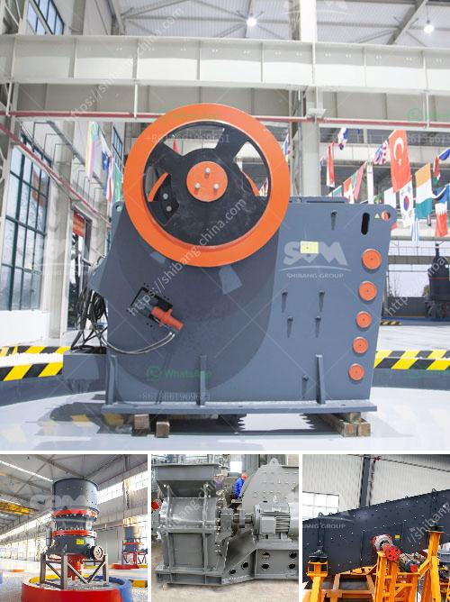

<h3>مورد جنوب أفريقي لمطحنة الكرة</h3>
يُعد مورد جنوب أفريقي لمطحنة الكرة من بين أبرز الموارد الطبيعية في العالم. يتم استخراج هذا المورد من منجم بوشفيلد الواقع في شمال غرب البلاد. تعتبر الكرة طريقة فعالة لطحن المواد الخام المعدنية والمعادن، وتستخدم على نطاق واسع في صناعات مثل التعدين والبناء وصناعة السيراميك.

تتميز مطاحن الكرة الجنوب أفريقية بجودة عالية وأداء متفوق، مما يجعلها محط اهتمام العديد من الشركات العالمية. فهي تعتبر جزءًا أساسيًا في عملية التكسير والطحن، وتساهم في زيادة الكفاءة وتحسين جودة المنتج النهائي.

تتم إنتاج مطاحن الكرة الجنوب أفريقية باستخدام تقنيات حديثة ومعدات متطورة، مما يؤدي إلى تحقيق معايير الجودة العالمية. تتميز هذه المطاحن بتصميماتها الفريدة والمتطورة، والتي تساهم في زيادة الكفاءة وتقليل التكاليف التشغيلية.

تحتوي مطاحن الكرة الجنوب أفريقية على أجزاء داخلية مصنوعة من الصلب عالي الجودة، مما يضمن قوة التحمل والصلابة والمتانة. تتمتع هذه المطاحن أيضًا بنظام تشغيل مبتكر يسمح بترشيد استهلاك الطاقة وتقليل الانبعاثات الضارة.

توفر صناعة مطاحن الكرة في جنوب أفريقيا فرصًا اقتصادية هامة للبلاد، حيث تعتبر صناعة التعدين من أبرز القطاعات الاقتصادية في البلاد. بفضل وجود الموارد الطبيعية الغنية، تعد جنوب أفريقيا وجهة استثمارية مثالية للشركات العالمية الراغبة في توسيع نشاطاتها في مجال التعدين.

على الرغم من وجود العديد من الموارد الطبيعية في جنوب أفريقيا، إلا أن صناعة مطاحن الكرة تواجه التحديات البيئية والاجتماعية. يجب أن تعمل الشركات المنتجة على تطوير ممارسات الاستدامة وحماية البيئة، وتعزيز معايير العمل والسلامة للعمال.

يعد مورد جنوب أفريقي لمطاحن الكرة من أهم الموارد الطبيعية في العالم، حيث يتم تصنيعها باستخدام تقنيات حديثة ومعدات متطورة. تعتبر هذه المطاحن أساسية في صناعة التعدين والبناء، وتقدم فرصًا اقتصادية هامة لجنوب أفريقيا. ومع ذلك، يجب أن تتعامل الشركات المنتجة مع التحديات البيئية والاجتماعية بهدف ضمان الاستدامة والتنمية المستدامة في هذا القطاع.
<h3>Contact us</h3><ul><li><strong>Whatsapp:&nbsp;<a href="https://wa.me/8613661969651">+8613661969651</a></strong></li><li><a href="https://swt.shibang-china.com/?git&amp;zhl&amp;مورد جنوب أفريقي لمطحنة الكرة"><strong>Online Service(chat now)</strong></a></li></ul><h3>Related</h3><ul><li><a href='الحجر الجيري المستخدم لصنع الزجاج.md'>الحجر الجيري المستخدم لصنع الزجاج</a></li><li><a href='مطحنة رايموند في ماليزيا.md'>مطحنة رايموند في ماليزيا</a></li><li><a href='آلة طلاء مسحوق كربونات الكالسيوم في الهند.md'>آلة طلاء مسحوق كربونات الكالسيوم في الهند</a></li><li><a href='تكلفة فتح مصنع للأسمنت الصغير.md'>تكلفة فتح مصنع للأسمنت الصغير</a></li><li><a href='دراسة جدوى لمصنع سحق الكروم الفير.md'>دراسة جدوى لمصنع سحق الكروم الفير</a></li></ul>