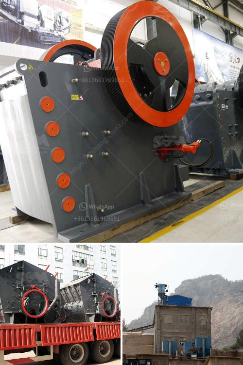

<h3>مورد سير ناقل في الصين</h3>
تعتبر الصين واحدة من الدول الرائدة في العالم في صناعة السيارات والتكنولوجيا الصناعية بشكل عام. واحدة من قطاعات الصناعة الهامة في الصين هي صناعة المعدات الثقيلة والسيارات. وتعتبر صناعة مورد السير الناقل من أهم الصناعات في البلاد.

تعد صناعة مورد السير الناقل من أكثر الصناعات تطوراً في الصين خلال السنوات الأخيرة. تُستخدم السيور الناقلة في مجموعة واسعة من الصناعات مثل التعدين والتصنيع والنقل والبناء. وتتميز بمرونتها وقدرتها على نقل المواد الثقيلة والسائلة والغازية بسلاسة وكفاءة.

توجد في الصين العديد من الشركات الكبيرة والتي تُعرف بجودة منتجاتها وعملياتها الفعالة. وتنتج هذه الشركات مجموعة واسعة من موردي السير الناقل التي تُستخدم على نطاق واسع في الصناعات المختلفة. تتميز مُعظم هذه الشركات بحجمها الكبير وعملياتها العالية المستوى.

تعتمد صناعة موردي السير الناقل في الصين على الابتكار والتقنية الحديثة. حاليًا، تعمل الشركات على تطوير سير ناقل مزود بأحدث التقنيات والذكاء الاصطناعي. وهذا يعزز التكلفة الفعالة والأداء العالي لموردي السير الناقل في السوق.

تُصدر الشركات الصينية موردي السير الناقل إلى الأسواق العالمية بشكل واسع. توجد شبكة واسعة من شركات التصدير والتوزيع التي تعمل على ترويج منتجات السير الناقل الصينية في أنحاء العالم. تعد السيور الصينية ذات جودة عالية وأسعار معقولة، مما يجعلها خيارًا شائعًا للعديد من الشركات في مختلف الصناعات.

ومع زيادة الطلب على موردي السير الناقل، تتوقع الصين تحقيق مزيد من التقدم في هذه الصناعة في المستقبل. ومن المرجح أن تتوسع الشركات في تطوير منتجاتها واستخدام أحدث التقنيات لتعزيز الأداء والكفاءة. وسيكون لذلك تأثير إيجابي على الاقتصاد الصيني وسوق العمل بصفة عامة.

لخلاصة القول، تعد صناعة موردي السير الناقل في الصين واحدة من القطاعات الرائدة في العالم. وبفضل توفر الشركات الكبيرة والتكنولوجيا الحديثة، تُنتج موردي السير الناقل صينية المنشأ بجودة عالية وأسعار معقولة. ومن المتوقع أن تستمر هذه الصناعة في التطور وتحقيق المزيد من التقدم في المستقبل.
<h3>Contact us</h3><ul><li><strong>Whatsapp:&nbsp;<a href="https://wa.me/8613661969651">+8613661969651</a></strong></li><li><a href="https://swt.shibang-china.com/?git&amp;zhl&amp;مورد سير ناقل في الصين"><strong>Online Service(chat now)</strong></a></li></ul><h3>Related</h3><ul><li><a href='عملية التحول للأسمنت.md'>عملية التحول للأسمنت</a></li><li><a href='إنتاج الإسمنت الأبيض من مسحوق الرخام.md'>إنتاج الإسمنت الأبيض من مسحوق الرخام</a></li><li><a href='سعر كسارة الح.md'>سعر كسارة الح</a></li><li><a href='آلة كسارة الحجر للبيع في الإمارات.md'>آلة كسارة الحجر للبيع في الإمارات</a></li><li><a href='كسارة الفك في نيبال للبيع.md'>كسارة الفك في نيبال للبيع</a></li></ul>