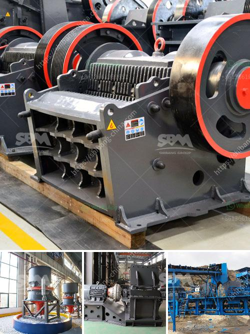

<h3>مورد سيور ناقلة للفحم من الهند</h3>
تعتبر الهند واحدة من أكبر الدول المنتجة والمصدرة للفحم في العالم. تمتلك الهند احتياطيات كبيرة من الفحم تغطي احتياجاتها المحلية وتساهم في تصدير كميات كبيرة إلى الدول الأخرى. تعمل صناعة الفحم في الهند بكفاءة عالية بفضل استخدام العديد من الأدوات والمعدات المتقدمة، بما في ذلك سيور ناقلة لنقل الفحم من المناجم إلى المحطات الحرارية ومصانع التكرير.

تتميز سيور النقل بالهند بالعديد من المزايا التي تجعلها خيارا مثلى لنقل الفحم. فهي تتميز بالسرعة والكفاءة في نقل الكميات الهائلة من الفحم بكل سهولة ويسر. بالإضافة إلى ذلك، تعد هذه السيور قابلة للتكيف مع الظروف المختلفة الموجودة في المناجم، حيث يمكن ترتيبها بطرق مختلفة لتتناسب مع الإعدادات المحددة. تستخدم سيور النقل أحزمة أو تروس تعمل بوجود محركات كهربائية قوية لضمان حركة سلسة للفحم من مكان إلى آخر.

من المهم أن نلاحظ أن سيور النقل لا تستخدم فقط في صناعة الفحم، بل يمكن استخدامها أيضًا لنقل العديد من المواد الأخرى مثل الحبوب والمواد الغذائية والمواد الكيميائية والمعادن. تساهم سيور النقل في زيادة الإنتاجية وتقليل تكاليف العمالة وتحسين كفاءة العملية الإنتاجية بشكل عام.

على الرغم من جميع هذه المزايا، فإن استخدام سيور النقل يشكل تحديات بيئية واجتماعية. قد يؤدي عمل هذه السيور إلى تلوث البيئة بانبعاثات الغبار والضجيج والاهتزازات. لذلك، يتعين على الشركات المستخدمة لهذه السيور اتخاذ إجراءات احترازية للحد من التأثير السلبي على البيئة والمجتمع المحلي. على سبيل المثال، يمكن استخدام تقنيات الرش المائي للحد من انبعاثات الغبار وتقليل الضجيج واستخدام الأنظمة الصوتية الحديثة للمراقبة والتحكم في الاهتزازات.

باختصار، تلعب سيور النقل الناقلة للفحم دورًا حاسمًا في صناعة الفحم في الهند. توفر هذه التكنولوجيا الحديثة سرعة وكفاءة في نقل الفحم، مما يزيد من الإنتاجية ويخفض التكاليف. ومع ذلك، يجب أن تواجه هذه الصناعة التحديات البيئية والاجتماعية لتحقيق التنمية المستدامة والحفاظ على البيئة وصحة المجتمعات المحلية.
<h3>Contact us</h3><ul><li><strong>Whatsapp:&nbsp;<a href="https://wa.me/8613661969651">+8613661969651</a></strong></li><li><a href="https://swt.shibang-china.com/?git&amp;zhl&amp;مورد سيور ناقلة للفحم من الهند"><strong>Online Service(chat now)</strong></a></li></ul><h3>Related</h3><ul><li><a href='مطاحن الكرة في ماليزيا.md'>مطاحن الكرة في ماليزيا</a></li><li><a href='كسارة صناعية.md'>كسارة صناعية</a></li><li><a href='كسارة التعدين في تنزانيا.md'>كسارة التعدين في تنزانيا</a></li><li><a href='آلات إنتاج الجبس.md'>آلات إنتاج الجبس</a></li><li><a href='ضواغط الديزل للبيع في جنوب أفريقيا.md'>ضواغط الديزل للبيع في جنوب أفريقيا</a></li></ul>