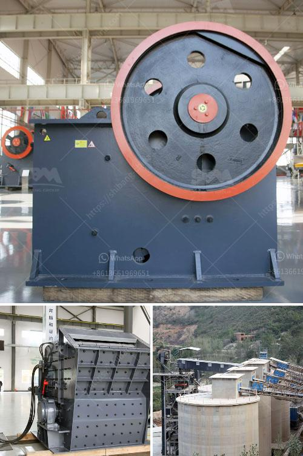

<h3>مورد قطع غيار الكسارة كينيا</h3>
تعد قطع الغيار أحد عناصر الأهمية القصوى لصناعة الكسارات في كينيا. تعتبر الكسارات أدوات أساسية في صناعة البناء والتشييد، حيث تقوم بسحق وتكسير المواد الصلبة مثل الحجارة والركام لصنع مواد البناء المستخدمة في الصناعات المختلفة.

مع مرور الوقت واستخدام الكسارات، تتعرض بعض قطع الغيار للاهتراء والتآكل، مما يجعلها تحتاج إلى الاستبدال والتجديد. لذا، يعد العثور على مورد موثوق لقطع غيار الكسارة في كينيا أمرًا بالغ الأهمية.

تتوافر في كينيا عدة موردين يقدمون قطع غيار الكسارات. ومن أهم هذه الموردين شركة "قطع الغيار للكسارات"، حيث تقدم مجموعة واسعة من الأجزاء المختلفة للكسارات، بما في ذلك الفكوك والإطارات وأجزاء الهياكل الأخرى. تتوفر قطع الغيار لمعظم أنواع الكسارات الشائعة في السوق، بما في ذلك كسارة الفك وكسارة المخروط والكسارة المطرقية.

تتميز هذه الشركة بجودة منتجاتها وتنوعها، فهي تضمن توفير قطع غيار عالية الجودة تلبي متطلبات العملاء. كما توفر شركة "قطع الغيار للكسارات" خدمة استشارات فنية للعملاء فيما يتعلق بالمنتجات واختيار القطع الأصلية المناسبة.

بالإضافة إلى ذلك، يوفر العديد من الموردين في كينيا خدمات التوصيل والتركيب لقطع غيار الكسارات، مما يوفر الوقت والجهد للعملاء. يمكن للعملاء الحصول على القطع الغيار المطلوبة دون الحاجة إلى البحث عنها في الأسواق المحلية أو الخارجية.

بشكل عام، إيجاد مورد موثوق لقطع غيار الكسارة في كينيا يساعد على ضمان سلامة واستدامة عمليات الكسارة، فضلاً عن تقليل تكاليف الصيانة والإصلاح. وعندما يتم الحصول على قطع الغيار الأصلية والمناسبة، يتمكن المشغلون من تشغيل الكسارة بكفاءة أعلى وإطالة عمر الخدمة الفعال للكسارة.

باختصار، يتعين على أصحاب الكسارات والعملاء في كينيا البحث عن موردين موثوقين لقطع غيار الكسارة. يجب الاهتمام بجودة المنتجات، وتوفر الأجزاء المطلوبة، وخدمات التوصيل والتركيب، من أجل الحفاظ على استدامة وفاعلية عمليات الكسارة، وخفض تكاليف الصيانة والإصلاح.
<h3>Contact us</h3><ul><li><strong>Whatsapp:&nbsp;<a href="https://wa.me/8613661969651">+8613661969651</a></strong></li><li><a href="https://swt.shibang-china.com/?git&amp;zhl&amp;مورد قطع غيار الكسارة كينيا"><strong>Online Service(chat now)</strong></a></li></ul><h3>Related</h3><ul><li><a href='تكلفة طاحونة الكوارتز.md'>تكلفة طاحونة الكوارتز</a></li><li><a href='طواحين الطوابع الذهبية في زيمبابوي.md'>طواحين الطوابع الذهبية في زيمبابوي</a></li><li><a href='المعدات المطلوبة لعمل محجر الجرانيت.md'>المعدات المطلوبة لعمل محجر الجرانيت</a></li><li><a href='سعر مصنع تعدين الذهب في الصين.md'>سعر مصنع تعدين الذهب في الصين</a></li><li><a href='كيفية إعداد خطة عمل لمصنع الكسارات.md'>كيفية إعداد خطة عمل لمصنع الكسارات</a></li></ul>