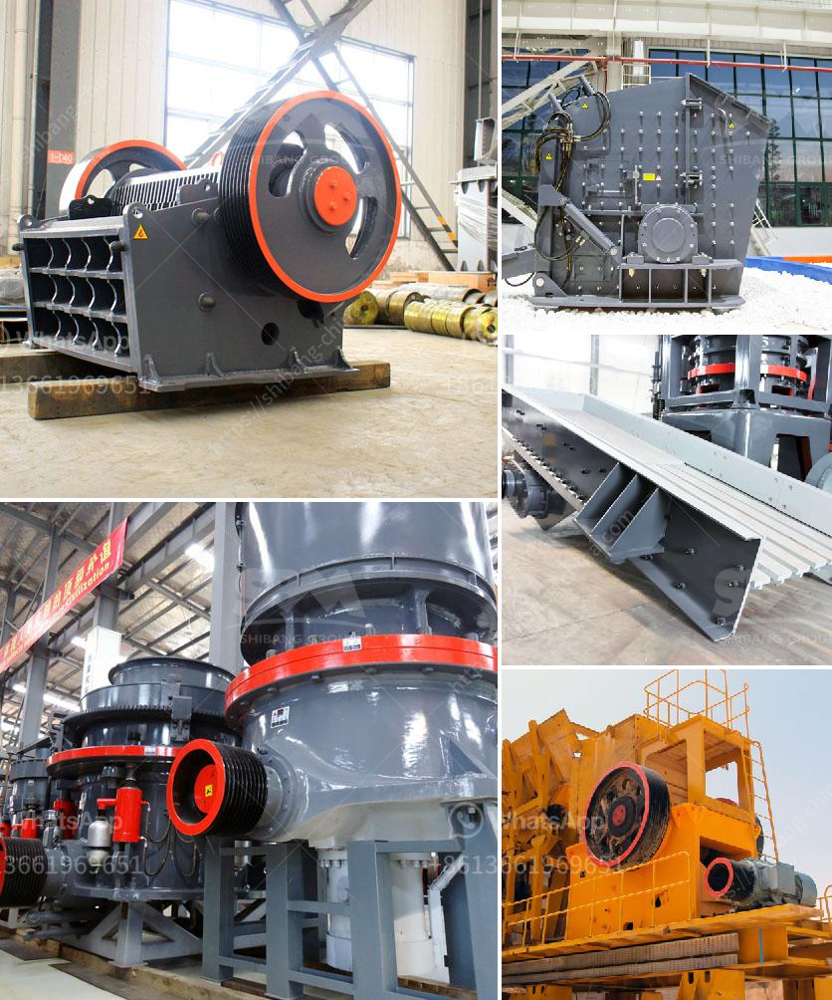

<h3>مورد كسارة الأسطوانة المزدوجة</h3>
يعتبر مورد كسارة الأسطوانة المزدوجة أحد الموردين المهمين في صناعة التعدين والبناء. تستخدم كسارة الأسطوانة المزدوجة لسحق المواد الصلبة مثل الحجر والخامات المعدنية والفحم.

ميزة كسارة الأسطوانة المزدوجة هي أنها تتكون من طبقتين من الأسطوانات الموجودة في الجزء العلوي والسفلي من الجهاز. تدور الأسطوانات في اتجاهين معاكسين وتضغط على المواد بينهما. يتم استخدام قوة الضغط لسحق المواد إلى حجم أصغر.

تعتبر كسارة الأسطوانة المزدوجة متعددة الاستخدامات وتنتج أحجامًا مختلفة من المنتجات المكسرة. يتم تعديل فتحة الخروج بين الأسطوانات لتحقيق حجم الجسيمات المرغوب. بالإضافة إلى ذلك، يمكن تعديل الضغط بين الأسطوانتين للتحكم في حجم المنتج النهائي.

كسارة الأسطوانة المزدوجة ذات تصميم بسيط وهي سهلة الاستخدام والصيانة. يمكن تنظيفها وتشذيبها بسهولة للحفاظ على أدائها المثلى. تأتي بعض النماذج مع أحزمة ناقلة لنقل المواد المكسرة بشكل آلي.

توفر كسارة الأسطوانة المزدوجة أداءً ممتازًا لسحق المواد الصلبة. يتم استخدامها بشكل شائع في صناعة التعدين لسحق الخامات المعدنية، بما في ذلك النحاس والذهب والفضة. وتستخدم أيضًا في صناعة البناء لسحق الحجارة والركام.

ومن بين المزايا الأخرى للكسارة المزدوجة أنها تستهلك طاقة أقل من بعض الكسارات الأخرى. بفضل نظام الأسطوانة المزدوجة، يتم تقليل الاحتكاك والتأكد من استخدام الطاقة بكفاءة.

عند شراء مورد كسارة الأسطوانة المزدوجة، يجب اختيار الشركة المنتجة الموثوقة. يجب أيضًا النظر في السعة المطلوبة وحجم المواد التي ستعاد تدويرها. كما يجب مراعاة التكلفة والكفاءة للكسارة المطلوبة.

باختصار، تعتبر كسارة الأسطوانة المزدوجة موردًا هامًا في صناعة التعدين والبناء. يتم استخدامها لسحق المواد الصلبة وإنتاج منتجات مكسرة مناسبة. تتميز ببساطتها وسهولة استخدامها وصيانتها. إذا كنت تبحث عن كسارة موثوقة وفعالة، فإن مورد كسارة الأسطوانة المزدوجة يعتبر خيارًا جيدًا.
<h3>Contact us</h3><ul><li><strong>Whatsapp:&nbsp;<a href="https://wa.me/8613661969651">+8613661969651</a></strong></li><li><a href="https://swt.shibang-china.com/?git&amp;zhl&amp;مورد كسارة الأسطوانة المزدوجة"><strong>Online Service(chat now)</strong></a></li></ul><h3>Related</h3><ul><li><a href='كتلة الآلات وكسارة في AutoCAD.md'>كتلة الآلات وكسارة في AutoCAD</a></li><li><a href='معدات زراعية للبيع بأسعار مناسبة.md'>معدات زراعية للبيع بأسعار مناسبة</a></li><li><a href='تكلفة الكسارة المحمولة للساعة الواحدة.md'>تكلفة الكسارة المحمولة للساعة الواحدة</a></li><li><a href='كسارة مخروط في أمريكا.md'>كسارة مخروط في أمريكا</a></li><li><a href='تكلفة مصنع الكسارة.md'>تكلفة مصنع الكسارة</a></li></ul>