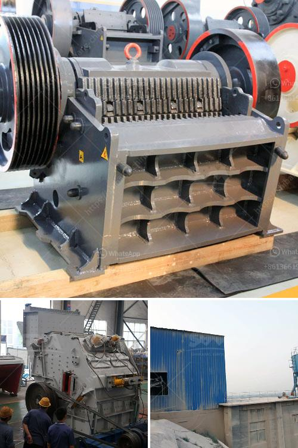

<h3>مورد كسارة الحجر الجيري</h3>
تعد كسارة الحجر الجيري واحدة من المعدات الأساسية المستخدمة في صناعة البناء والإنشاء. يتم استخدام الحجر الجيري كمواد خام في العديد من الصناعات مثل البناء، والمواد الكيميائية، والأسمنت. ويتم تكسير الحجر الجيري في الكسارة للحصول على حبيبات صغيرة تصلح للاستخدام في عمليات الإنتاج المختلفة.

عندما نتحدث عن مستلزمات البناء، فإن كسارة الحجر الجيري لها دور حيوي في إعداد المواد الخام. توجد العديد من أنواع كسارات الحجر الجيري المستخدمة، وأحد أنواعها هو الكسارة الفكية. تمتاز الكسارة الفكية بتصميمها البسيط والفعال وقدرتها على تكسير الحجر الجيري بسرعة وسهولة.

تتكون الكسارة الفكية من واجهتين متحركتين تضغطان على الحجر الجيري وتكسرونه. تعتبر هذه العملية أسرع وأكثر كفاءة من استخدام الأدوات التقليدية مثل المطارق والنوارات. بالإضافة إلى تكسير الحجر الجيري، يمكن للكسارة الفكية أيضًا استخدامها في تفتيت مواد أخرى مثل الصخور الصلبة والمعادن.

وبجانب الكسارة الفكية، تقوم الكسارات التصادمية بدور هام أيضًا في صناعة التعدين والإنشاءات. تستخدم الكسارات التصادمية لتفتيت الحجر الجيري بواسطة ضربه بشكل قوي، مما يساعد على تفكيكه إلى قطع أصغر.

تعمل كسارة الحجر الجيري على قطع الحجر إلى حجم أصغر يمكن استخدامه في العديد من الصناعات المختلفة. يتم وضع الحجر الجيري في الكسارة، ثم تدفع طرق الحجر الثابت في الكسارة وتتحرك الكسارة للأعلى وللأسفل بواسطة محرك. تتكسر الحجارة بين وجهتي الكسارة، وتخرج الحصى من الكسارة في حجم مطلوب.

في النهاية، يمكن القول أن استخدام كسارة الحجر الجيري أمر ضروري جدًا في صناعة البناء والإنشاءات. تُعد كسارة الحجر الجيري أداة أساسية لتكسير الحجر إلى حجم ملائم للاستخدام في العديد من الصناعات المختلفة. من خلال تحطيم الحجر الجيري إلى جزيئات صغيرة، يمكن أن تستفيد الصناعات من الحجر الجيري بشكل أكبر وتستخدمه في عمليات الإنتاج بكفاءة أكبر.
<h3>Contact us</h3><ul><li><strong>Whatsapp:&nbsp;<a href="https://wa.me/8613661969651">+8613661969651</a></strong></li><li><a href="https://swt.shibang-china.com/?git&amp;zhl&amp;مورد كسارة الحجر الجيري"><strong>Online Service(chat now)</strong></a></li></ul><h3>Related</h3><ul><li><a href='مورد جنوب أفريقي لمطحنة الكرة.md'>مورد جنوب أفريقي لمطحنة الكرة</a></li><li><a href='آلة التكسير للبيع في نيجيريا.md'>آلة التكسير للبيع في نيجيريا</a></li><li><a href='شركة مطحنة الكرة في تاميل نادو.md'>شركة مطحنة الكرة في تاميل نادو</a></li><li><a href='طحن الكرة للأدوية.md'>طحن الكرة للأدوية</a></li><li><a href='عملية تصنيع الرمل الاصطناعي.md'>عملية تصنيع الرمل الاصطناعي</a></li></ul>