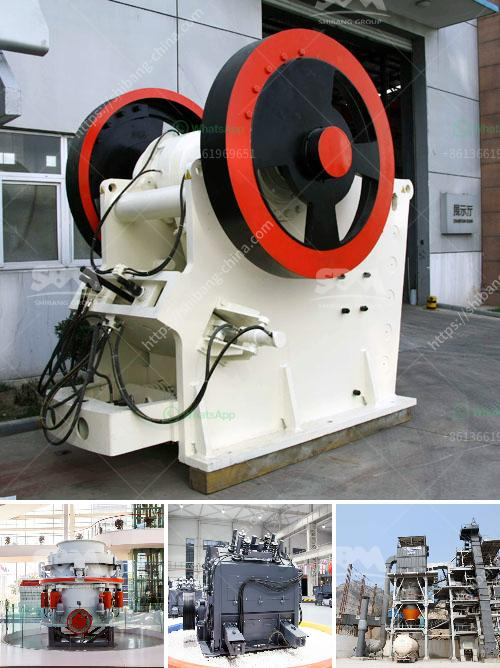

<h3>مورد كسارة الرخام</h3>
تعد الرخام واحدة من أجمل وأثمن أنواع الحجارة المستخدمة في العديد من التطبيقات المعمارية والديكورية. وتضفي طبقة الرخام الفاخرة لمسة من الأناقة والفخامة على المساحات التي يتم استخدامها فيها. ولكن قبل أن يتم استخدام هذه الحجارة الجميلة، يجب أن تمر بمرحلة تكسير وتحضير تتطلب استخدام ما يعرف بكسارة الرخام.

تعتبر مورد كسارة الرخام هي المكان الذي يتم فيه تكسير الرخام وتحضيره للاستخدام في العديد من التطبيقات المختلفة. وتوجد كسارات الرخام في عدة دول حول العالم، حيث تتوفر بها الموارد الطبيعية من هذه الحجارة الجميلة.

عملية تكسير الرخام تتطلب استخدام معدات خاصة، تشمل كسارات الفك، وكسارات الصدم، وكسارات المخروط. تتم عملية التكسير عن طريق استخدام قوة الضغط والصدمة لتكسير الرخام إلى قطع أصغر حجماً. يتم تحميل الرخام في الكسارة، وتتم عملية التكسير عن طريق الحركة الدورانية للأجزاء الميكانيكية الداخلية للكسارة.

بعد عملية التكسير، يتم تحويل الرخام إلى قطع صغيرة جاهزة للاستخدام في التطبيقات المختلفة. يمكن استخدامها في الأرضيات والجدران والأسطح والمطابخ والحمامات وأيضاً في صناعة الأثاث. وتعد مورد كسارة الرخام هو الذي يوفر هذه القطع الجاهزة بأحجام وأشكال مختلفة لتلبية احتياجات العملاء المختلفة.

إن مصدر الرخام المستخدم في عمليات التكسير يلعب دوراً هاماً في جودة القطع النهائية. فالرخام الذي يتم استخدامه يجب أن يكون عالي الجودة وخالي من العيوب والشوائب. ولذلك، ينبغي على المستخدمين البحث عن موردين موثوقين وذوي سمعة جيدة، الذين يتمتعون بخبرة في هذا المجال.

باختصار، تلعب مورد كسارة الرخام دوراً حاسماً في تحضير الرخام وجعله جاهزاً للاستخدام في التطبيقات المختلفة. وبفضل موردي الرخام المحترفين، يمكن الحصول على قطع الرخام عالية الجودة والفاخرة التي تعزز جمالية الأماكن التي يتم استخدامها فيها.
<h3>Contact us</h3><ul><li><strong>Whatsapp:&nbsp;<a href="https://wa.me/8613661969651">+8613661969651</a></strong></li><li><a href="https://swt.shibang-china.com/?git&amp;zhl&amp;مورد كسارة الرخام"><strong>Online Service(chat now)</strong></a></li></ul><h3>Related</h3><ul><li><a href='كسارة الفك في نيبال للبيع.md'>كسارة الفك في نيبال للبيع</a></li><li><a href='غسيل الرمال الصغيرة.md'>غسيل الرمال الصغيرة</a></li><li><a href='شركة تصنيع مطحنة الفحم في الصين.md'>شركة تصنيع مطحنة الفحم في الصين</a></li><li><a href='مطاحن الطحن للبيع في باكستان.md'>مطاحن الطحن للبيع في باكستان</a></li><li><a href='كسارات حجر بسيطة من زيفيث في كينيا.md'>كسارات حجر بسيطة من زيفيث في كينيا</a></li></ul>