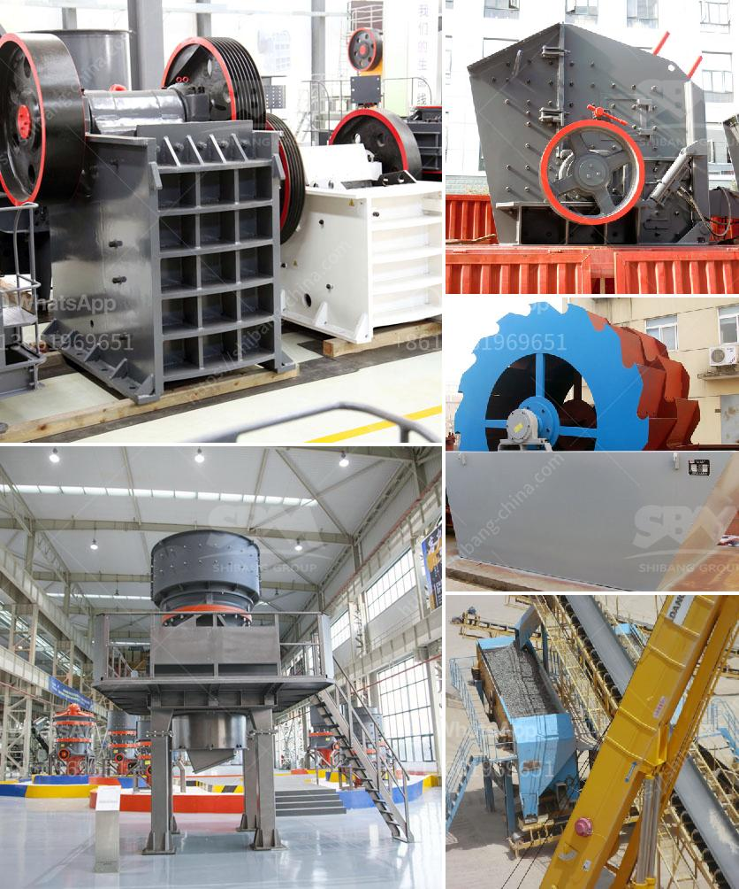

<h3>مورد كسارة الفك</h3>
مورد كسارة الفك هو نوع من المعدات الهندسية المستخدمة في صناعة التعدين والبناء والبنية التحتية. تعد الكسارة الفكية أحد أنواع الكسارات الأكثر شيوعًا واستخدامًا في هذه الصناعات بسبب قدرتها على سحق المواد الخام بكفاءة وسهولة.

تعمل الكسارة الفكية عن طريق وضع المواد الخام بين صفيحتين متحركتين (صفيحة تسمى ثابتة وأخرى متحركة). يتم ضغط المواد بين الصفيحتين ، ومن ثم تمريرها خلال مجرى الكسر ، حيث يتم سحق المواد وتقسيمها إلى قطع صغيرة. يتم تحقيق هذا الضغط العالي بفضل حركة متعرجة للصفيحة المتحركة ، مما يمكنها من سحق المواد بفعالية.

يتم استخدام مورد كسارة الفك في العديد من الصناعات. في صناعة التعدين ، تستخدم الكسارة لسحق المواد الخام المعدنية بحيث يصبح الحجم النهائي مناسبًا لعمليات معالجة أخرى مثل الترشيح والطحن. كما تستخدم في صناعة البناء لتكسير الحجارة والصخور والخرسانة المكسرة لإعادة تدويرها واستخدامها في مشاريع البناء الجديدة.

تتميز مورد كسارة الفك بالعديد من المزايا. فهي تتميز بكفاءة عالية في سحق المواد وتحويلها إلى قطع صغيرة. كما أنها تستخدم قوة ضغط عالية بفضل الصفائح المتحركة ، مما يسمح بسحق المواد الصلبة والصعبة بفعالية. علاوة على ذلك ، فإن الصفيحة الثابتة للكسارة تعمل كحماية للأجزاء الداخلية ، مما يضمن سلامة وموثوقية الكسارة.

وفي الختام ، تُعد مورد كسارة الفك أحد الأدوات الهامة في صناعة التعدين والبناء. تستخدم لسحق المواد الخام وتحويلها إلى قطع صغيرة يمكن معالجتها واستخدامها في العديد من التطبيقات. بفضل كفاءتها وسهولة استخدامها وقوتها ، فإن الكسارة الفكية تعد حلاً مثاليًا في عملية التشغيل الصناعي وتعمل على تحسين الإنتاجية وتقليل التكاليف.
<h3>Contact us</h3><ul><li><strong>Whatsapp:&nbsp;<a href="https://wa.me/8613661969651">+8613661969651</a></strong></li><li><a href="https://swt.shibang-china.com/?git&amp;zhl&amp;مورد كسارة الفك"><strong>Online Service(chat now)</strong></a></li></ul><h3>Related</h3><ul><li><a href='تكلفة مشروع نظام حزام الناقل.md'>تكلفة مشروع نظام حزام الناقل</a></li><li><a href='البوكسيت من مصانع الأسمنت في الهند.md'>البوكسيت من مصانع الأسمنت في الهند</a></li><li><a href='تأجير كسارة صغيرة دبلن.md'>تأجير كسارة صغيرة دبلن</a></li><li><a href='صنع مسحوق الكالسيوم.md'>صنع مسحوق الكالسيوم</a></li><li><a href='كسارة الفك في كينيا مصنعة.md'>كسارة الفك في كينيا مصنعة</a></li></ul>