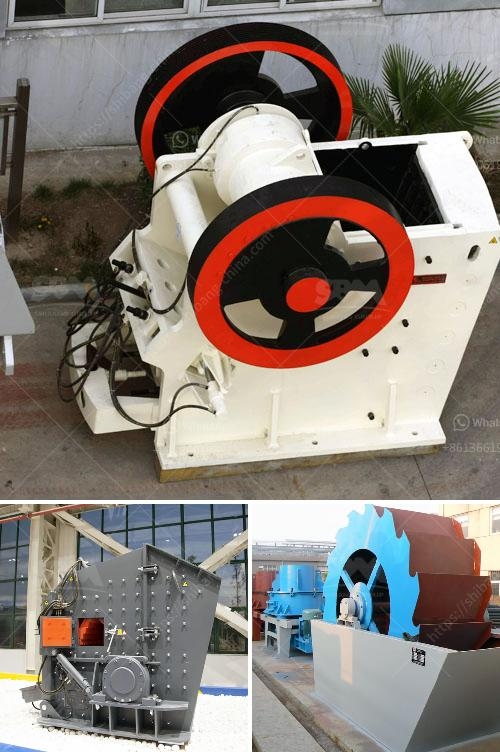

<h3>مورد كسارة النحاس</h3>
تحتل كسارات النحاس مكانة مهمة في صناعة التعدين والتصنيع بفضل قدرتها على استخراج وتكرير خام النحاس. يتم استخدام النحاس في العديد من الصناعات مثل صناعة السلك الكهربائي، وأنظمة السبك، وقطع غيار المحركات الكهربائية، وأنابيب المياه، والتكييفات وغيرها. ومع زيادة الطلب على هذه المنتجات في العالم، ازداد الاهتمام بتوافر مورد كسارات النحاس.

تعتبر مناجم النحاس المصدر الأساسي لكسارة النحاس، حيث يتم استخراج الخام من الأرض ومن ثم يتم نقله إلى المصانع للتصنيع. ومن المهم أن تكون كسارات النحاس عالية الكفاءة وفعالة لاستخراج أكبر كمية ممكنة من النحاس من الخام. ويستخدم هذا النحاس في إنتاج العديد من المنتجات التي تعتمد عليها الصناعة والحياة اليومية.

تعمل كسارة النحاس على سحق الخام، ثم يتم تحويلها إلى مسحوق ناعم، ومن ثم يتم فصل النحاس عن المواد الأخرى باستخدام طرق تقنية متقدمة مثل الفصل المغناطيسي أو التعويم. بعد ذلك، يتم تكرير النحاس حتى يتم الحصول على نقاوة مطلوبة وجودة عالية.

تعتبر تكنولوجيا الكسارات الحديثة تحفيزًا لصناعة التعدين والتصنيع، حيث تزود الشركات بالمعدات والآلات التي تضمن جودة وسرعة وكفاءة في عملية استخراج النحاس. كما أن تحسين أساليب استخراج النحاس يساهم في الحفاظ على بيئتنا وتقليل التأثيرات السلبية عليها.

وبصفة عامة، يتوقع أن يستمر الطلب على النحاس في الزيادة في السنوات القادمة مع تطور الصناعات المتقدمة والتحول نحو الطاقة النظيفة. وبالتالي، يجب أن تتواصل الجهود لتحسين تكنولوجيا الكسارات الحالية وتطوير أساليب استخراج النحاس الصديقة للبيئة والمستدامة.

باختصار، يلعب قطاع كسارات النحاس دورًا حيويًا في تزويد الصناعات المختلفة بالنحاس، وهو المعدن الثمين الذي يستخدم في العديد من المنتجات المهمة. بالتالي، يجب أن تتواصل جهود تطوير تكنولوجيا الكسارات الحديثة لكسب الكفاءة والفعالية وحماية البيئة.
<h3>Contact us</h3><ul><li><strong>Whatsapp:&nbsp;<a href="https://wa.me/8613661969651">+8613661969651</a></strong></li><li><a href="https://swt.shibang-china.com/?git&amp;zhl&amp;مورد كسارة النحاس"><strong>Online Service(chat now)</strong></a></li></ul><h3>Related</h3><ul><li><a href='معدات التعدين في جنوب أفريقيا.md'>معدات التعدين في جنوب أفريقيا</a></li><li><a href='مصنع تكسير الحجر الكلي في الصين.md'>مصنع تكسير الحجر الكلي في الصين</a></li><li><a href='الرمل المصنع مقابل الرمل الطبيعي.md'>الرمل المصنع مقابل الرمل الطبيعي</a></li><li><a href='طاحونة رايموند للفحم.md'>طاحونة رايموند للفحم</a></li><li><a href='مصنع كبير للكسارة بسعة ١٠٠٠ حجر.md'>مصنع كبير للكسارة بسعة ١٠٠٠ حجر</a></li></ul>