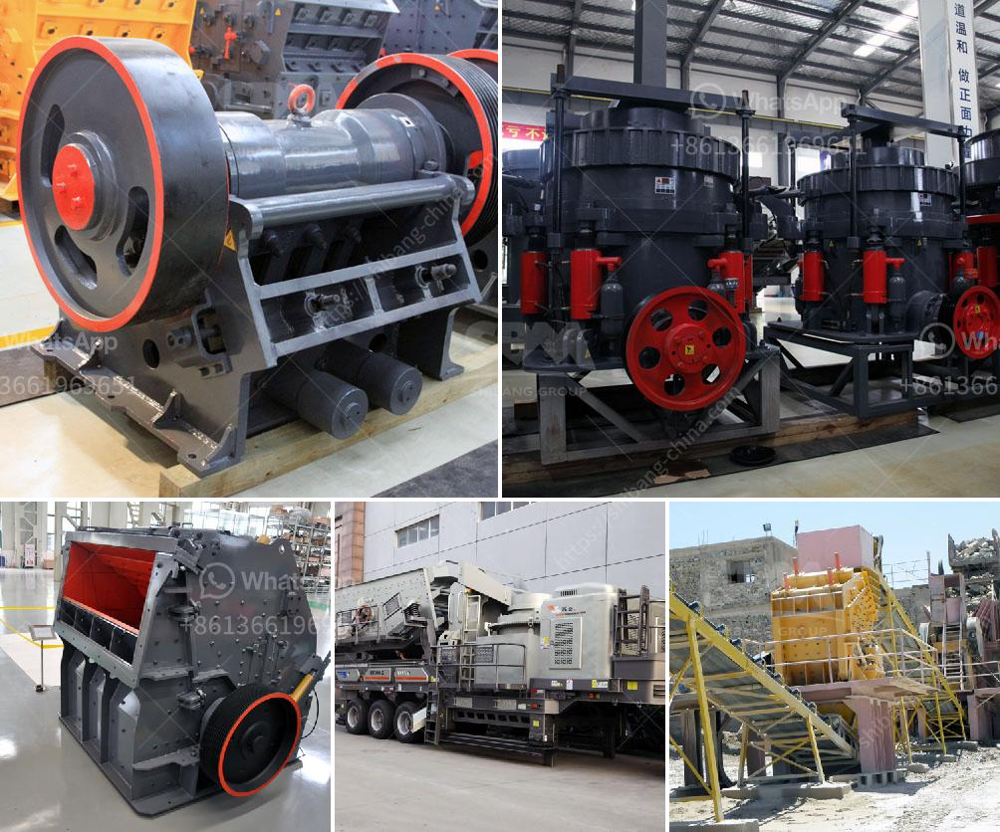

<h3>مورد كسارة في الصين</h3>
تعتبر الصين إحدى أكبر الدول المصنعة في العالم ولديها صناعة قوية في مجال تصنيع المعدات الثقيلة، ومن بين هذه المعدات تتميز كسارات الصخور. يعد اقتصاد البناء في الصين من أهم قطاعات النشاط الاقتصادي ويحتاج إلى توفير كميات كبيرة من الركام والحصى. ومن أجل تلبية هذه الاحتياجات المتزايدة، تعتمد شركات بناء في الصين بشكل كبير على شراء أجهزة كسارة من مقدمي الخدمات المحليين.

تتوفر العديد من الموردين المحليين لمعدات الكسارات في الصين، حيث يتنافس العديد من الشركات على تزويد السوق بمختلف أنواع الكسارات كالكسارات الفكية والكسارات الصدمية والكسارات المخروطية وغيرها. تتميز هذه الكسارات بالجودة العالية والأداء الممتاز، والتي تجعلها الخيار الأمثل لشركات البناء والمقاولات.

تتعدد استخدامات الكسارات في قطاعات البناء والهندسة المدنية، حيث يتم استخدامها لكسر الصخور الكبيرة وتفتيتها إلى قطع صغيرة قابلة للاستخدام في إنشاء الطرق والمباني والجسور والأنفاق وغيرها. تعمل الكسارات بواسطة محركات قوية وفعالة تقوم بتحويل الطاقة الكهربائية إلى طاقة ميكانيكية لتكسير الصخور بأحجام مختلفة.

من أهم الموردين الرئيسيين للكسارات في الصين، تجد شركات مثل شنغهاي شيبانج ماشيناري كو.، المحدودة وتشنغتشو سانمينغ للآلات والمعدات الهندسية وما إلى ذلك. تتميز هذه الشركات بخبرتها الواسعة في مجال تصنيع وتوفير معدات الكسارات لمختلف الأسواق العالمية. كما تحرص هذه الشركات على الابتكار والتطوير المستمر لمنتجاتها لتلبية الطلب المتزايد للعملاء.

يجب أخذ العديد من العوامل في الاعتبار عند اختيار مورد كسارة في الصين، مثل جودة وكفاءة المعدات المقدمة، والخدمات الفنية المتاحة، وسمعة المورد في السوق. يفضل أن يتم توقيع عقود رسمية مع المورد لضمان الجودة والتسليم في الوقت المحدد.

باختصار، يتمتع مورد كسارة في الصين بدور هام في تلبية احتياجات قطاع البناء في البلاد. وبفضل توفر العديد من الشركات المحلية المتخصصة وبمختلف الأنواع والموديلات، يكون للمشتري العديد من الخيارات لاختيار المورد الأمثل الذي يلبي احتياجاته ومتطلباته الفنية والتشغيلية.
<h3>Contact us</h3><ul><li><strong>Whatsapp:&nbsp;<a href="https://wa.me/8613661969651">+8613661969651</a></strong></li><li><a href="https://swt.shibang-china.com/?git&amp;zhl&amp;مورد كسارة في الصين"><strong>Online Service(chat now)</strong></a></li></ul><h3>Related</h3><ul><li><a href='مشغل مصنع كسارة في كسارة.md'>مشغل مصنع كسارة في كسارة</a></li><li><a href='مطحنة رايموند للبيع مستعملة.md'>مطحنة رايموند للبيع مستعملة</a></li><li><a href='مطحنة الكرة في معدات مصنع الألومنيوم.md'>مطحنة الكرة في معدات مصنع الألومنيوم</a></li><li><a href='سعر الطحن بالكرات.md'>سعر الطحن بالكرات</a></li><li><a href='آلة تعدين الذهب.md'>آلة تعدين الذهب</a></li></ul>