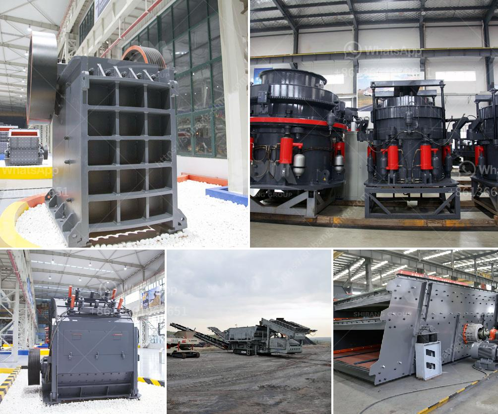

<h3>مورد لكسارة</h3>
تعتبر الكسارات أحد الوسائل الهامة في صناعة البناء والتشييد، حيث تستخدم لسحق الصخور والمواد الصلبة الأخرى لإنتاج الركام اللازم لإنشاء الطرق والمباني. وتعتبر الكسارة موردًا حيويًا لهذا النوع من الأعمال، فهي تكسر المواد الخام إلى أجزاء صغيرة يمكن استخدامها في إنتاج مواد البناء.

تتميز الكسارات بأنها توفر كمية كبيرة من الركام بسرعة وبأعلى جودة ممكنة. فالركام الذي يتم إنتاجه يمتاز بالقوة والمتانة، كما أنه مطابق للمواصفات الفنية المطلوبة في صناعة البناء. وتتوفر الكسارات بمختلف الأحجام والأنواع، حيث يمكن العثور على الكسارات الصغيرة التي يمكن نقلها بسهولة والكسارات الكبيرة التي تتطلب مساحة كبيرة للاستخدام.

إن استخدام الكسارات في صناعة البناء يوفر العديد من الفوائد الاقتصادية والبيئية. ففي الجانب الاقتصادي، يمكن توفير كميات كبيرة من المواد الخام بتكلفة منخفضة، كما أن أعمال تكسير المواد يمكن تنفيذها بشكل فعال وسريع. ومن الجانب البيئي، يساهم استخدام الكسارات في تدوير المواد والحفاظ على الموارد الطبيعية، حيث تمكن من إعادة استخدام الصخور والحجارة المكسرة في المشاريع البنائية الأخرى.

بالإضافة إلى ذلك، توفر الكسارات أيضًا فرص عمل للعديد من الأشخاص. فتشغيل الكسارات يتطلب فريقًا من العمال المهرة في التشغيل والصيانة. ويعمل هؤلاء العمال في ظروف صعبة ومناطق نائية، ويجدون في هذا القطاع فرصة لكسب لقمة العيش وتحسين ظروفهم المعيشية.

وفي النهاية، يمكن القول إن الكسارات هي مورد حيوي مهم في صناعة البناء، حيث تمكن من إنتاج الركام الضروري لتنفيذ المشاريع البنائية. وبفضل فوائدها الاقتصادية والبيئية، فإن استخدام الكسارات يساهم في دعم تطور البنية التحتية للمدن وتحسين حياة الناس.
<h3>Contact us</h3><ul><li><strong>Whatsapp:&nbsp;<a href="https://wa.me/8613661969651">+8613661969651</a></strong></li><li><a href="https://swt.shibang-china.com/?git&amp;zhl&amp;مورد لكسارة"><strong>Online Service(chat now)</strong></a></li></ul><h3>Related</h3><ul><li><a href='آلة كسارة في الفلبين.md'>آلة كسارة في الفلبين</a></li><li><a href='كسارة الكرة باكستان للبيع.md'>كسارة الكرة باكستان للبيع</a></li><li><a href='بيع الكسارات في ماليزيا.md'>بيع الكسارات في ماليزيا</a></li><li><a href='أسعار آلات تكسير الحجر في زيمبابوي.md'>أسعار آلات تكسير الحجر في زيمبابوي</a></li><li><a href='حساب تصميم مطحنة الكرة.md'>حساب تصميم مطحنة الكرة</a></li></ul>