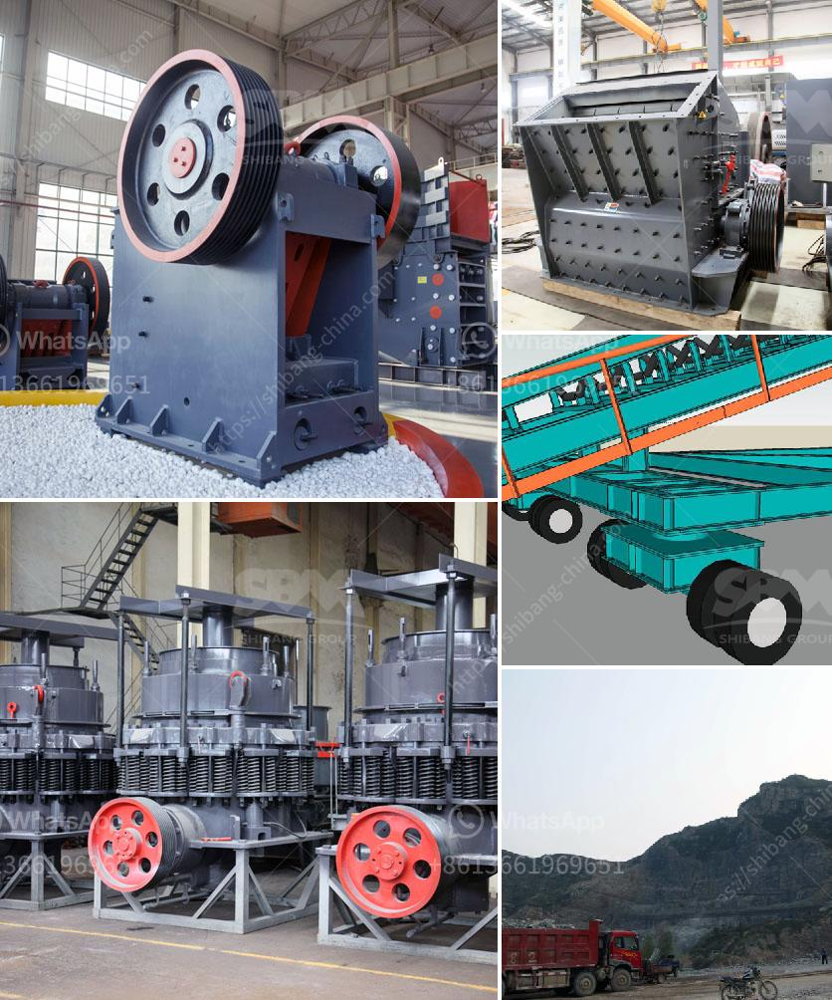

<h3>مورد محطة كسارة الحجر</h3>
تلعب محطات كسارة الحجر دورًا حاسمًا في صناعة البناء والتشييد. تُستخدم هذه المحطات لسحق الصخور الكبيرة إلى قطع صغيرة مناسبة للاستخدام في البناء والطرق والأعمال العامة الأخرى. تعتبر محطات كسارة الحجر موردًا حيويًا لهذه الصناعات وتساهم في التنمية الاقتصادية بشكل كبير.

تعمل محطات كسارة الحجر عن طريق سحق الصخور الكبيرة باستخدام آلات كسارة قوية. يتم تحميل الصخور في المحطة ومن ثم تُسحق بواسطة الآلات القوية التي تعمل بالضغط والاحتكاك. عند الانتهاء من عملية السحق، يتم تصفية الصخور للحصول على قطع صغيرة مناسبة للاستخدام. يمكن أن تُستخدم هذه الصخور في العديد من التطبيقات بما في ذلك الخرسانة والأسفلت والبناء وتعبيد الطرق.

من أهم المزايا لمحطات كسارة الحجر هو تقليل تكاليف البناء والتشييد. فبدلاً من استخدام الصخور الطبيعية، يمكن استخدام الصخور المسحوقة المنتجة من محطات كسارة الحجر. ينتج استخدام هذه الصخور المسحوقة توفيرًا كبيرًا في التكاليف والوقت المستغرق في نقل الصخور الطبيعية. بالإضافة إلى ذلك، فإن استخدام الصخور المسحوقة يقلل من احتياجات التنقيب عن الصخور الطبيعية، مما يحمي البيئة ويحفظ الموارد الطبيعية.

ومن أجل تلبية الطلب المتزايد على الحجر المسحوق، تم تطوير محطات كسارة الحجر لتتكيف مع احتياجات المشروعات المختلفة. توجد محطات صغيرة ومتوسطة وكبيرة، تعمل بطاقات إنتاج مختلفة. بعض المحطات تعمل بطاقة إنتاج صغيرة تبلغ حوالي 50 طن في الساعة، بينما تعمل المحطات الأكبر بطاقات إنتاج تصل إلى 1000 طن في الساعة.

تعتبر صناعة محطات كسارة الحجر قطاعًا مزدهرًا ومهمًا، حيث تشهد توسعًا وتطورًا مستمرًا. تستخدم هذه المحطات على نطاق واسع في العديد من البلدان حول العالم، مما يعكس الحاجة المستمرة للحجر المسحوق في صناعة البناء والتشييد.

باختصار، تُعد محطات كسارة الحجر موردًا حاسمًا في صناعة البناء والتشييد. تستخدم لسحق الصخور الكبيرة وتحويلها إلى قطع صغيرة مناسبة للاستخدام في البناء والطرق والبنية التحتية. توفر هذه المحطات فوائد اقتصادية كبيرة، بما في ذلك تقليل التكاليف والوقت وحماية الموارد الطبيعية. تعد صناعة محطات كسارة الحجر قطاعًا مزدهرًا ومتطورًا، وتشهد زيادة في الطلب على الحجر المسحوق في جميع أنحاء العالم.
<h3>Contact us</h3><ul><li><strong>Whatsapp:&nbsp;<a href="https://wa.me/8613661969651">+8613661969651</a></strong></li><li><a href="https://swt.shibang-china.com/?git&amp;zhl&amp;مورد محطة كسارة الحجر"><strong>Online Service(chat now)</strong></a></li></ul><h3>Related</h3><ul><li><a href='دراسة جدوى مشروع مصنع الإسمنت pdf.md'>دراسة جدوى مشروع مصنع الإسمنت pdf</a></li><li><a href='قطع غيار آلة المطحنة ووظيفتها.md'>قطع غيار آلة المطحنة ووظيفتها</a></li><li><a href='آلة تكسير الفك.md'>آلة تكسير الفك</a></li><li><a href='أسعار مطاحن المطرقة في الرأس الشرقي.md'>أسعار مطاحن المطرقة في الرأس الشرقي</a></li><li><a href='مصنع معالجة مسحوق الجبس في الهند.md'>مصنع معالجة مسحوق الجبس في الهند</a></li></ul>