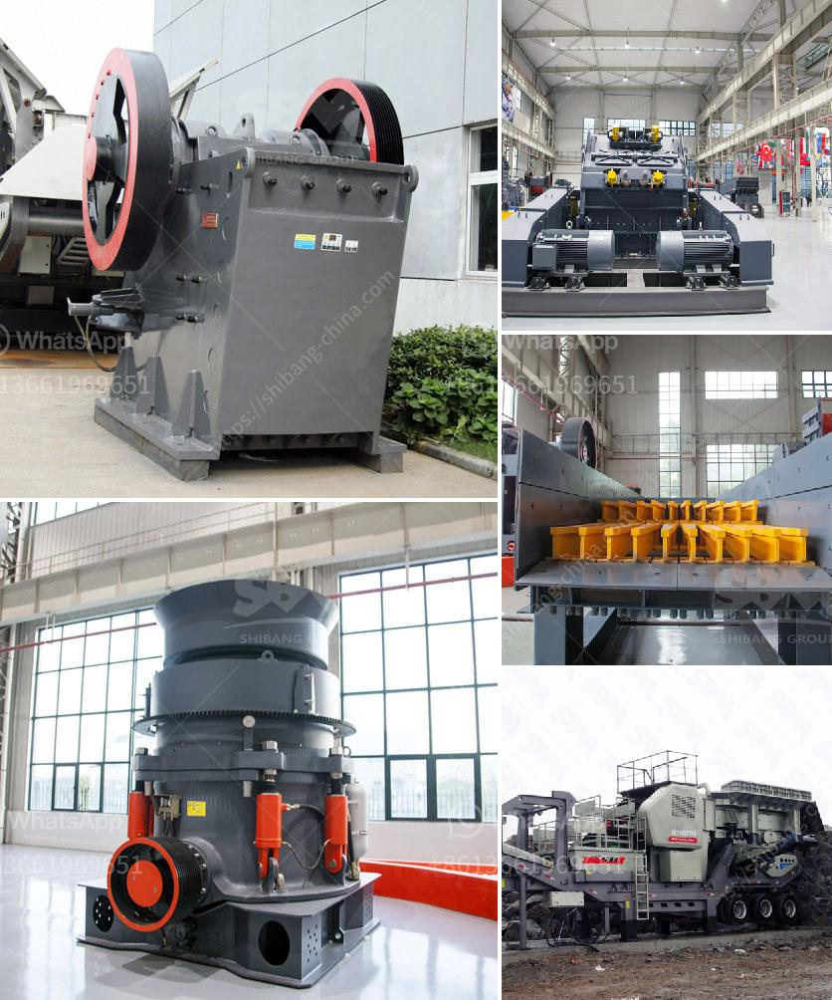

<h3>مورد مصنع التكسير والفرز في الصين</h3>
مصنع التكسير والفرز في الصين هو مصنع يقوم بسحق وفرز المواد الخام مثل الصخور والمعادن والحصى والرمال بغرض إنتاج مواد خام جاهزة للاستخدام في العديد من الصناعات المختلفة. تعتبر الصين واحدة من أكبر الدول المنتجة للمعادن والحجارة في العالم، وتشتهر بتصديرها الواسع لهذه المواد.

يتم تشغيل مصانع التكسير والفرز في الصين باستخدام معدات حديثة وتقنيات متقدمة تسمح بتحويل المواد الخام إلى منتجات نهائية قيمة. تتضمن عملية التكسير سحق المواد الخام إلى أحجام أصغر، وتتم عملية الفرز لفصل المواد المكسورة وفقًا لأحجامها وصفاتها المختلفة. تعمل هذه المصانع بشكل متسلسل وفعال لضمان تحقيق أعلى جودة للمنتجات النهائية.

من أبرز التطبيقات لمنتجات مصنع التكسير والفرز في الصين هي استخدامها في صناعة البناء. فمثلاً، تُستخدم الحصى المكسرة والرمل في إنتاج الخرسانة والأسفلت والطوب، وتعتبر هذه المنتجات أساسية لبناء المنازل والمباني والطرق. كما يمكن استخدامها في تعبيد الطرق وتأليف الأسطح المرصوفة، حيث توفر مواد التكسير والفرز الثبات والمتانة اللازمين لهذه الأعمال.

وبجانب صناعة البناء، تجد استخدامات أخرى لمنتجات المصنع في صناعات أخرى مثل صناعة الصلب والزجاج والسيراميك وصناعة المواد المضافة للأسمنت. تعد هذه الصناعات جزءًا أساسيًا من الاقتصاد الصيني المزدهر، وتعمل مصانع التكسير والفرز على تزويدها بالمواد الخام اللازمة لإنتاج منتجاتهم.

تعتبر صناعة المصانع المتخصصة في التكسير والفرز في الصين من أكبر الصناعات في البلاد، حيث تتواجد العديد من المصانع في جميع أنحاء الصين. تسهم هذه المصانع في تشغيل العديد من العمال وإيجاد فرص عمل جديدة، مما يعزز النمو الاقتصادي والتنمية المستدامة في البلاد.

في الختام، يعد مصنع التكسير والفرز في الصين من الصناعات الرئيسية في البلاد، حيث تلبي الطلب المحلي على المواد الخام اللازمة للصناعات المتنوعة. تعتبر هذه المصانع أيضًا موردين رئيسيين للمنتجات المصنعة للتصدير إلى العديد من الدول الأخرى حول العالم. تتمتع الصين بإمكانات هائلة في هذا القطاع، وتستمر في الاستثمار في تحديث التقنيات وتطوير العمليات لضمان تلبية احتياجات السوق المتزايدة بشكل مستدام وفعال.
<h3>Contact us</h3><ul><li><strong>Whatsapp:&nbsp;<a href="https://wa.me/8613661969651">+8613661969651</a></strong></li><li><a href="https://swt.shibang-china.com/?git&amp;zhl&amp;مورد مصنع التكسير والفرز في الصين"><strong>Online Service(chat now)</strong></a></li></ul><h3>Related</h3><ul><li><a href='وزير التعدين في غانا.md'>وزير التعدين في غانا</a></li><li><a href='مصنعي كسارات التعدين.md'>مصنعي كسارات التعدين</a></li><li><a href='كسارة للإيجار في نيو جيرسي.md'>كسارة للإيجار في نيو جيرسي</a></li><li><a href='كسارة حجر في إندونيسيا.md'>كسارة حجر في إندونيسيا</a></li><li><a href='معدات تكسير الحجر زينيث.md'>معدات تكسير الحجر زينيث</a></li></ul>