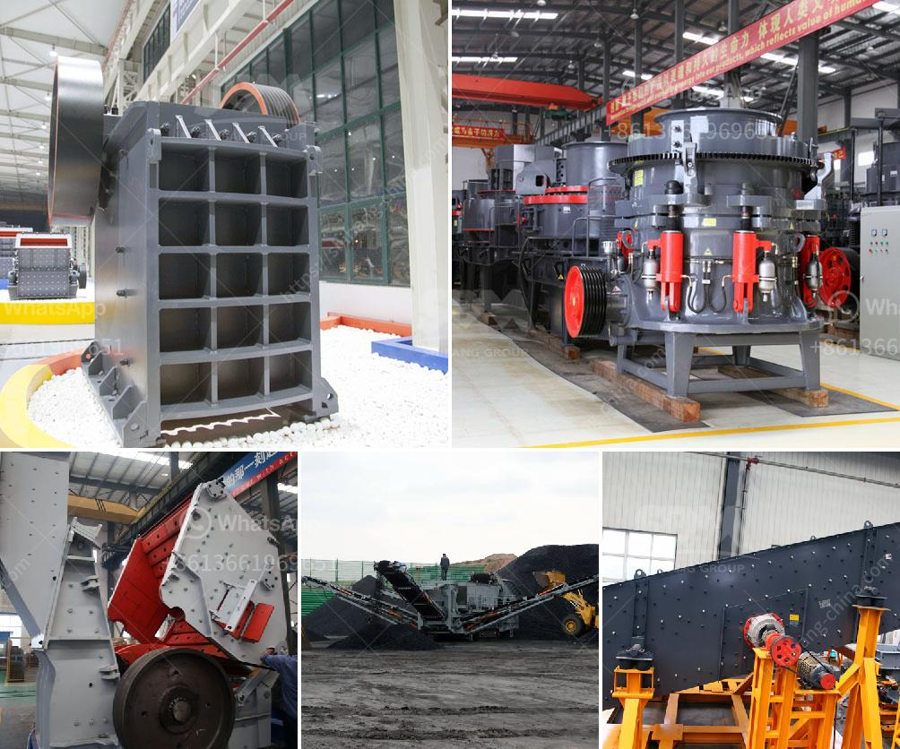

<h3>مورد مصنع الكسارة</h3>
تعتبر مصانع الكسارات من ضمن أهم المصانع في صناعة البناء والمقاولات، حيث تهدف إلى سحق الصخور الكبيرة إلى حجم صغير يستخدم في العديد من التطبيقات البنائية. تعتبر المصانع المتخصصة في صناعة الكسارات والتي تحتوي على العديد من المعدات المتقدمة والتقنيات الحديثة أساسية لتلبية احتياجات السوق.

يتكون مصنع الكسارة من العديد من العناصر الأساسية التي تعمل معًا لسحق الصخور بفعالية وكفاءة. يتم تحميل الصخور الكبيرة في الكسارة الأولية حيث يتم سحقها إلى قطع صغيرة باستخدام آليات قوية مثل الفكين الهيدروكونيكين. تنتقل القطع المسحوقة إلى الكسارة الثانوية حيث تتم عملية السحق النهائية للحصول على الحجم المطلوب.

تعتمد مصانع الكسارات على العديد من المعدات مثل الغرابيل والناقلات والتهوية لتسهيل عملية التحميل والتفريغ والفصل بين الصخور حسب الحجم. يتم تشغيل هذه المعدات بواسطة الطاقة الكهربائية أو الديزل.

يعتبر الكسارات مهمة جدًا في صناعة البناء حيث يتم استخدام الحصى والركام الذي تم سحقه من قبلها في الخرسانة والأسفلت والتربة المحسنة والأساسات الطرقية والإنشاءات الأخرى. ولذلك فإن جودة المنتج النهائي التي تحققها مصانع الكسارات مهمة جدًا للمشاريع البنائية.

يتطلب مصنع الكسارة الناجح عملية إدارة فعالة للموارد لضمان انتاجية عالية وتقديم المنتجات ذات الجودة العالية. يتطلب ذلك رصد وتقييم مستمر للعمليات وضبط الجودة وضمان السلامة في مكان العمل. بالإضافة إلى ذلك، فمن المهم أيضًا التفكير في تحسين الاستدامة البيئية من خلال اتخاذ إجراءات للتحكم في الغبار والضوضاء وإدارة المخلفات بشكل صحيح.

في الختام، يمكن القول إن مصنع الكسارة يلعب دورًا حاسمًا في صناعة البناء والمقاولات. يتميز بتحقيق الإنتاجية والجودة والاستدامة، مما يلبي احتياجات السوق ويساهم في تقدم البنى التحتية في البلاد.
<h3>Contact us</h3><ul><li><strong>Whatsapp:&nbsp;<a href="https://wa.me/8613661969651">+8613661969651</a></strong></li><li><a href="https://swt.shibang-china.com/?git&amp;zhl&amp;مورد مصنع الكسارة"><strong>Online Service(chat now)</strong></a></li></ul><h3>Related</h3><ul><li><a href='مطحنة ريموند ميكرو بلفرايزر.md'>مطحنة ريموند ميكرو بلفرايزر</a></li><li><a href='سعر التحسين العالي لطحن الكرة.md'>سعر التحسين العالي لطحن الكرة</a></li><li><a href='مصانع محمولة للبيع في جنوب أفريقيا.md'>مصانع محمولة للبيع في جنوب أفريقيا</a></li><li><a href='معدات تعدين الذهب على نطاق صغير للبيع في مزاد.md'>معدات تعدين الذهب على نطاق صغير للبيع في مزاد</a></li><li><a href='آلة غسيل الرمال للبيع.md'>آلة غسيل الرمال للبيع</a></li></ul>