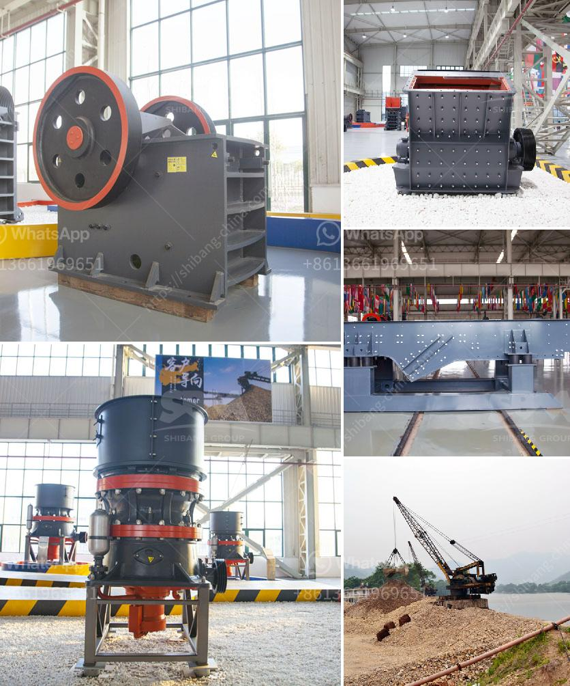

<h3>مورد مصنع تكسير الحجر في الفلبين</h3>
تعد صناعة تكسير الحجر من أهم الصناعات البنائية، حيث يتم استخدام الحجر المكسر في العديد من التطبيقات البنائية والإنشائية. وفي الفلبين، تعد صناعة تكسير الحجر من الصناعات الهامة التي تساهم في تطور وازدهار البنية التحتية للبلاد.

توجد العديد من المصانع في الفلبين التي تقوم بتكسير الحجر وتوريده للسوق المحلية والعالمية، حيث تعمل هذه المصانع بأحدث التقنيات والمعدات لضمان تحقيق أعلى معايير الجودة والكفاءة في منتجاتها. تحرص هذه المصانع على توفير مجموعة متنوعة من الحجارة المكسرة التي تتناسب مع احتياجات العملاء المختلفة.

يتم استخدام الحجر المكسر في العديد من الأغراض، مثل بناء الطرق والجسور والمباني والمستشفيات والمدارس، بالإضافة إلى تطبيقاته في الصناعات الأخرى مثل البناء البحري والنفط والغاز والتعدين. تعتبر الفلبين بلدًا ذات طبيعة خصبة حيث توجد بها مصادر طبيعية غنية من الحجر، مما يجعلها وجهة مثالية لاستثمار مصانع تكسير الحجر.

تحقق مصانع تكسير الحجر في الفلبين العديد من المزايا، فهي توفر فرص عمل للمحليين، وتدعم الاقتصاد المحلي من خلال تعزيز الصناعات البنائية والتعدينية وتلبية احتياجات السوق المحلية والعالمية. بالإضافة إلى ذلك، فإن منتجات مصانع تكسير الحجر تتمتع بسمعة جيدة بسبب جودتها وموثوقيتها.

ويجب أن لا يُغفل أهمية الاهتمام بالبيئة في صناعة تكسير الحجر. تعمل هذه المصانع على تنفيذ ممارسات مستدامة وصديقة للبيئة للحفاظ على البيئة المحيطة، مثل استخدام معدات خضراء وتدوير المواد النفايات وتحسين كفاءة استهلاك الطاقة.

في الختام، تعد صناعة تكسير الحجر في الفلبين من الصناعات الحيوية والمهمة، حيث تقوم بتوفير الحجر المكسر اللازم للبناء والإنشاءات في البلاد. تمثل هذه المصانع إضافة قوية للاقتصاد المحلي وتعزز الصناعات البنائية والتعدينية في البلاد. وبفضل الاهتمام بالجودة والكفاءة والاستدامة، تعد منتجات مصانع تكسير الحجر في الفلبين مطلوبة على نطاق واسع في السوق المحلية والعالمية.
<h3>Contact us</h3><ul><li><strong>Whatsapp:&nbsp;<a href="https://wa.me/8613661969651">+8613661969651</a></strong></li><li><a href="https://swt.shibang-china.com/?git&amp;zhl&amp;مورد مصنع تكسير الحجر في الفلبين"><strong>Online Service(chat now)</strong></a></li></ul><h3>Related</h3><ul><li><a href='تقرير مشروع تصنيع الطوب الرملي.md'>تقرير مشروع تصنيع الطوب الرملي</a></li><li><a href='مصنع غسل الذهب msi المستخدم.md'>مصنع غسل الذهب msi المستخدم</a></li><li><a href='مصنع تكسير الحصى بمقياس كبير.md'>مصنع تكسير الحصى بمقياس كبير</a></li><li><a href='حجم مدخلات ومخرجات مصنع تكسير الكوارتز.md'>حجم مدخلات ومخرجات مصنع تكسير الكوارتز</a></li><li><a href='سعر مصنع كسارة الحجر في ألمانيا.md'>سعر مصنع كسارة الحجر في ألمانيا</a></li></ul>