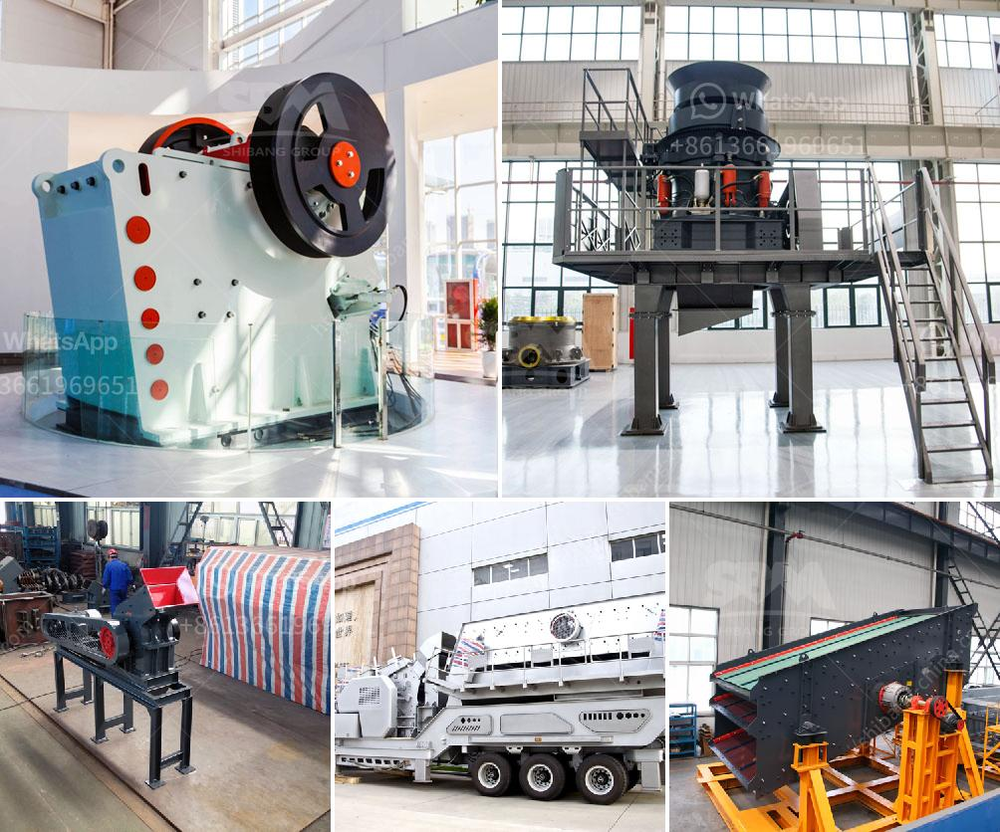

<h3>مورد معدات الكسارة في غانا</h3>
تعد غانا واحدة من أهم الدول النامية في قارة أفريقيا وتشتهر بوجود مصادر غنية من الموارد الطبيعية مثل الذهب والبوكسيت والمنغنيز والدولوميت والتيتانيوم والنفط. وتعتبر صناعة التعدين واحدة من أهم القطاعات الاقتصادية في البلاد. وتعتمد عملية التعدين على استخدام معدات الكسارة، التي تعد أساسية لتحطيم وطحن المواد الصلبة والتي تسهم في استخراج المعادن والمواد الأخرى من الأرض.

مورد معدات الكسارة في غانا يلعب دورًا مهمًا في تزويد شركات التعدين بالمعدات اللازمة لعمليات التعدين. وتتوفر مجموعة واسعة من معدات الكسارة التي يتم توريدها في غانا بما في ذلك الكسارات المركبة والكسارات الفكية والكسارات التصادمية والكسارات المخروطية والكسارات الواجبة والمطارق الهيدروليكية والشاشات الاهتزازية والناقلات.

تتوفر مختلف أنواع المعدات وتكون متوفرة من مصادر داخل البلاد أو واردة من الخارج. يتم توريد بعض المعدات محليًا بواسطة الشركات المحلية المتخصصة في تصنيع وتوزيع المعدات والآلات الصناعية. أما المعدات الأخرى، فتوفر من خلال الشركات العالمية المتخصصة التي تصدر معداتها إلى غانا وتعمل بالتعاقد المباشر مع شركات التعدين المحلية.

يمكن تصنيف معدات الكسارة استنادًا إلى الاحتياجات والتطبيقات المحددة لشركات التعدين. فمثلاً، تستخدم الكسارات المخروطية في المقام الأول لتفتيت المعادن إلى جزيئات صغيرة ولطحنها بالتساوي. أما الكسارات الفكية، فتعتبر مثالية لتحطيم المواد الصلبة وتقسيمها إلى أحجام أصغر. وتستخدم الكسارات التصادمية لتحطيم المواد المتوسطة والقوية ويتم تركيبها عادة في خطوط إنتاج متعددة.

لضمان جودة المعدات الموردة، يتم التأكد من أن تلك المعدات تلبي المعايير القياسية وتمتلك شهادات الجودة اللازمة. كما يتم توفير خدمات ما بعد البيع من قبل الموردين لتقديم الدعم الفني والصيانة وتدريب العملاء على كيفية استخدام المعدات بشكل صحيح وآمن.

بهذه الطريقة، يلعب مورد معدات الكسارة في غانا دورًا حاسمًا في تطوير صناعة التعدين بالبلاد، بما في ذلك تحسين الإنتاجية وزيادة الكفاءة وتحقيق أقصى استفادة من الموارد الطبيعية المتاحة. كما يعزز هذا القطاع الاقتصادي ويسهم في توفير فرص العمل وزيادة الاستثمار في غانا.
<h3>Contact us</h3><ul><li><strong>Whatsapp:&nbsp;<a href="https://wa.me/8613661969651">+8613661969651</a></strong></li><li><a href="https://swt.shibang-china.com/?git&amp;zhl&amp;مورد معدات الكسارة في غانا"><strong>Online Service(chat now)</strong></a></li></ul><h3>Related</h3><ul><li><a href='سيور ناقلة في ماليزيا.md'>سيور ناقلة في ماليزيا</a></li><li><a href='مصنع مكثف الزنك المحمول.md'>مصنع مكثف الزنك المحمول</a></li><li><a href='قائمة أسعار الشاشات الاهتزازية.md'>قائمة أسعار الشاشات الاهتزازية</a></li><li><a href='طريقة فحص عمودية.md'>طريقة فحص عمودية</a></li><li><a href='مصنع تحسين أكسيد النحاس في الصين.md'>مصنع تحسين أكسيد النحاس في الصين</a></li></ul>