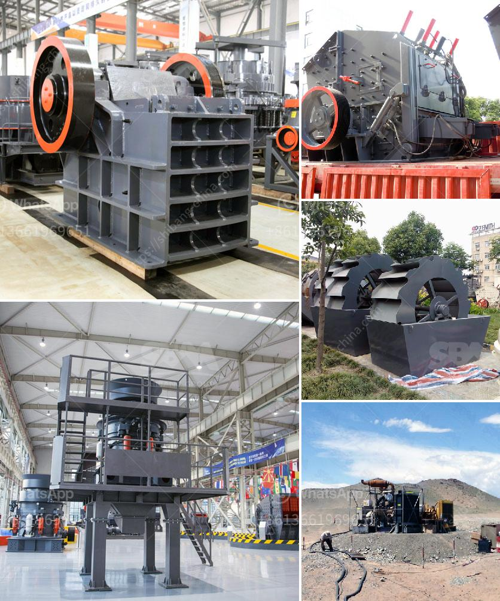

<h3>مورد معدات فصل الوسط الكثيف</h3>
يعد مورد معدات فصل الوسط الكثيف أداة أساسية في صناعة التعدين ومعالجة المعادن، ويستخدم على نطاق واسع في عمليات فصل معادن الثقل النوعي العالي عن المواد الأخرى ذات الوزن الأخف والوسط.

تشمل معدات فصل الوسط الكثيف قائمة من التجهيزات التي تتضمن المغسلة الجاذبة، الجداول الاهتزازية، الفاصل الكهربائي والمختلف الفصلات الطبقية. يتم استخدام هذه الأدوات لتحقيق فصل فعال للمواد المعدنية من شوائب أخرى مثل الرمال والتراب.

يتم تعبئة المعدات بالماء المثقل بطريقة معينة تتيح للجاذبات الثقيلة الركوب على قاع المعدات، بينما تعوق الجسيمات الخفيفة الصعود إلى الأعلى. يتم تعديل الشدة والتركيز للحصول على فصل فعال، حيث يتم جمع المعادن الجاذبة في أحواض التجميع، بينما تمر المواد الأخف فوق وحدها.

يعتبر المورد الذي يوفر معدات فصل الوسط الكثيف أحد أهم العناصر لضمان التشغيل السلس والفعال لسلسلة عمليات التعدين والمعالجة. يجب أن تتمتع هذه المعدات بجودة عالية وتصميم متقدم، حيث تتطلب التكنولوجيا المتطورة لتحقيق أداء ممتاز.

يسمح المورد المحترف للمعدات بتوفير الدعم والتدريب اللازم لمشغليها، حيث يضمن تركيب المعدات الصحيح وتحقيق أفضل النتائج. كما أن المورد الموثوق به يقدم الصيانة الدورية والتحديثات التكنولوجية للمطابقة مع التطورات والاحتياجات الجديدة.

عند اختيار مورد معدات فصل الوسط الكثيف، يجب أن يتمتع بسمعة ممتازة في السوق والقدرة على تلبية متطلبات عملائه. يجب الاهتمام أيضًا بجودة المنتج والاستجابة السريعة لأي مشاكل تطرأ على المعدات.

باختصار، فإن مورد معدات فصل الوسط الكثيف يعتبر شريكًا أساسيًا للتعدين وصناعة المعادن. يجب اختيار المورد بعناية لضمان الجودة والأداء الممتاز، ويجب أن يقدم الدعم اللازم والتدريب المستمر. من الضروري أيضًا الحفاظ على صيانة المعدات لضمان تشغيلها المستمر والفعال.
<h3>Contact us</h3><ul><li><strong>Whatsapp:&nbsp;<a href="https://wa.me/8613661969651">+8613661969651</a></strong></li><li><a href="https://swt.shibang-china.com/?git&amp;zhl&amp;مورد معدات فصل الوسط الكثيف"><strong>Online Service(chat now)</strong></a></li></ul><h3>Related</h3><ul><li><a href='خط تكسير الحجر الجرانيت.md'>خط تكسير الحجر الجرانيت</a></li><li><a href='مطحنة الكرة لمسحوق الكوارتز في تاميل نادو.md'>مطحنة الكرة لمسحوق الكوارتز في تاميل نادو</a></li><li><a href='مطاحن الهامر المستخدمة في تعدين الذهب.md'>مطاحن الهامر المستخدمة في تعدين الذهب</a></li><li><a href='تعدين الجبس والكروم والحجر الجيري.md'>تعدين الجبس والكروم والحجر الجيري</a></li><li><a href='مشاكل طحن السخام.md'>مشاكل طحن السخام</a></li></ul>