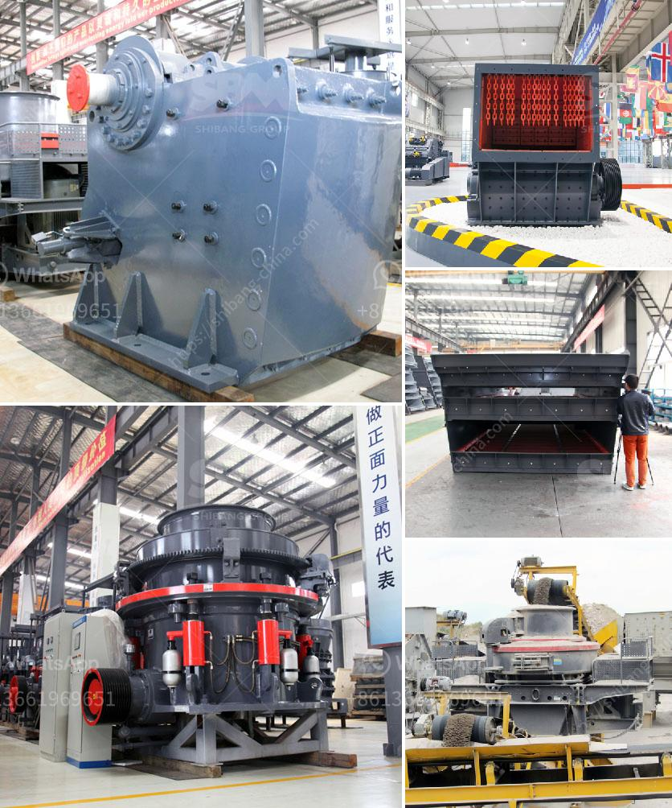

<h3>موردي آلات الأسمنت ووحدة الطحن</h3>
تعتبر آلات الأسمنت ووحدة الطحن أحد العوامل الرئيسية في صناعة الأسمنت، حيث تقوم بطحن المواد الخام وتقسيمها إلى جزيئات صغيرة لتحصل على الخليط المطلوب لإنتاج الأسمنت. وفي هذه المقالة سنتحدث عن موردي آلات الأسمنت ووحدة الطحن ودورهم الحيوي في تلبية احتياجات الصناعة.

تلعب آلات الأسمنت ووحدة الطحن دورًا هامًا في عملية إنتاج الأسمنت. فهذه الآلات تقوم بطحن المواد الخام مثل الحجر الجيري والطين والحديد الطري وغيرها من المكونات إلى مسحوق ناعم. وبعد ذلك، تقوم الوحدة بخلط المواد الخام المطحونة مع الغضار وتسخينها في فرن الأسمنت لإنتاج الكلنكر.

واختيار موردي آلات الأسمنت ووحدة الطحن الجيدين يعتبر أمرًا حاسمًا لنجاح عملية إنتاج الأسمنت. فمن المهم أن يكونوا على دراية بأحدث التقنيات والابتكارات في هذا المجال. كما ينبغي أن يتمتعوا بمعرفة وخبرة واسعة في تصميم وتصنيع الآلات الخاصة بصناعة الأسمنت.

أما عن فوائد اختيار موردي آلات الأسمنت ووحدة الطحن بعناية، فإنه يمكن أن يؤدي ذلك إلى زيادة كفاءة عملية الإنتاج وتقليل تكاليف التشغيل. حيث يمكن للآلات ذات الكفاءة العالية أن تزيد من إنتاجية المصنع وتقلل من استهلاك الطاقة. كما يمكن للآلات الحديثة أن تضمن جودة المنتج النهائي وتحسن من خصائصه.

ومن مزايا العمل مع موردين ذوي سمعة طيبة، أنهم يقدمون خدمات ما بعد البيع الممتازة مثل التركيب والتدريب والصيانة الدورية. فهم يقدمون الدعم الفني والمساعدة اللازمة لضمان تشغيل سلس للمعدات واستمرارية الإنتاج بأفضل شكل ممكن.

وفي النهاية، يمكن القول إن اختيار موردي آلات الأسمنت ووحدة الطحن المناسبين يعد أمرًا حاسمًا لنجاح صناعة الأسمنت. فعملية الطحن والخلط تؤثر بشكل كبير على جودة الأسمنت النهائي، ويمكن للآلات الحديثة والمتطورة أن تحسن أداء العمليات وتزيد من كفاءة الإنتاج. لذلك، ينبغي اختيار الموردين بعناية والسعي للعمل مع الشركات ذات الخبرة والتقنية المتقدمة.
<h3>Contact us</h3><ul><li><strong>Whatsapp:&nbsp;<a href="https://wa.me/8613661969651">+8613661969651</a></strong></li><li><a href="https://swt.shibang-china.com/?git&amp;zhl&amp;موردي آلات الأسمنت ووحدة الطحن"><strong>Online Service(chat now)</strong></a></li></ul><h3>Related</h3><ul><li><a href='كسارة التعدين في تنزانيا.md'>كسارة التعدين في تنزانيا</a></li><li><a href='دراسة جدوى لإنشاء محجر.md'>دراسة جدوى لإنشاء محجر</a></li><li><a href='قائمة أسعار معدات كسارة الحجر الثقيلة.md'>قائمة أسعار معدات كسارة الحجر الثقيلة</a></li><li><a href='معدات التعدين في جنوب أفريقيا.md'>معدات التعدين في جنوب أفريقيا</a></li><li><a href='شركة تصنيع آلات الحجر في إيروود.md'>شركة تصنيع آلات الحجر في إيروود</a></li></ul>