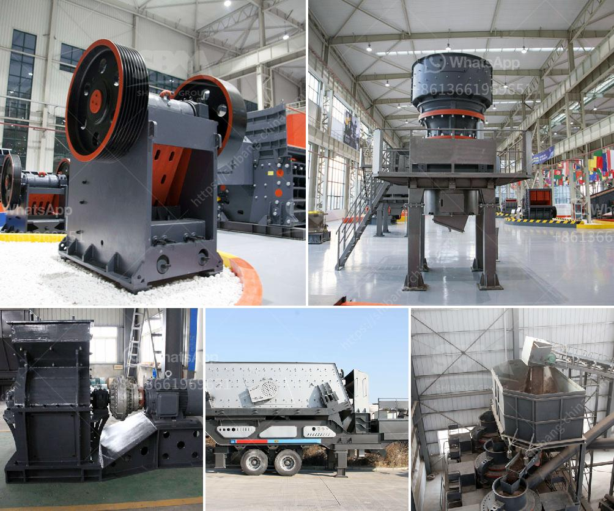

<h3>موردي آلة فحص الفحم</h3>
آلة فحص الفحم هي واحدة من الأدوات الهامة في صناعة التعدين والنقل والطاقة. تستخدم هذه الآلة لفحص الفحم وتصنيفه حسب الحجم والجودة. تعتمد عملية فحص الفحم على عدة معايير مثل الحجم واللزوجة والرطوبة والمحتوى الكبريتي.

إحدى الشركات التي تعمل في توفير موردي آلات فحص الفحم هي شركة "XYZ". توفر هذه الشركة مجموعة متنوعة من الآلات التي تناسب احتياجات العملاء المختلفة. تتميز آلاتها بتكنولوجيا متقدمة وأداء عالي.

تتضمن مجموعة "XYZ" من آلات فحص الفحم الآلية واليدوية. تعمل الآلات الآلية بواسطة نظام الكمبيوتر الذي يمكن برمجته وضبطه حسب المعايير المطلوبة. تستخدم هذه الآلات أشعة الليزر والأشعة تحت الحمراء لفحص الفحم بدقة وسرعة عالية.

بالإضافة إلى ذلك، توفر شركة "XYZ" أيضًا آلات فحص الفحم اليدوية للاستخدام في المناجم الصغيرة والمرافق ذات الحجم المحدود. تحتوي هذه الآلات على مقابض قابلة للتعديل ومغايرة في الأحجام لتلبية متطلبات الفحص المختلفة.

تعتبر آلات فحص الفحم التي تقدمها شركة "XYZ" موثوقة وفعالة. تجري الشركة اختبارات موثوقة ومهنية على آلاتها لضمان جودتها وأدائها المتميز. تقدم الشركة أيضا خدمة ما بعد البيع الممتازة وقطع الغيار الأصلية للعملاء.

باختيار مورد آلة فحص الفحم المناسب، يمكن للشركات في صناعة التعدين والنقل والطاقة زيادة كفاءتها وتحسين جودة الفحم. يمكن استخدام الفحم النقي والمصنف بدقة في عدة تطبيقات مثل توليد الطاقة وصناعة المواد الكيميائية.

باختصار، آلة فحص الفحم هي أداة حيوية في عملية فرز وتصنيف الفحم. تجلب شركة "XYZ" تقنيات متقدمة وجودة عالية في آلاتها. باستخدام هذه الآلات، يمكن للمناجم وشركات النقل ومحطات توليد الطاقة أن تعتمد على الفحم ذو الجودة العالية في أنشطتها المختلفة.
<h3>Contact us</h3><ul><li><strong>Whatsapp:&nbsp;<a href="https://wa.me/8613661969651">+8613661969651</a></strong></li><li><a href="https://swt.shibang-china.com/?git&amp;zhl&amp;موردي آلة فحص الفحم"><strong>Online Service(chat now)</strong></a></li></ul><h3>Related</h3><ul><li><a href='مصنع تصنيع الدولوميت.md'>مصنع تصنيع الدولوميت</a></li><li><a href='مطحنة الطحن الصينية.md'>مطحنة الطحن الصينية</a></li><li><a href='جهاز كسر الكوارتز الصغير.md'>جهاز كسر الكوارتز الصغير</a></li><li><a href='مورد كسارة النحاس.md'>مورد كسارة النحاس</a></li><li><a href='شاشة اهتزاز في إندونيسيا.md'>شاشة اهتزاز في إندونيسيا</a></li></ul>