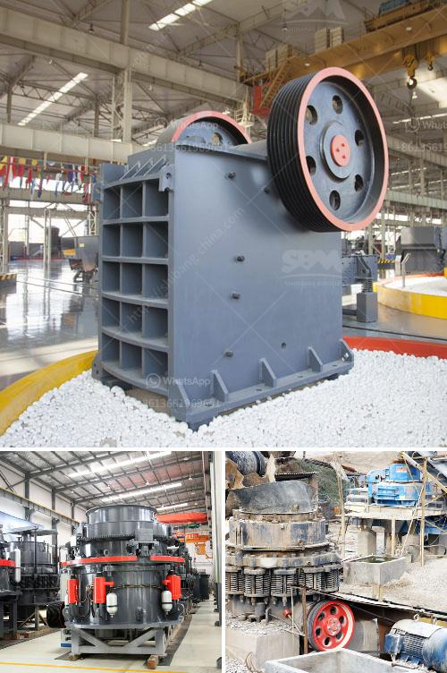

<h3>موردي خط إنتاج الحبر</h3>
تعتبر صناعة الحبر أحد الصناعات الهامة والحيوية في العديد من القطاعات التجارية والصناعية. وللحفاظ على استمرارية عملية الإنتاج وضمان جودة المنتجات، يعتبر اختيار موردي خط إنتاج الحبر ذو أهمية بالغة.

يعد مورد خط إنتاج الحبر الشريك الرئيسي للشركات المصنعة، حيث يقدم المواد الخام الضرورية والمعدات اللازمة لتصنيع الحبر بجودة عالية وفقًا للمعايير الصناعية المطلوبة. قد يكون الحبر المستخدم في الطابعات أو الأجهزة الإلكترونية أو حتى في صناعة الطباعة الفنية والتجارية، ومن ثم يجب أن يتم اختيار الموردين بعناية لضمان حصول الشركة على المنتجات ذات الجودة العالية والتسليم في الوقت المحدد.

تعد جودة المواد الخام المستخدمة في تصنيع الحبر من العوامل الحاسمة التي تؤثر على جودة المنتج النهائي. يجب على الموردين توفير المكونات الأساسية للحبر ذات جودة عالية والتي تلبي متطلبات الشركة المصنعة. يجب أن يعملوا بشكل مستمر على تطوير وتحسين المواد الخام، والاستجابة لأي تغييرات في متطلبات الشركة.

بالإضافة إلى ذلك، يجب أن يتوفر لدى موردي خط إنتاج الحبر المعدات والآلات الحديثة التي تتميز بالكفاءة والأداء العالي. يعتبر اختيار المورد الذي يقدم أحدث التقنيات في مجال تصنيع الحبر من الأمور الهامة للشركات المصنعة للحبر. يساعد استخدام التكنولوجيا الحديثة في زيادة الإنتاجية وتحسين جودة المنتجات.

علاوة على ذلك، يجب أن يكون المورد قادرًا على تلبية الطلب المتزايد على الحبر وتقديم الكميات المطلوبة خلال فترات زمنية محددة. يجب أن يعمل المورد بكفاءة عالية ويكون لديه القدرة على التوفير السريع للمنتجات عند الحاجة، فهذا يساعد الشركة في الوفاء بمتطلبات العملاء النهائيين في الوقت المحدد وتحسين سمعتها في السوق.

باختصار، يعتبر اختيار موردي خط إنتاج الحبر أمرًا بالغ الأهمية لضمان استدامة العملية الإنتاجية وتحقيق أعلى مستويات الجودة للمنتجات. يجب على الشركات المصنعة للحبر البحث والتحقق من خلفية الموردين المحتملين ومتطلبات الجودة اللازمة والتسليم في الوقت المحدد. إن اختيار المورد المناسب يضمن توافر المواد الخام عالية الجودة والأداء المتميز للمعدات، مما يؤدي إلى تحسين العملية الإنتاجية وتحقيق رضا العملاء.
<h3>Contact us</h3><ul><li><strong>Whatsapp:&nbsp;<a href="https://wa.me/8613661969651">+8613661969651</a></strong></li><li><a href="https://swt.shibang-china.com/?git&amp;zhl&amp;موردي خط إنتاج الحبر"><strong>Online Service(chat now)</strong></a></li></ul><h3>Related</h3><ul><li><a href='أسعار مطاحن المطرقة في الرأس الشرقي.md'>أسعار مطاحن المطرقة في الرأس الشرقي</a></li><li><a href='ما هو مطحنة الكرة.md'>ما هو مطحنة الكرة</a></li><li><a href='تحجيم مطاحن الكرة.md'>تحجيم مطاحن الكرة</a></li><li><a href='معدات تعدين الصغيرة مصنعين في جنوب أفريقيا.md'>معدات تعدين الصغيرة مصنعين في جنوب أفريقيا</a></li><li><a href='كسارة الحجر للبيع الفلبين.md'>كسارة الحجر للبيع الفلبين</a></li></ul>