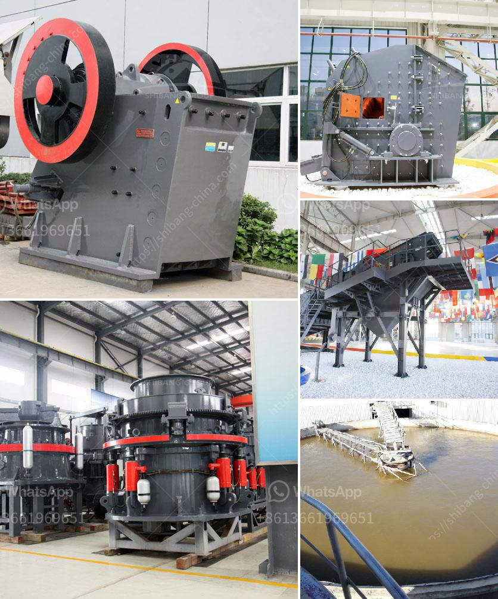

<h3>موردي قطع غيار مطحنة الطحن</h3>
تعتبر موردي قطع غيار مطحنة الطحن أحد اللاعبين الرئيسيين في صناعة الأعلاف وصناعات الغذاء بشكل عام. فبفضل توفر قطع الغيار المناسبة والتي تضمن استمرارية عمل المطحنة بكفاءة عالية، يتمكن المصانع والمزارع من إنتاج المنتجات ذات الجودة العالية التي يتطلبها السوق. في هذه المقالة، سنتحدث عن أهمية موردي قطع غيار مطحنة الطحن ودورهم في تحقيق الاستدامة والكفاءة في هذه الصناعة.

أولاً وقبل كل شيء، يتوقف أداء مطحنة الطحن على حالة القطع الغيار المستخدمة. فقطع الغيار المتآكلة أو التالفة تؤثر سلباً على كفاءة المطحنة وتزيد من استهلاك الطاقة بشكل غير ضروري. لذا، يعتبر توفير قطع الغيار المناسبة وتحديثها بشكل منتظم أمراً ضرورياً لضمان استمرارية الإنتاجية والحصول على نتائج مرضية.

ثانياً، يؤثر موردي قطع غيار مطحنة الطحن على جودة المنتج النهائي. فالمطاحن التي تعتمد على قطع الغيار ذات الجودة العالية يمكنها تحقيق طحن دقيق ومتساوٍ للمحاصيل الزراعية مثل الحبوب والذرة والشعير. وهذا بدوره يؤثر على جودة المواد الغذائية التي تنتجها هذه المطاحن. فعلى سبيل المثال، المطاحن ذات القدرة على طحن الحبوب بشكل متساوٍ ودقيق تؤدي إلى إنتاج الطحين ذو الجودة العالية الذي يستخدم في صناعة المخبوزات والمعجنات.

ثالثاً، يمكن لموردي قطع غيار مطحنة الطحن أن يلعبوا دوراً هاماً في تحسين كفاءة الإنتاج وتقليل تكاليف الصيانة. فعندما يتم توريد قطع الغيار ذات الجودة العالية، تقل فرصة حدوث أعطال غير متوقعة وتعطل المعدات. وهذا يقلل من الفترات الزمنية التي تتحتم فيها الصيانة وتتعطل عمليات الإنتاج. بالإضافة إلى ذلك، يمكن أن يعرض موردي قطع غيار مطحنة الطحن خدمات الصيانة المتخصصة وتدريب فني يساعد المستخدمين على استخدام المعدات بشكل صحيح ويقلل من خطر حدوث أعطال.

في النهاية، يمكن القول إن موردي قطع غيار مطحنة الطحن هم أساس نجاح هذه الصناعة. وذلك لأن التصنيع السليم والجودة العالية لقطع الغيار يؤديان إلى تحقيق الاستدامة والكفاءة والجودة في صناعة الأعلاف والغذاء. لذا، ينبغي على الشركات والمصانع اختيار موردي قطع الغيار ذوي السمعة الطيبة والخبرة في هذا المجال، ومراعاة دورهم الحيوي في تحقيق هذه الأهداف.
<h3>Contact us</h3><ul><li><strong>Whatsapp:&nbsp;<a href="https://wa.me/8613661969651">+8613661969651</a></strong></li><li><a href="https://swt.shibang-china.com/?git&amp;zhl&amp;موردي قطع غيار مطحنة الطحن"><strong>Online Service(chat now)</strong></a></li></ul><h3>Related</h3><ul><li><a href='طبقة من مطحنة ريمون.md'>طبقة من مطحنة ريمون</a></li><li><a href='آلة سحق جوز الهند.md'>آلة سحق جوز الهند</a></li><li><a href='مكونات مصنع الحجر الجيري الأولي.md'>مكونات مصنع الحجر الجيري الأولي</a></li><li><a href='كسارة تأثير رأسية.md'>كسارة تأثير رأسية</a></li><li><a href='سعر آلة كسارة المحجر.md'>سعر آلة كسارة المحجر</a></li></ul>