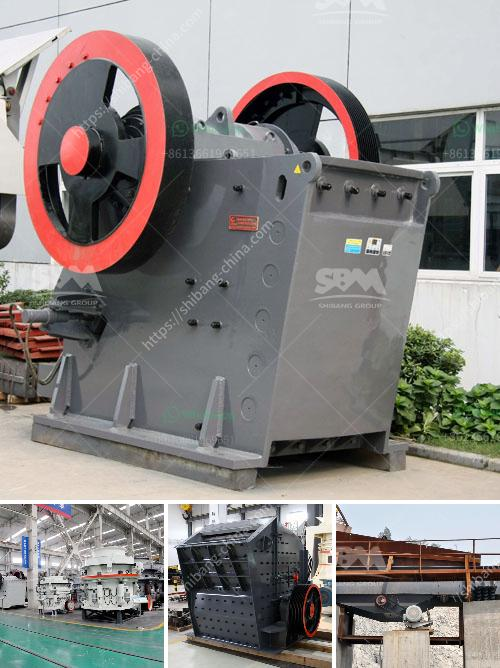

<h3>موردي كسارات الصخور في جنوب أفريقيا</h3>
تعتبر جنوب أفريقيا واحدة من الوجهات الرئيسية في العالم لاستخراج وتصنيع الصخور. تشتهر بكونها وجهة رئيسية لموردي كسارات الصخور، وتعتبر منتجاتها مهمة جدًا في الصناعات المختلفة مثل البناء والطرق والإنشاءات العامة. سنلقي نظرة عامة على هذا القطاع الحيوي وذلك بالتركيز على موردي كسارات الصخور في جنوب أفريقيا.

يتم استخراج الصخور في جنوب أفريقيا بواسطة الكسارات، والتي تستخدم معدات وتقنيات متقدمة لكسر الصخور إلى قطع صغيرة. تتنوع المواد التي تستخلص في جنوب أفريقيا من حيث النوع والاستخدام. تستخدم الحصى والرمل في مشاريع البناء، بينما يتم استخدام الصخور الصلبة مثل الجرانيت والبازلت في الطرق والأزقة المعبدة.

تعمل شركات موردي كسارات الصخور في جنوب أفريقيا على تلبية الطلب المتزايد على هذه المواد في السوق المحلية والدولية. يعتبر البناء والتشييد قطاعًا رئيسيًا في جنوب أفريقيا، حيث تشهد البلاد نموًا سريعًا في هذا القطاع. تعزز الحكومة الجنوب أفريقية هذا النمو من خلال جذب الاستثمارات الأجنبية المباشرة وتعزيز قدرات الموردين المحليين.

يقدم موردي كسارات الصخور في جنوب أفريقيا مجموعة واسعة من المنتجات والخدمات لتلبية احتياجات العملاء المختلفة. يتميزون بتوفير منتجات عالية الجودة وفقًا للمعايير الدولية، مما يجعلها محل تقدير وطلب من قبل العديد من المشترين المحليين والعملاء الدوليين.

بالإضافة إلى جودة المنتجات، يتمتع موردي كسارات الصخور في جنوب أفريقيا بقدرات تصنيع قوية وخدمة عملاء ممتازة. يقدمون خدمات استشارية للعملاء بخصوص أفضل الحلول والمنتجات المناسبة بناءً على احتياجاتهم الفردية. تساهم هذه الخدمات في مساعدة العملاء على اتخاذ قرارات مستنيرة ومناسبة، وبالتالي تحقيق توفير في الوقت والتكاليف.

على الرغم من أن جنوب أفريقيا تعتبر وجهة رئيسية لموردي كسارات الصخور، إلا أنها تواجه تحديات في هذا القطاع. تشمل تلك التحديات القضايا البيئية والتشريعات الصارمة المتعلقة بصناعة التعدين والكسارات. وبالتالي، فإن على الموردين أن يعملوا بطرق مستدامة وسليمة بيئيًا وأن يلتزموا بالمعايير البيئية المحددة.

في الختام، تلعب موردي كسارات الصخور دورًا حاسمًا في الاقتصاد الجنوب أفريقي وفي صناعات البناء والتشييد على الصعيدين المحلي والعالمي. يلتزمون بتوفير منتجات عالية الجودة وخدمة عملاء ممتازة، ومع توجه الحكومة إلى تعزيز البنية التحتية والتنمية الاقتصادية، فإن آفاق هذا القطاع في جنوب أفريقيا واعدة ومشرقة
<h3>Contact us</h3><ul><li><strong>Whatsapp:&nbsp;<a href="https://wa.me/8613661969651">+8613661969651</a></strong></li><li><a href="https://swt.shibang-china.com/?git&amp;zhl&amp;موردي كسارات الصخور في جنوب أفريقيا"><strong>Online Service(chat now)</strong></a></li></ul><h3>Related</h3><ul><li><a href='مواصفات خام الكروم.md'>مواصفات خام الكروم</a></li><li><a href='محطة كسارة نيجيريا.md'>محطة كسارة نيجيريا</a></li><li><a href='عملية تحويل الحجر الجيري إلى الإسمنت.md'>عملية تحويل الحجر الجيري إلى الإسمنت</a></li><li><a href='الفرق بين الطحن والتلميع.md'>الفرق بين الطحن والتلميع</a></li><li><a href='مشروع كلنكر الإسمنت في الهند.md'>مشروع كلنكر الإسمنت في الهند</a></li></ul>