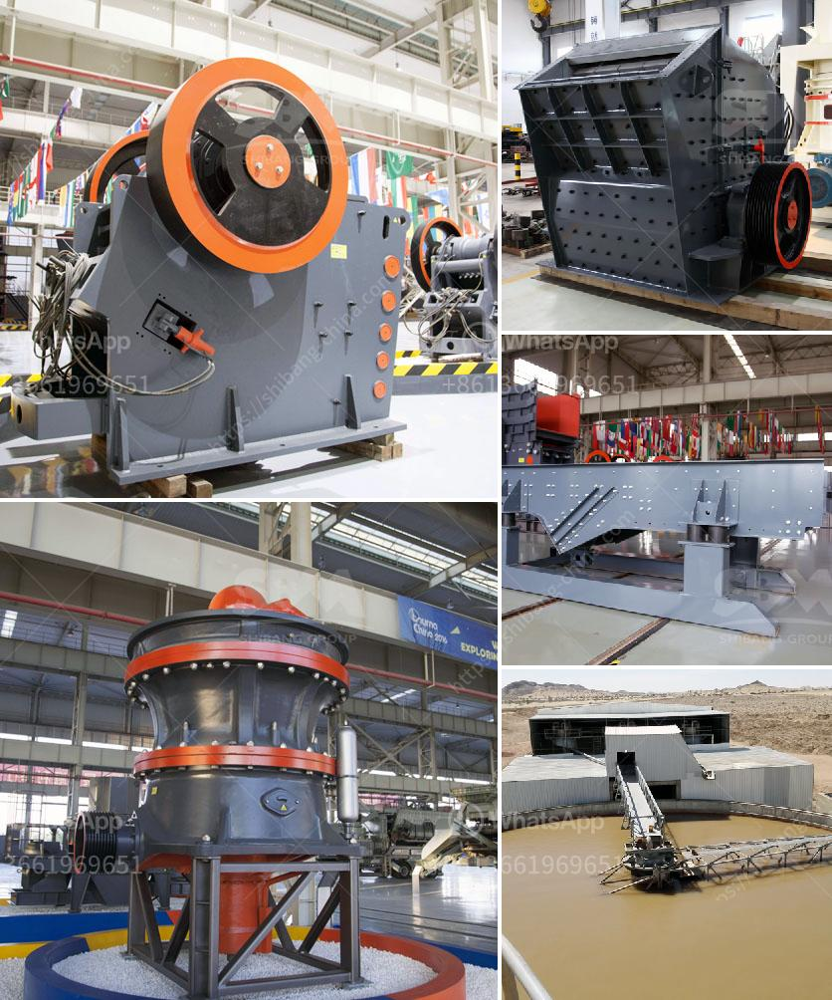

<h3>موردي مطاحن الأسطوانة في المكسيك</h3>
تعد مطاحن الأسطوانة من أهم الآلات المستخدمة في صناعة الأغذية في مختلف أنحاء العالم، وهي تستخدم بشكل رئيسي في طحن الحبوب والبذور لإنتاج الدقيق والأغذية الأخرى. واحدة من البلدان التي تمتلك طاقة إنتاجية كبيرة لمطاحن الأسطوانة هي المكسيك.

تعتبر المكسيك واحدة من أكبر المنتجين والمصدرين للغلال في العالم، وتمتلك موارد غنية من الحبوب مثل الذرة والقمح والشعير. وبالتالي، فإن صناعة مطاحن الأسطوانة تلعب دورًا حيويًا في تلبية احتياجات السوق المحلية، إضافة إلى التصدير إلى العديد من البلدان الأخرى.

تتميز موردي مطاحن الأسطوانة في المكسيك بخبرة واسعة وجودة عالية في تصنيع وتوريد هذه الآلات الحيوية. يستخدم الموردون أحدث التقنيات والمعدات لتلبية متطلبات العملاء وتحسين الأداء والإنتاجية.

تتيح مطاحن الأسطوانة المكسيكية للشركات المصنعة العاملة في مجال الأغذية تحقيق العديد من المزايا الهامة. فإنها تسمح بإنتاج دقيق عالي الجودة بطرق مبتكرة وبسرعة عالية، مما يتيح توفير الوقت والجهد في عملية الطحن. بفضل هذه المزايا، يتمكن مصنعو المطاحن المكسيكيون من المنافسة في السوق المحلية والعالمية بنجاح.

توفر مطاحن الأسطوانة أيضًا دورة طحن ذاتية تضمن التكيف المثالي للحبوب وتحكم أفضل في نسبة الطحن والفصل في المنتج النهائي. كما أن لديهم القدرة على ضمان تغذية مستمرة وسريعة للحبوب، مما يعزز فعالية الإنتاج ويزيد من كفاءة المصانع والمطاحن.

وبالإضافة إلى توفير المطاحن عالية الجودة، يقدم موردي مطاحن الأسطوانة في المكسيك أيضًا خدمات ما بعد البيع الممتازة، مثل الصيانة الدورية والتدريب على استخدام الآلات. يقدم الموردون أيضًا الدعم الفني في حالة حدوث أي مشكلات أو خلل في الآلات.

باختصار، تلعب موردي مطاحن الأسطوانة دورًا حيويًا في صناعة الأغذية في المكسيك. توفر آلاتهم عالية الجودة والمتطورة تكنولوجيًا فرصًا كبيرة للشركات المصنعة لزيادة إنتاجيتها وتحسين جودة منتجاتها. وبفضل توفر الموردين المحليين ذوي الخبرة، فإن شركات مطاحن الأسطوانة في المكسيك قادرة على تلبية احتياجات السوق المحلية وتصدير منتجاتها إلى العديد من البلدان الأخرى.
<h3>Contact us</h3><ul><li><strong>Whatsapp:&nbsp;<a href="https://wa.me/8613661969651">+8613661969651</a></strong></li><li><a href="https://swt.shibang-china.com/?git&amp;zhl&amp;موردي مطاحن الأسطوانة في المكسيك"><strong>Online Service(chat now)</strong></a></li></ul><h3>Related</h3><ul><li><a href='آلة مطحنة الكرة في الصين.md'>آلة مطحنة الكرة في الصين</a></li><li><a href='مطاحن الكرة المتواصلة أو الانقطاعية.md'>مطاحن الكرة المتواصلة أو الانقطاعية</a></li><li><a href='كسارات للركام الجرانيت.md'>كسارات للركام الجرانيت</a></li><li><a href='سحق وفحص خام المنجنيز.md'>سحق وفحص خام المنجنيز</a></li><li><a href='مطحنة الأسطوانة مطحنة السميكة.md'>مطحنة الأسطوانة مطحنة السميكة</a></li></ul>