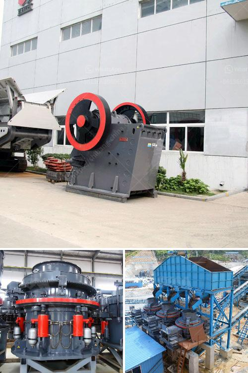

<h3>موردين آلات تكسير الحجر</h3>
يعتبر تكسير الحجر عملية ضرورية في قطاع البناء والتشييد، حيث يستخدم في إنتاج الركام الخرساني والرمل والحصى والحجر المكسر. ولتنفيذ هذه العملية، يلجأ معظم المقاولين والشركات إلى شراء آلات تكسير الحجر من موردين متخصصين وموثوقين.

تعتبر آلات تكسير الحجر من المعدات الثقيلة التي تتطلب خبرة واحترافية في التشغيل والصيانة. لذلك، يجب أن تكون الآلات عالية الجودة وتلبي الاحتياجات المحددة للعملاء. يجب أن تكون قوية ومتينة لتحمل ضغط العمل الشاق والتحميل الثقيل. كما يجب أن تكون سهلة الاستخدام وتتمتع بمرونة في التحرك والتشغيل.

يمكن العثور على موردين لآلات تكسير الحجر في العديد من الدول، حيث يتم تصنيع هذه الآلات في ورش العمل المتخصصة. يوفرون مجموعة واسعة من الآلات المختلفة التي تتناسب مع متطلبات العملاء. يمكن للعملاء اختيار الحجم والطاقة والقدرة التي يحتاجونها، بناءً على نوع الحجر والمشروع الذي يعملون عليه.

تتميز موردين آلات تكسير الحجر الموثوقين بتوفير معدات ذات جودة عالية وأداء ممتاز. يتبعون معايير صارمة في عمليات التصنيع ويستخدمون مواد عالية الجودة لضمان المتانة والمتانة. يقدمون أيضًا خدمات الصيانة والدعم الفني للعملاء، مما يضمن استخدام آلاتهم بكفاءة عالية ويطيل عمرها الافتراضي.

وبالإضافة إلى ذلك، يقدم موردين آلات تكسير الحجر خدمات التركيب والتدريب على التشغيل لفرق العمل، وهذا يعزز فعالية العمل ويقلل من إمكانية حدوث أي حوادث أو أخطاء في عمليات التشغيل. كما أن الاستثمار في آلات تكسير الحجر ذات الجودة العالية يساهم في زيادة الإنتاجية وتحسين جودة المنتج النهائي.

بشكل عام، يتعاون المقاولون والشركات مع موردين آلات تكسير الحجر الموثوقين لضمان توافر معدات عالية الجودة وفعالة لإكمال مشاريعهم بنجاح. إن اختيار الموردين المناسبين يلعب دورًا حاسمًا في تحقيق أهداف العمل وضمان الرضا والثقة من قبل العملاء.
<h3>Contact us</h3><ul><li><strong>Whatsapp:&nbsp;<a href="https://wa.me/8613661969651">+8613661969651</a></strong></li><li><a href="https://swt.shibang-china.com/?git&amp;zhl&amp;موردين آلات تكسير الحجر"><strong>Online Service(chat now)</strong></a></li></ul><h3>Related</h3><ul><li><a href='خط إنتاج مطحنة ريموند.md'>خط إنتاج مطحنة ريموند</a></li><li><a href='آلات ومعدات تعدين واستغلال المحاجر.md'>آلات ومعدات تعدين واستغلال المحاجر</a></li><li><a href='كسارة الصدم من نوع مانسبرجر.md'>كسارة الصدم من نوع مانسبرجر</a></li><li><a href='مكونات مصنع معالجة الفحم المتنقل.md'>مكونات مصنع معالجة الفحم المتنقل</a></li><li><a href='محطات الكسارات في الكويت.md'>محطات الكسارات في الكويت</a></li></ul>