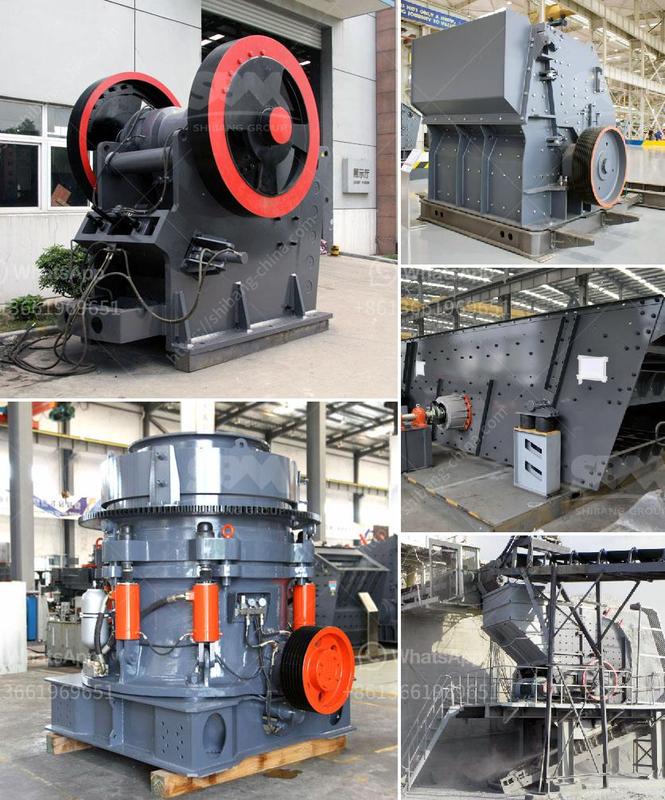

<h3>موردين آلة طحن الجبس</h3>
تلعب ماكينات طحن الجبس دورًا حيويًا في صناعة البناء والديكور. وسواء كنت تبحث عن آلة طحن الجبس للاستخدام المهني أو الشخصي، فإن اختيار المورد المناسب يعتبر أمرًا مهمًا لضمان الجودة والكفاءة.

قبل الشروع في البحث عن الموردين، ينبغي عليك أولاً تحديد احتياجاتك ومتطلباتك الفنية. يجب أن تنظر في عوامل مثل حجم الآلة، القدرة، والكفاءة، والموثوقية، وسهولة الصيانة. بعد تحديد هذه العوامل، يمكنك البدء في البحث عن الموردين المحتملين.

الخطوة الأولى في العثور على موردين آلات طحن الجبس هي الاطلاع على شركات التصنيع المعروفة في هذه الصناعة. يمكنك البحث عبر الإنترنت عن الشركات المصنعة الموثوقة التي تقدم آلات طحن الجبس عالية الجودة. تأكد من قراءة تعليقات العملاء والمراجعات للتأكد من جودة الماكينة وكفاءتها.

بعد ذلك، يمكنك البدء في الاتصال بالموردين لمعرفة المزيد عن المنتجات التي يقدمونها والخدمات المرتبطة بها. استفسر عن الأسعار وشروط الدفع ومدة التسليم. يمكنك أيضًا طلب اختبار المنتج قبل الشراء للتأكد من توافقه مع احتياجاتك.

لا تنس أن تلتقي مع الموردين المحتملين وتعقد اجتماعًا معهم لمناقشة المزيد من التفاصيل. يمكنك من خلال الاجتماعات الشخصية التأكد من مصداقية الموردين وخبرتهم في هذا المجال. قد يساعدك توجيه الأسئلة الفنية في فهم أكثر دقة لكيفية عمل الآلة وكيفية الحفاظ عليها.

بعد مقارنة العروض المختلفة والاعتماد على معلوماتك واجتماعاتك مع الموردين، يمكنك اتخاذ قرار الشراء النهائي. ينصح بأن تتأكد من توفر ضمان على المنتج وخدمة ما بعد البيع لضمان الصيانة والدعم اللازم.

في النهاية، عند اختيار موردي آلات طحن الجبس، يجب أن يكون الانتباه موجهًا للجودة والكفاءة والموثوقية. قم ببحث شامل واستفسار عن المعلومات الفنية ومراجعات العملاء قبل اتخاذ القرار النهائي.
<h3>Contact us</h3><ul><li><strong>Whatsapp:&nbsp;<a href="https://wa.me/8613661969651">+8613661969651</a></strong></li><li><a href="https://swt.shibang-china.com/?git&amp;zhl&amp;موردين آلة طحن الجبس"><strong>Online Service(chat now)</strong></a></li></ul><h3>Related</h3><ul><li><a href='تصميم آلة تكسير الحجر.md'>تصميم آلة تكسير الحجر</a></li><li><a href='مصنع معالجة رمل الحديد للبيع في باكستان.md'>مصنع معالجة رمل الحديد للبيع في باكستان</a></li><li><a href='مصنع معالجة الحجر الجيري في الفلبين.md'>مصنع معالجة الحجر الجيري في الفلبين</a></li><li><a href='كرات كربونات الكالسيوم.md'>كرات كربونات الكالسيوم</a></li><li><a href='معدات معالجة الجبس والكالسينيشن.md'>معدات معالجة الجبس والكالسينيشن</a></li></ul>