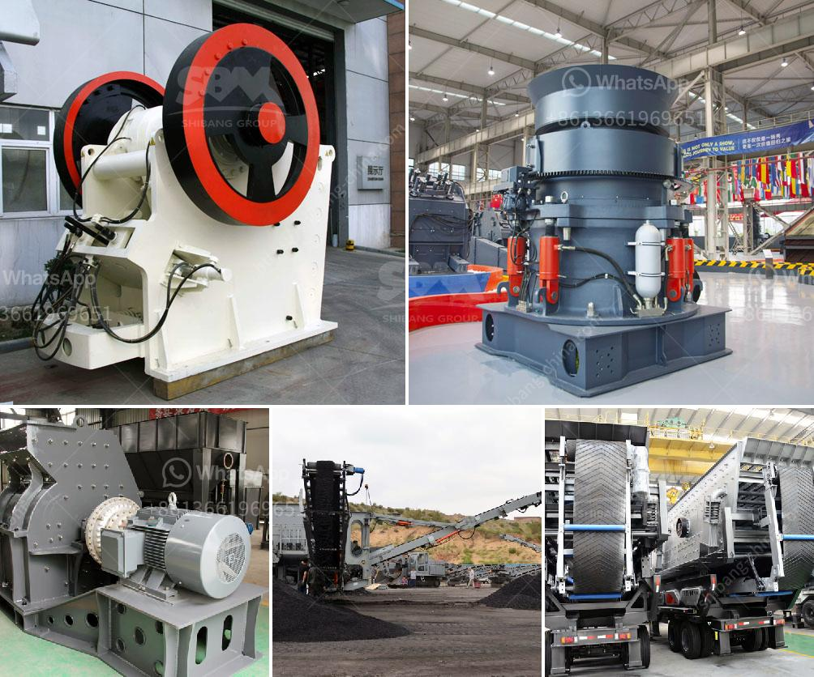

<h3>موردين استفادة خام الحديد</h3>
موردين استفادة خام الحديد: إسهاماتهم الرئيسية في صناعة الحديد

تعتبر الصناعة التحويلية للحديد من أهم الصناعات في العالم، حيث يعتمد العديد من القطاعات على منتجات الحديد لتطوير أعمالها وتحقيق النمو الاقتصادي. وفي هذا السياق، يلعب موردي استفادة خام الحديد دوراً حيوياً في ضمان توفر المصادر الأساسية للإنتاج.

يشكل خام الحديد المادة الأولية الرئيسية للصناعات المعدنية، ويتميز بخصائصه الفريدة وتركيبه الكيميائي. وعلى الرغم من تواجد خام الحديد في أنحاء العالم، فقد يوجد اختلاف في جودة وتركيب المعادن الموجودة في كل منجم. لذلك، يلعب موردي استفادة خام الحديد دوراً هاماً في ضمان توفير الجودة المطلوبة والكميات اللازمة للعملية الإنتاجية.

تقوم شركات الاستفادة من خام الحديد بشراء الخام من المناجم ومعالجتها بحيث يتم تنقية الخام وفصل الشوائب والمعادن غير الضرورية لصناعة الحديد. وبعد ذلك، يتم نقل الخام المعالج إلى مصانع الصلب ليتم تحويله إلى منتجات حديدية نهائية.

أحد التحديات الرئيسية التي يواجهها موردي استفادة خام الحديد هو تلبية احتياجات الصناعة المستمرة. حيث يتطلب إنتاج الحديد كميات ضخمة من الخام، وبالتالي يجب أن تكون هناك استعدادات وتخطيطات جيدة من قبل تلك الشركات لضمان استمرارية توفير الخام بنسبة معقولة.

علاوة على ذلك، يجب على موردي استفادة خام الحديد الالتزام بمعايير الجودة والسلامة في عملياتهم. فعملية استفادة الحديد تنطوي على مخاطر صحية وبيئية، ويجب ألا تؤثر هذه العمليات على العاملين والمجتمع المحلي والبيئة المحيطة.

من الجدير بالذكر أن صناعة الحديد قد شهدت تطورات كبيرة في السنوات الأخيرة، وقد تم تجهيز مصانع الصلب بتقنيات متقدمة لزيادة كفاءة العملية الإنتاجية وتحسين الجودة. ولذلك، يجب على موردي استفادة خام الحديد أن يبقوا على اطلاعٍ دائم على أحدث التكنولوجيات التي تستخدم في المصانع، وأن يوفروا خام ذا جودة عالية لضمان حصول عملائهم على منتجات حديدية متميزة.

باختصار، يمكن القول إن موردي استفادة خام الحديد هم العنصر الأساسي في صناعة الحديد، حيث يلعبون دوراً حاسماً في توفير الجودة والكمية المطلوبة لعملية الإنتاج. كما يجب أن تكون لديهم إدارة تخطيطية فعالة لتلبية الاحتياجات العالمية المتزايدة للحديد والمنتجات الحديدية، بالإضافة إلى المحافظة على المعايير البيئية والسلامة لحماية العاملين والبيئة والمجتمع المحلي.
<h3>Contact us</h3><ul><li><strong>Whatsapp:&nbsp;<a href="https://wa.me/8613661969651">+8613661969651</a></strong></li><li><a href="https://swt.shibang-china.com/?git&amp;zhl&amp;موردين استفادة خام الحديد"><strong>Online Service(chat now)</strong></a></li></ul><h3>Related</h3><ul><li><a href='آلة سحق الأسفلت بسعة 15 طن في الساعة.md'>آلة سحق الأسفلت بسعة 15 طن في الساعة</a></li><li><a href='حسابات تصميم مجفف دوار.md'>حسابات تصميم مجفف دوار</a></li><li><a href='آلة كسارة الحجر الصينية.md'>آلة كسارة الحجر الصينية</a></li><li><a href='شاشة هزازة صينية.md'>شاشة هزازة صينية</a></li><li><a href='كسارة متنقلة بسعة 100 طن في الساعة.md'>كسارة متنقلة بسعة 100 طن في الساعة</a></li></ul>