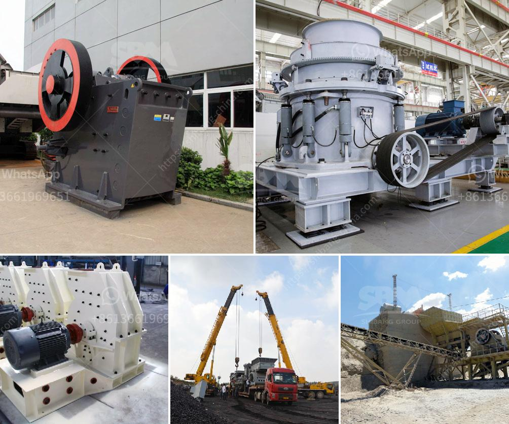

<h3>موردين تكسير الكوارتز في أوروبا</h3>
في السنوات الأخيرة، شهد قطاع تكسير الكوارتز في أوروبا نمواً كبيراً. حيث أصبح الكوارتز من المواد الأساسية التي يتم استخدامها في صناعات مختلفة مثل صناعة الزجاج، والسيراميك، والإلكترونيات، وصناعة المجوهرات. ولتلبية الطلب المتزايد على الكوارتز، تأتي دور الموردين الذين يقومون بعملية تكسير الكوارتز.

تعتبر عملية تكسير الكوارتز هامة جداً، حيث يتطلب تحويل الصخور الصلبة والضخمة إلى قطع صغيرة من الكوارتز المستخدمة في الصناعة. يتم تكسير الكوارتز بواسطة معدات وآلات متخصصة، مثل كسارات الفك والمطارق الهيدروليكية والكسارات المخروطية. تبحث الشركات المصنعة والموردين في أوروبا عن أحدث التقنيات والمعدات لتحسين عملية التكسير وجعلها أكثر كفاءة واقتصادية.

تتميز شركات موردين تكسير الكوارتز في أوروبا بالجودة العالية للمنتجات التي تقدمها، فهي تعمل بجد لتلبية متطلبات العملاء وتوفير منتجات ذات جودة عالية وأداء مستدام. تحرص هذه الشركات على تطوير وتحديث معداتها بشكل مستمر، بالإضافة إلى توفير الدعم الفني للعملاء لضمان حصولهم على أعلى مستوى من الأداء والجودة.

كما تولي هذه الشركات اهتماماً كبيراً للعوامل البيئية والاستدامة في عملية التكسير. فهي تعمل على تحسين كفاءة استهلاك الطاقة وتقليل انبعاثات الكربون، وتتبنى مبادرات تدعم الحفاظ على البيئة واستخدام الموارد بشكل مستدام.

وبالنسبة للعملاء، يعد وجود موردين مختصين في تكسير الكوارتز في أوروبا منتجاتهم ذات جودة عالية وأداء ممتاز من أهم العوامل في اختيارهم للتعامل معهم. فمن خلال الاعتماد على موردين موثوقين، يمكن للعملاء ضمان توفير أفضل حلول التكسير لتلبية احتياجاتهم وتحقيق أهدافهم في الإنتاج.

بصفة عامة، يتميز قطاع تكسير الكوارتز في أوروبا بتوفير منتجات عالية الجودة وأداء ممتاز، وهو قطاع يشهد نمواً مستداماً ويركز على الاستدامة البيئية. الموردين الرئيسيين في هذا القطاع يعملون بجد لتلبية احتياجات العملاء وتوفير حلول التكسير الأمثل التي تضمن الجودة والكفاءة.
<h3>Contact us</h3><ul><li><strong>Whatsapp:&nbsp;<a href="https://wa.me/8613661969651">+8613661969651</a></strong></li><li><a href="https://swt.shibang-china.com/?git&amp;zhl&amp;موردين تكسير الكوارتز في أوروبا"><strong>Online Service(chat now)</strong></a></li></ul><h3>Related</h3><ul><li><a href='شاشة تصنيف اهتزازية.md'>شاشة تصنيف اهتزازية</a></li><li><a href='احتياطي في مطحنة الكرة.md'>احتياطي في مطحنة الكرة</a></li><li><a href='خطة عمل عينية لشركة تعدين الذهب الصغيرة.md'>خطة عمل عينية لشركة تعدين الذهب الصغيرة</a></li><li><a href='تجارة سحق الخرسانة للبيع.md'>تجارة سحق الخرسانة للبيع</a></li><li><a href='كسارات VSI بسعة 25 طن في الساعة.md'>كسارات VSI بسعة 25 طن في الساعة</a></li></ul>