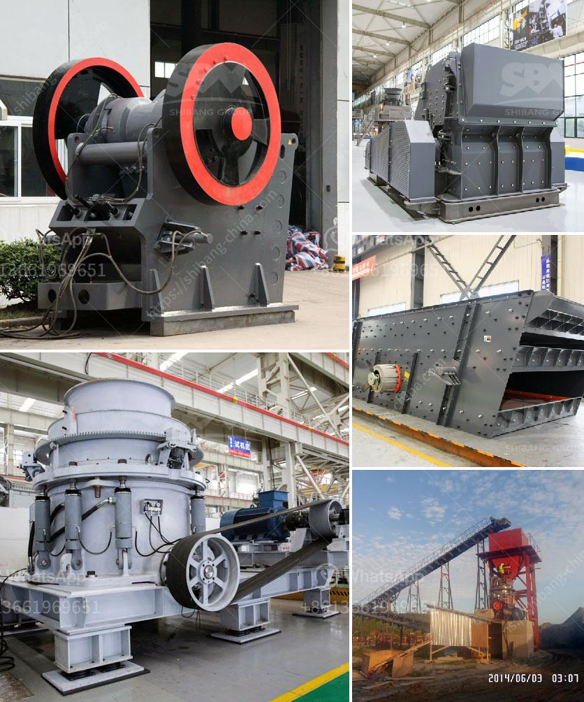

<h3>موردين خام الزنك في جنوب أفريقيا</h3>
جنوب أفريقيا هي واحدة من أكبر منتجي خام الزنك في العالم، حيث يُقدر إنتاجها السنوي بنحو 15٪ من إجمالي الإنتاج العالمي. تُعد مناجم خام الزنك في جنوب أفريقيا مُصدراً رئيسياً للمعدن في البلاد، وتساهم بشكل كبير في اقتصاد البلاد وتوفير فرص العمل للعديد من السكان.

تتواجد مناجم خام الزنك في مقاطعات مختلفة في جنوب أفريقيا، بما في ذلك ليمبوبو في شمال البلاد وشمال غرب البلاد. وتشمل بعض أكبر المشاريع منجم زينكوتا ومنجم برونزيوزو، حيث يتم استخراج الزنك بواسطة تقنيات التعدين التقليدية مثل التفجير والحفر الأفقي والتخصص في الفصل الجاذبي.

موردي خام الزنك في جنوب أفريقيا يلتزمون بتوفير منتجات عالية الجودة وفقًا للمعايير العالمية. يتم تصدير خام الزنك إلى العديد من البلدان الأخرى الرائدة في صناعة الصلب والمعادن في جميع أنحاء العالم، بما في ذلك الصين والهند وروسيا وجنوب كوريا.

تلعب جنوب أفريقيا دورًا مهمًا في السوق العالمية لخام الزنك، حيث يعتمد العديد من الشركات العالمية على توريداتها. وتمتلك شركات التعدين الرائدة في البلاد مصانع تكرير وتكسير حديثة، مما يمكنها من إنتاج منتجات ذات نوعية عالية وتلبية احتياجات السوق.

تُعتبر صناعة خام الزنك في جنوب أفريقيا مهمة للبلاد من حيث توليد الإيرادات وخلق الوظائف. إضافةً إلى ذلك، فإن هذه الصناعة تسهم في تعزيز البنية التحتية وتحسين الظروف المعيشية للمجتمعات المحلية. فهي تعزز اقتصاد البلاد وتتيح فرص العمل وتساعد في تنمية البنية التحتية وتعزيز التعليم والرعاية الصحية في تلك المناطق.

بشكل عام، تلعب جنوب أفريقيا دورًا مهمًا في صناعة خام الزنك عالميًا. بمواردها الضخمة من هذا المعدن والتقنيات المتقدمة في عملية التعدين والتكرير، تُعد من الموردين الرئيسيين لخام الزنك في العالم وتلبي احتياجات السوق العالمية.
<h3>Contact us</h3><ul><li><strong>Whatsapp:&nbsp;<a href="https://wa.me/8613661969651">+8613661969651</a></strong></li><li><a href="https://swt.shibang-china.com/?git&amp;zhl&amp;موردين خام الزنك في جنوب أفريقيا"><strong>Online Service(chat now)</strong></a></li></ul><h3>Related</h3><ul><li><a href='كسارة من الصين السعر.md'>كسارة من الصين السعر</a></li><li><a href='مجفف رمل مستعمل للبيع.md'>مجفف رمل مستعمل للبيع</a></li><li><a href='مطحنة الهامر للحبوب.md'>مطحنة الهامر للحبوب</a></li><li><a href='مصنع الكرة لمصنع الكالسيت.md'>مصنع الكرة لمصنع الكالسيت</a></li><li><a href='حساب سعة كسارة الأسطوانة.md'>حساب سعة كسارة الأسطوانة</a></li></ul>