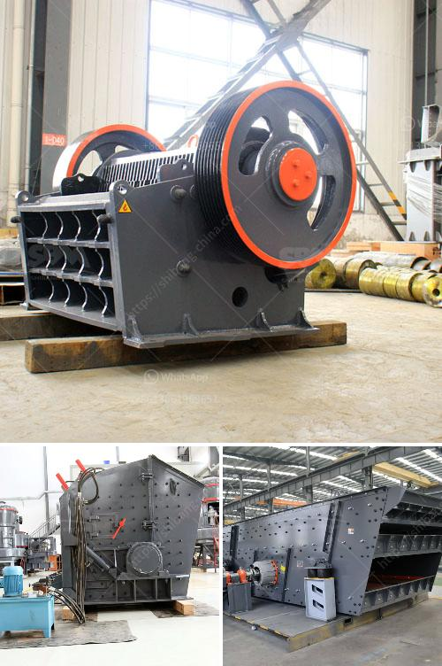

<h3>موردين رمل السيليكا في زيمبابوي</h3>
رمل السيليكا هو عبارة عن مادة خام طبيعية تشتهر بخصائصها الميكانيكية والكيميائية المثالية للاستخدام في العديد من الصناعات. وتُعد زيمبابوي واحدة من الدول الرائدة في إنتاج وتوريد رمل السيليكا. يتم العثور على رمال السيليكا في المناطق الصحراوية الجافة في زيمبابوي، بما في ذلك مناطق ماتوبو، ومشوشوانا، و مليكيلاندي، وغيرها.

تمتلك زيمبابوي موارد وفيرة من رمل السيليكا، وتتميز بنسبة نقاء عالية وخالية من الشوائب الملوثة. وهذا يجعلها مثالية للاستخدام في العديد من الصناعات مثل صناعة الزجاج، والصناعات الكيماوية، والمواد الكاشطة، والمنتجات الكاشطة للبناء، والإسفلت. تتميز زيمبابوي أيضًا بطبيعتها غير قابلة للتآكل وصلابتها العالية، مما يجعلها ملاذًا مثاليًا للشركات والمصانع التي تحتاج إلى رمل السيليكا عالي الجودة.

هناك العديد من الموردين المحليين في زيمبابوي لرمل السيليكا. تهدف هذه الموردين إلى تلبية الاحتياجات المتنوعة للعملاء في الداخل والخارج. وتعتبر الشركات الموردة مكونًا رئيسيًا لاقتصاد زيمبابوي، حيث تساهم في زيادة العائدات وتعزيز فرص العمل في البلاد.

توفر الشركات الموردة رمل السيليكا بعدة أشكال وأحجام مختلفة وذلك لتلبية متطلبات العملاء. يتم جمع الرمل وتنقيته وفقًا للمعايير العالمية لضمان الجودة العالية والمواصفات المطلوبة. كما يتم فحص الرمل بشكل مستمر للتأكد من عدم وجود خلل أو تلوث يؤثر على جودته.

يتم تصدير رمل السيليكا من زيمبابوي إلى العديد من الدول حول العالم بسبب جودته العالية وتكلفته المنخفضة. يستخدم العديد من العملاء العالميين رمل السيليكا من زيمبابوي في صناعات مثل السيراميك والحديد والصلب والمستحضرات الدوائية والمنتجات الكيماوية والإلكترونيات.

بالنظر إلى مزاياها المتعددة، فإن موردي رمل السيليكا في زيمبابوي يلعبون دورًا حيويًا في سد احتياجات العديد من الصناعات في السوق المحلية والعالمية. ويتوقع أن يزداد الطلب على رمل السيليكا من زيمبابوي في المستقبل، نظرًا لتوفر مواردها الغنية والجودة العالية التي تلبي معايير الجودة العالمية.

لذا، يجب على شركات الصناعة والمشترين العالميين أن يستغلوا المزايا المتوفرة في زيمبابوي ويقوموا بالاستثمار في رمل السيليكا من هذا البلد. وبذلك سيعود ذلك على الشركات بالفائدة المالية والجودة العالية للمنتجات التي ستحظى بها.

في الختام، يعتبر رمل السيليكا في زيمبابوي منتجًا ذو جودة عالية وتكلفة منخفضة. وتمتلك البلاد موردين محليين موثوق بهم يلبون احتياجات العملاء المحليين والعالميين. يُظهر اعتماد العديد من الصناعات على رمل السيليكا من زيمبابوي مدى أهميتها وعالميتها في السوق الحالية.
<h3>Contact us</h3><ul><li><strong>Whatsapp:&nbsp;<a href="https://wa.me/8613661969651">+8613661969651</a></strong></li><li><a href="https://swt.shibang-china.com/?git&amp;zhl&amp;موردين رمل السيليكا في زيمبابوي"><strong>Online Service(chat now)</strong></a></li></ul><h3>Related</h3><ul><li><a href='مطحنة أسطوانية للمعادن.md'>مطحنة أسطوانية للمعادن</a></li><li><a href='كسارة الكرة باكستان للبيع.md'>كسارة الكرة باكستان للبيع</a></li><li><a href='تكلفة مصنع كسارة الحجر الجيري.md'>تكلفة مصنع كسارة الحجر الجيري</a></li><li><a href='مصنع تكسير في مالي.md'>مصنع تكسير في مالي</a></li><li><a href='شراء محطة غسيل الفحم في ألمانيا.md'>شراء محطة غسيل الفحم في ألمانيا</a></li></ul>