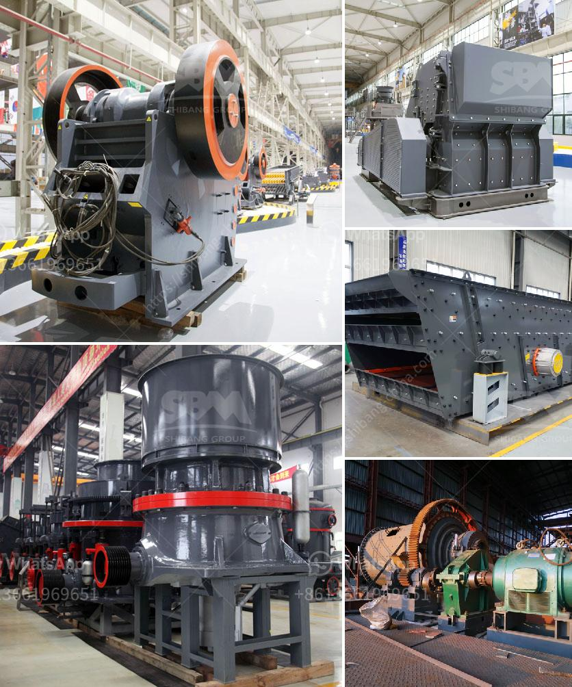

<h3>موردين طاحونة الأسمنت</h3>
تعتبر طاحونة الأسمنت من الآلات الرئيسية في صناعة الأسمنت، حيث تستخدم لطحن وسحق المواد الخام وتحويلها إلى مسحوق ناعم يسمى العجينة الجافة. ومن أجل تشغيل هذه الطواحين بكفاءة عالية وضمان توفر المواد اللازمة للعملية الإنتاجية، يعتمد المصنعون على موردين متخصصين في توفير قطع الغيار والمعدات اللازمة لتشغيل وصيانة طواحين الأسمنت.

موردين طاحونة الأسمنت يلعبون دورًا حاسمًا في نجاح عملية الإنتاج، حيث يقومون بتوفير أجزاء الغيار الضرورية لتشغيل الطواحين، مثل الفرش والمطاط والمسامير والتروس والمحركات والحاويات وغيرها من القطع المهمة. بالإضافة إلى ذلك، يوفرون الآلات والمعدات الجديدة التي تحتاجها الحديدة، مثل اللفافات والأسطوانات والفلاتر والمكابس.

واحدة من أهم صفات موردين طاحونة الأسمنت هي توفير قطع الغيار ذات الجودة العالية والمتينة. فعندما يكون الإنتاج يعمل بكفاءة، فإن توفير قطع الغيار المناسبة هو أمر بالغ الأهمية. وبالتالي، يلتزم موردين طاحونة الأسمنت بمراقبة جودة المنتجات التي يوفرونها للمصانع، من أجل ضمان أداء موثوق وطويل الأمد للطواحين.

بالإضافة إلى ذلك، يوفرون خدمات ما بعد البيع لمساعدة العملاء في تركيب وتشغيل وصيانة طواحين الأسمنت. غالبًا ما تكون هذه الآلات ضخمة ومعقدة، وتتطلب الخبرة والمعرفة المتخصصة لضمان تشغيلها بكفاءة. وبالتالي، يقدم موردين طواحين الأسمنت الدعم الفني للعملاء، سواء عن طريق توفير الإرشادات والتعليمات الفنية أو عن طريق إرسال فرق فنية لتقديم الدعم المباشر في موقع المصنع.

باختصار، يعتبر موردين طواحين الأسمنت شريكًا حيويًا للشركات في صناعة الأسمنت. فهم يساعدون في توفير قطع الغيار الضرورية والمعدات والخدمات اللازمة لتشغيل وصيانة الطواحين بكفاءة. ومن خلال توفير منتجات عالية الجودة والدعم الفني المتخصص، يسهمون في ضمان استمرارية العملية الإنتاجية وتحقيق أعلى مستويات الجودة في منتجات الأسمنت.
<h3>Contact us</h3><ul><li><strong>Whatsapp:&nbsp;<a href="https://wa.me/8613661969651">+8613661969651</a></strong></li><li><a href="https://swt.shibang-china.com/?git&amp;zhl&amp;موردين طاحونة الأسمنت"><strong>Online Service(chat now)</strong></a></li></ul><h3>Related</h3><ul><li><a href='تكلفة إنشاء مصنع الأسمنت الصغير في الهند.md'>تكلفة إنشاء مصنع الأسمنت الصغير في الهند</a></li><li><a href='مصنع تركيز النحاس الصغير.md'>مصنع تركيز النحاس الصغير</a></li><li><a href='وحدة طحن الصين.md'>وحدة طحن الصين</a></li><li><a href='مصنع معالجة الحجر الجيري المحمول.md'>مصنع معالجة الحجر الجيري المحمول</a></li><li><a href='كيفية تحديد سعة سير الناقل.md'>كيفية تحديد سعة سير الناقل</a></li></ul>