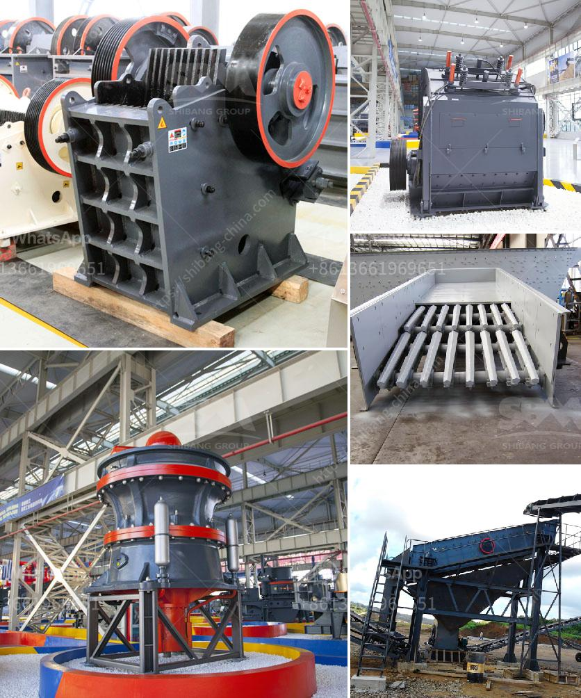

<h3>موردين طاحونة الفحم</h3>
تعتبر طاحونة الفحم من الأجهزة الهامة في صناعات الطاقة، حيث تقوم بطحن الفحم الخام لتحويله إلى مسحوق ناعم يستخدم في إنتاج الكهرباء والصناعات الأخرى. ولتلبية احتياجات هذه الصناعات، تعتمد الطواحين على موردين متخصصين في توريد أجزاء ومعدات مختلفة.

يعتبر اختيار موردين طاحونة الفحم من الأمور المهمة لضمان جودة المعدات والأجزاء المستخدمة في الطاحونة. يجب أن يتمتع المورد بخبرة وسمعة جيدة في هذا المجال، وأن يقدم منتجات ذات جودة عالية ومواصفات مطابقة للمعايير القياسية المعتمدة.

أول مورد رئيسي لطاحونة الفحم هو مورد الأجزاء الرئيسية كالأسطوانة والشفرات والغرابيل والمحامل وغيرها، والتي تتطلب دقة وجودة عالية لضمان سلامة وفعالية العملية. يجب أن يقدم المورد الأجزاء بأحجام ومواصفات تتناسب مع النموذج الذي يتم استخدامه في الطاحونة.

ثانياً، يعتبر مورد المعدات الثانوية مهماً أيضاً، فتلك المعدات تشمل السخانات والمبدلات الحرارية ومعدات الفصل والنقل وغيرها. يجب أن يوفر المورد معدات ذات جودة تضمن كفاءة الطاحونة وسلامة العملية بشكل عام.

وبالإضافة إلى ذلك، يجب أن تكون الخدمات المقدمة من قبل الموردين ممتازة، فقد تحتاج الطاحونة إلى الصيانة الدورية والتشحيم وقطع الغيار والتحديثات. يجب أن يقدم المورد الدعم الفني اللازم والاستشارات المتعلقة بعملية الطحن والتحديثات اللازمة لتحسين أداء الطاحونة.

في النهاية، يجب أن يتعاون الموردون مع العملاء في تحقيق أهدافهم المتعلقة بالأداء والاعتمادية والكفاءة وغيرها. يعتبر توفر المنتجات والخدمات عالية الجودة والتزام الموردين بالتسليم في الوقت المحدد أموراً أساسية لتحقيق ذلك.

باختصار، يتعاون موردو طواحين الفحم مع الشركات المصنعة لضمان جودة الأجزاء والمعدات وتوفير الخدمات الفنية اللازمة. يجب أن يكون المورد ذو سمعة جيدة وخبرة في هذا المجال، وأن يلتزم بتزويد العملاء بأفضل المنتجات والخدمات لتلبية احتياجاتهم وتحقيق نجاح صناعة الطاقة والصناعات الأخرى المعتمدة على الفحم.
<h3>Contact us</h3><ul><li><strong>Whatsapp:&nbsp;<a href="https://wa.me/8613661969651">+8613661969651</a></strong></li><li><a href="https://swt.shibang-china.com/?git&amp;zhl&amp;موردين طاحونة الفحم"><strong>Online Service(chat now)</strong></a></li></ul><h3>Related</h3><ul><li><a href='علامات الناقل والكسارات في إندونيسيا.md'>علامات الناقل والكسارات في إندونيسيا</a></li><li><a href='فحص الشاشة التحجيم.md'>فحص الشاشة التحجيم</a></li><li><a href='آلة حزمة مطحنة الكرة.md'>آلة حزمة مطحنة الكرة</a></li><li><a href='آلة عملية مطحنة الأسطوانة.md'>آلة عملية مطحنة الأسطوانة</a></li><li><a href='مصنع أسمنت للبيع في ألمانيا.md'>مصنع أسمنت للبيع في ألمانيا</a></li></ul>