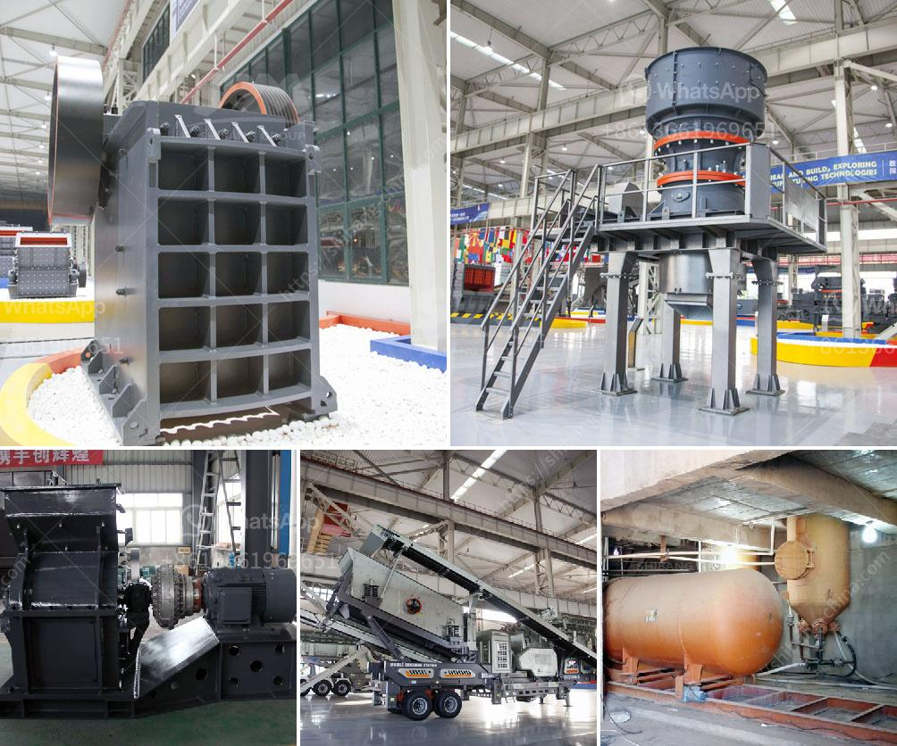

<h3>موردين لسحق الصخور في بريتوريا</h3>
إن محافظة بريتوريا في جنوب أفريقيا تعد واحدة من أبرز المناطق التي تستخدم بصورة واسعة في صناعة سحق الصخور. فهي تضم العديد من الموردين الرئيسيين الذين يوفرون خدمات سحق الصخور بجودة عالية وبأسعار تنافسية.

أحد الموردين الرئيسيين لسحق الصخور في بريتوريا هو شركة "راك ماستر"، والتي تعتبر واحدة من أكبر شركات سحق الصخور في المنطقة. تأسست الشركة في عام 1990 وتتمتع بخبرة واسعة في مجال سحق وتحسين الصخور. تستخدم "راك ماستر" أحدث التقنيات والمعدات للحصول على أعلى جودة في عمليات السحق، وتقدم مجموعة واسعة من خدمات سحق الصخور بما في ذلك سحق الصخور الكبيرة والتخلص من النفايات.

بالإضافة إلى "راك ماستر"، هناك شركة "ستوني" وهي أيضًا مورد رائد لسحق الصخور في بريتوريا. تعتمد الشركة على معدات حديثة وتقنيات متطورة لضمان تقديم خدمات سحق الصخور بأعلى مستوى من الدقة والكفاءة. كما توفر "ستوني" خدمات متنوعة لسحق الصخور، بما في ذلك إعادة تدوير الخرسانة وتحويلها إلى مواد قابلة لإعادة الاستخدام.

بصفة عامة، تتمتع شركات سحق الصخور في بريتوريا بخدمات متميزة وتعامل احترافي مع العملاء. فهم يوفرون حلولًا مختلفة لاحتياجات العملاء مثل إعادة تدوير الصخور واستخراج المواد الخام لمشاريع البناء. كما يحرص الموردون على تعلم أحدث التطورات التكنولوجية في صناعة سحق الصخور وتطبيقها في عملياتهم من أجل تقديم الأداء الأمثل لعملائهم.

بالاعتماد على موردي سحق الصخور في بريتوريا، يمكن للشركات والمقاولين الحصول على المواد الأساسية اللازمة لمشاريعهم بكفاءة وأداء عالي. سواء كنت بحاجة إلى توريد الحصى الخشنة أو الحجارة المسحوقة أو غيرها من المنتجات المحطمة، ستجد في بريتوريا موردين متخصصين يلبون احتياجاتك بشكل موثوق ومحترف.

باختصار، يعد سوق سحق الصخور في بريتوريا متناميًا ومنافسًا. وباختيار الموردين المناسبين، يمكن للعملاء الاستفادة من خدمات سحق الصخور عالية الجودة بأسعار مناسبة، مما يساهم في نجاح مشاريع البناء والتنمية في المنطقة.
<h3>Contact us</h3><ul><li><strong>Whatsapp:&nbsp;<a href="https://wa.me/8613661969651">+8613661969651</a></strong></li><li><a href="https://swt.shibang-china.com/?git&amp;zhl&amp;موردين لسحق الصخور في بريتوريا"><strong>Online Service(chat now)</strong></a></li></ul><h3>Related</h3><ul><li><a href='عملية الطحن الرطب.md'>عملية الطحن الرطب</a></li><li><a href='مصانع طحن الكرات.md'>مصانع طحن الكرات</a></li><li><a href='كسارات الحجر في بيلين.md'>كسارات الحجر في بيلين</a></li><li><a href='كسارة مخروطية بوزولانا 100 طن في الساعة.md'>كسارة مخروطية بوزولانا 100 طن في الساعة</a></li><li><a href='مصنع تكسير وفحص متنقل.md'>مصنع تكسير وفحص متنقل</a></li></ul>