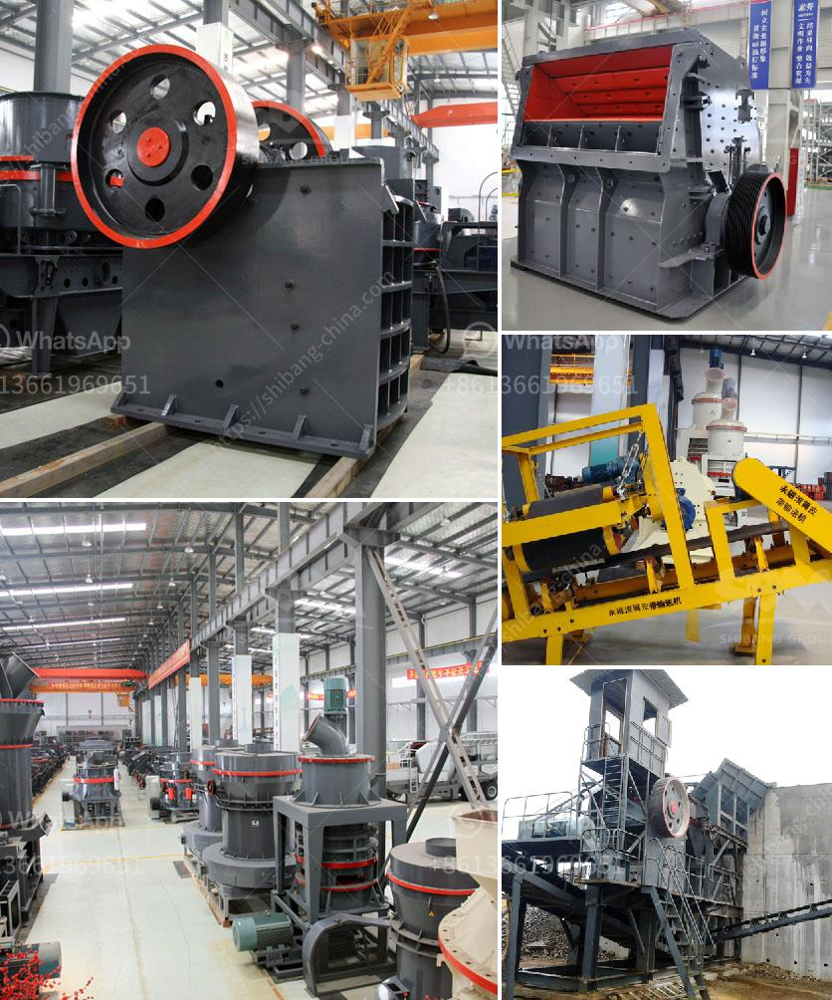

<h3>موردين لفات الناقل في جنوب أفريقيا</h3>
تلعب فوائد وسهولة النقل دورًا حاسمًا في تعزيز الاقتصاد وتطوير البنية التحتية للدولة. تلك البنية تشمل شبكة النقل، وخاصة فحص واستبدال لفات النقل. في جنوب أفريقيا، هناك العديد من الموردين الرائدين الذين يتمتعون بخبرة واسعة في صناعة اللفات الناقلة، ويقومون بتلبية احتياجات العملاء بكفاءة.

أحد الموردين الرائدين في جنوب أفريقيا لفات الناقل هو شركة "ويست بيلت". تأسست الشركة في عام 1906، وتمتلك سجلًا حافلاً في توفير الحلول المبتكرة لصناعة النقل. تعتبر "ويست بيلت" الشركة الرائدة في صناعة الأحزمة الناقلة ولفات النقل، حيث توفر منتجات موثوقة وعالية الجودة لعملائها. تقدم الشركة تشكيلة واسعة من اللفات الناقلة المصنوعة من مواد متينة وذات جودة عالية، مما يضمن متانة وطول عمر تشغيل اللفات.

أيضًا، توفر شركة "كونفيرثيك" للمواد البلاستيكية حلول مبتكرة لفحص واستبدال لفات النقل في جنوب أفريقيا. تستخدم هذه الشركة تقنيات تصنيع متطورة ومواد بلاستيكية عالية الجودة لتصنيع لفات النقل التي تتميز بالمتانة والموثوقية. بالإضافة إلى ذلك، تقدم "كونفيرثيك" خدمات تفحص وتركيب وصيانة لفات النقل، مما يسهم في ضمان عملية تشغيل سلسة وفعالة.

لا يمكننا أن نغفل دور شركة "إقتراندي" في هذا السياق. تعتبر هذه الشركة الرائدة في توفير حلول النقل، وتشمل فحص وتوريد وصيانة لفات النقل. تستخدم "إقتراندي" تقنيات حديثة ومواد عالية الجودة لصنع اللفات، مما يضمن متانة وأداء ممتاز للأحزمة الناقلة.

باختيار أحد هؤلاء الموردين، يضمن عملاؤك الحصول على أفضل المنتجات والخدمات بجودة عالية وأسعار تنافسية. إن جودة لفات النقل تؤثر بشكل كبير على أداء وعمر خدمة النقل، وبالتالي فإن اختيار المورد المناسب يعد أمرًا حاسمًا. من خلال تقديم المنتجات المبتكرة والخدمات الممتازة، يضمن موردي جنوب أفريقيا لفات النقل تلبية تلك الاحتياجات وتحقيق النمو والريادة في هذا القطاع المهم.
<h3>Contact us</h3><ul><li><strong>Whatsapp:&nbsp;<a href="https://wa.me/8613661969651">+8613661969651</a></strong></li><li><a href="https://swt.shibang-china.com/?git&amp;zhl&amp;موردين لفات الناقل في جنوب أفريقيا"><strong>Online Service(chat now)</strong></a></li></ul><h3>Related</h3><ul><li><a href='عملية الكرة الطحن.md'>عملية الكرة الطحن</a></li><li><a href='مطاحن الأسطوانات في الدول.md'>مطاحن الأسطوانات في الدول</a></li><li><a href='مصنع كرة الاسمنت المواد والطاقة.md'>مصنع كرة الاسمنت المواد والطاقة</a></li><li><a href='كسارات للركام الجرانيت.md'>كسارات للركام الجرانيت</a></li><li><a href='كسارة الحجر وأسعارها.md'>كسارة الحجر وأسعارها</a></li></ul>