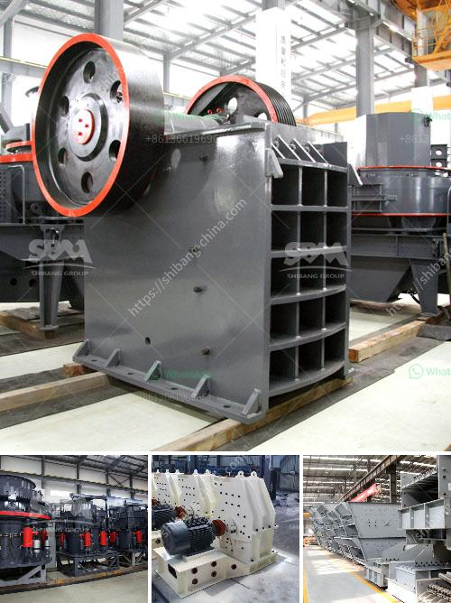

<h3>موردين للرمل والحصى في سيبو</h3>
موردين للرمل والحصى في سيبو: توجه نحو التنمية والاستدامة

تعتبر مدينة سيبو في الفلبين من المدن التي تشهد نموًا اقتصاديًا مستدامًا في السنوات الأخيرة. واحتياجات البنية التحتية تعتبر أحد العوامل الرئيسية لهذا النمو. يعتبر الرمل والحصى من العناصر الأساسية للبناء والتشييد وبالتالي فهي تشغل دورًا هامًا في عمليات التنمية.

تلبية احتياجات سوق البناء يتطلب توفر موردين موثوق بهم للرمل والحصى في سيبو. تنوع العوامل في سوق هذه المواد يجعل الاختيار صعبًا على المستهلكين، حيث يبحثون عن التوفر والجودة والسعر المناسب لاحتياجاتهم.

أحد أهم الموردين للرمل والحصى في سيبو هو شركة "سيبو ساند اند غرافيل"، وهي شركة متخصصة في توفير مواد البناء عالية الجودة. يتم توفير الرمل والحصى من المصادر الطبيعية المحلية، مما يساهم في التنمية المحلية. تمتلك الشركة عمليات استخراج في عدة مواقع في سيبو، مما يسمح لها بتزويد الأسواق بكمية كافية من المواد.

تلتزم الشركة بمعايير صارمة للجودة والاستدامة. تُحرص على ضمان جودة المواد التي توفرها، وتقوم بتحليلها وفقًا لمعايير الصناعة. بالإضافة إلى ذلك، تلتزم الشركة بتوفير أحدث التقنيات البيئية لتقليل التأثير البيئي لعمليات إنتاجها.

تعتبر شركة "باركستاون ساند اند غرافيل" أيضًا واحدة من الموردين الرئيسيين للرمل والحصى في سيبو. تشتهر الشركة بتقديم خدمات موثوقة ومواد ذات جودة عالية. تعتمد الشركة على عملياتها الذاتية لتأمين مصادر المواد وضمان التوافر المستمر.

تعتبر الشركتان السابقتان فقط من بين عدد من الموردين للرمل والحصى في سيبو. يتفوق هؤلاء الموردين بفضل جودة منتجاتهم، وسمعتهم الحسنة في السوق.

تُعد توفير موردين للرمل والحصى الموثوق بهم في سيبو أمرًا بالغ الأهمية للتطور الاقتصادي المستدام والتنمية المحلية. يسعى المستهلكون والمطورون العقاريون إلى العثور على موردين يقدمون خدمات عالية الجودة بأسعار معقولة وبطرق مستدامة.

من المهم أن يستجيب الموردون لهذا الطلب عن طريق الاستثمار في تقنيات الاستخلاص المتطورة ومعالجة مياه الصرف الصحي، بالإضافة إلى تبني معايير صارمة للجودة والسلامة. فهذا يمكن أن يساهم في تنمية مستدامة وصحية لمدينة سيبو ويعزز الثقة في البنية التحتية المحلية والتطور المستقبلي للمدينة.
<h3>Contact us</h3><ul><li><strong>Whatsapp:&nbsp;<a href="https://wa.me/8613661969651">+8613661969651</a></strong></li><li><a href="https://swt.shibang-china.com/?git&amp;zhl&amp;موردين للرمل والحصى في سيبو"><strong>Online Service(chat now)</strong></a></li></ul><h3>Related</h3><ul><li><a href='كسارة ومصنع الفرز.md'>كسارة ومصنع الفرز</a></li><li><a href='مصنع كسارة مستعمل بسعر 100 طن في الساعة للبيع.md'>مصنع كسارة مستعمل بسعر 100 طن في الساعة للبيع</a></li><li><a href='دراسة الجدوى لإنتاج مسحوق الجبس.md'>دراسة الجدوى لإنتاج مسحوق الجبس</a></li><li><a href='آلات الطحن والتعبئة في باكستان.md'>آلات الطحن والتعبئة في باكستان</a></li><li><a href='سعر آلة كسارة المحجر.md'>سعر آلة كسارة المحجر</a></li></ul>