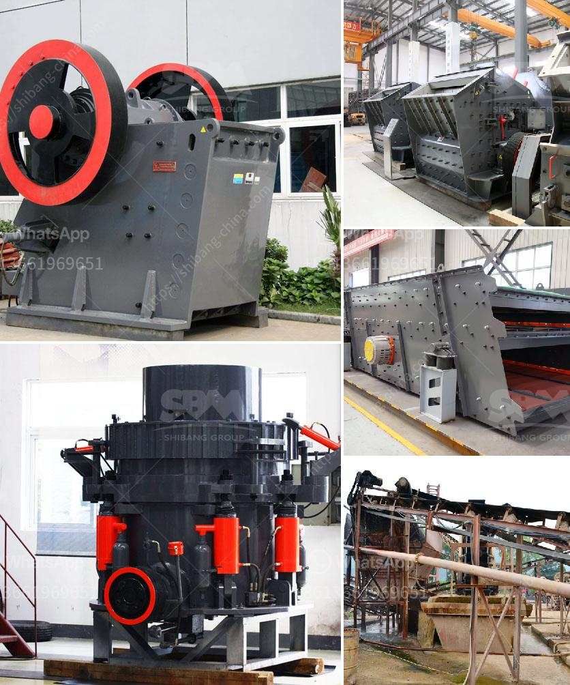

<h3>موردين لمصانع سحق ld slag في الهند</h3>
تُعد الهند واحدة من أكبر الدول المنتجة للصلب في العالم، ولذلك فإنها تواجه تحديات كبيرة في التعامل مع المخلفات الناتجة عن عملية إنتاج الصلب. تنطوي عملية إنتاج الصلب على إعادة تدوير المواد الخام، وتتولّد العديد من المخلفات والمنتجات الثانوية، من بينها الـ LD Slag.

يعتبر الـ LD Slag ناتجًا ثانويًا عن تصنيع الصلب باستخدام تقنية فرن الغاز الكهربائي. يختلف الـ LD Slag عن الـ Blast Furnace Slag المستخدم في تكنولوجيا صناعتيّة أخرى، حيث يتم قومه بسحق الـ LD Slag بغرض تحويله إلى مسحوق ناعم يمكن استخدامه في مجموعة من التطبيقات.

تعتبر صناعة سحق LD Slag من الصناعات الناشئة في الهند، ولذلك فإنها تواجه بعض التحديات فيما يتعلق بتوفير الموردين المناسبين. ومع ذلك، هناك موردين رئيسيين قد يكونون مهتمين بتزويد مصانع سحق LD Slag في الهند.

أحد الموردين الرئيسيين هو شركة JSW Steel المحدودة، وهي واحدة من أكبر شركات الصلب في الهند. تعمل الشركة على تطوير طرق جديدة لاستخدام الـ LD Slag في صناعة الإسمنت والخرسانة، وتعتبر قابلة للتحلل بشكل بيئي. كما تسعى الشركة أيضًا إلى توفير الـ LD Slag للمصانع الأخرى لمساعدتها في تحويل مخلفاتها الصلبية.

شركة Tata Steel Limited أيضًا تشغل دورًا مهمًا في صناعة التعامل مع المخلفات الصلبية في الهند. تملك الشركة مرافق خاصة لسحق الـ LD Slag ومعالجتها، حيث يتم استخدامها في إنتاج الإسمنت والخرسانة والأسمدة. تُعد Tata Steel أحد الرواد في العمل على تحويل المخلفات الصلبية إلى منتجات ثانوية قيمة تساهم في الاستدامة البيئية.

قد يواجه مصنع سحق LD Slag في الهند بعض التحديات في البداية في العثور على موردين مناسبين، ولذلك ينصح بالتعاون مع الشركات الكبرى مثل JSW Steel و Tata Steel التي تمتلك الخبرة والإمكانيات اللازمة لتوفير المواد الخام. يهدف هؤلاء الموردين إلى تعزيز الاقتصاد الدائري واستدامة التصنيع في الهند باستخدام المواد الثانوية المخلفة وتحويلها إلى منتجات قيمة.
<h3>Contact us</h3><ul><li><strong>Whatsapp:&nbsp;<a href="https://wa.me/8613661969651">+8613661969651</a></strong></li><li><a href="https://swt.shibang-china.com/?git&amp;zhl&amp;موردين لمصانع سحق ld slag في الهند"><strong>Online Service(chat now)</strong></a></li></ul><h3>Related</h3><ul><li><a href='كسارة الجبس الحجر الجيري.md'>كسارة الجبس الحجر الجيري</a></li><li><a href='كسارة محمولة في ماليزيا.md'>كسارة محمولة في ماليزيا</a></li><li><a href='إنشاء محجر في نيجيريا.md'>إنشاء محجر في نيجيريا</a></li><li><a href='معدات خط إنتاج كبريتات المغنيسيوم.md'>معدات خط إنتاج كبريتات المغنيسيوم</a></li><li><a href='كسارة الحجر الجيري المتنقلة.md'>كسارة الحجر الجيري المتنقلة</a></li></ul>