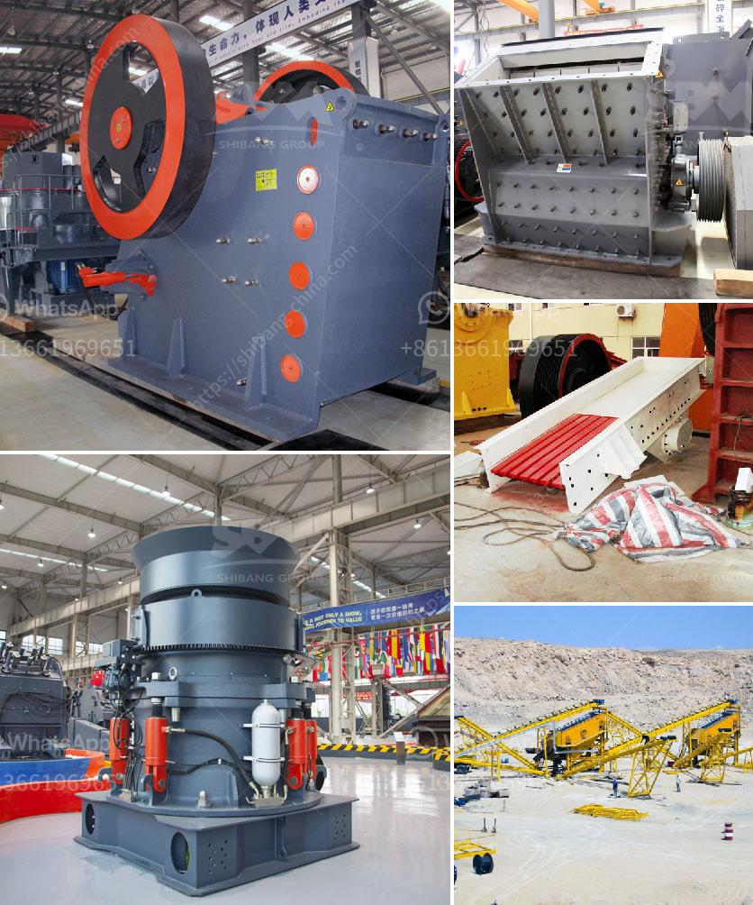

<h3>موردين لمعدات التعدين في جنوب أفريقيا</h3>
تعد جنوب أفريقيا واحدة من أكبر الدول المنتجة للمعادن في العالم، حيث تحتوي على موارد غنية من الذهب والفحم والماس والبلاتين والنحاس، مما يجذب عددًا كبيرًا من شركات التعدين للاستثمار في هذا القطاع.

تلعب المعدات التعدينية دورًا حيويًا في عمليات التنقيب والاستخراج والتصنيع في قطاع التعدين في جنوب أفريقيا. وهناك عدد من الموردين المميزين الذين يوفرون معدات التعدين عالية الجودة والتقنيات المتطورة لشركات التعدين في هذا البلد.

أحد الموردين الرائدين لمعدات التعدين في جنوب أفريقيا هو شركة "بيل إيكويبمنت" (Bell Equipment)، وهي شركة محلية تأسست عام 1954 وتعتبر الآن واحدة من أكبر الشركات المصنعة للمعدات التعدينية في جنوب أفريقيا. تقدم الشركة مجموعة واسعة من المعدات التعدينية التي تناسب مختلف أنواع العمليات التعدينية، بدءًا من الحفارات الهيدروليكية وشاحنات النقل وحتى المعدات الثقيلة للبناء.

تعد شركة "سانتا باربارا" (Santa Barbara) أيضًا إحدى الموردين المهمين لمعدات التعدين في جنوب أفريقيا. تأسست الشركة عام 1997 وتوفر معدات تعدين مبتكرة وفعالة، مثل الحفارات الدوارة ومعدات التكسير والغرابيل وأنظمة النقل. تعمل الشركة أيضًا في تطوير تكنولوجيا التعدين الذكي واستخدام الذكاء الاصطناعي في العمليات التعدينية.

من الموردين الشهيرين أيضًا شركة "كوماتسو" (Komatsu)، وهي شركة عالمية تتخصص في تصنيع معدات التعدين والبناء. تقدم الشركة مجموعة واسعة من المعدات التعدينية المتطورة والمتينة، مثل الحفارات والشاحنات واللوادر والكسارات. تتميز منتجات "كوماتسو" بالكفاءة والمتانة والتقنية الفائقة.

بالإضافة إلى ذلك، هناك شركات متعددة أخرى تقدم معدات تعدينية في جنوب أفريقيا مثل "إيس بيرج" (Epiroc) و "إلمب" (Elb Equipment) و "ليب ريت" (Liebherr) والعديد من الشركات الأخرى.

تعمل هذه الموردين على تزويد شركات التعدين في جنوب أفريقيا بمعدات عالية الجودة وتقنيات متطورة لتحسين الكفاءة وتعزيز الإنتاجية. كما يوفرون الدعم الفني وخدمات ما بعد البيع للعملاء، مما يجعلها خيارًا مثاليًا لشركات التعدين التي تبحث عن حلول شاملة وموثوقة.

باختصار، تعد موردين معدات التعدين في جنوب أفريقيا إحدى أهم الجوانب في نجاح شركات التعدين في هذا البلد، حيث يوفرون الأدوات والتكنولوجيا اللازمة لتحسين الإنتاجية وتحقيق النمو المستدام في صناعة التعدين.
<h3>Contact us</h3><ul><li><strong>Whatsapp:&nbsp;<a href="https://wa.me/8613661969651">+8613661969651</a></strong></li><li><a href="https://swt.shibang-china.com/?git&amp;zhl&amp;موردين لمعدات التعدين في جنوب أفريقيا"><strong>Online Service(chat now)</strong></a></li></ul><h3>Related</h3><ul><li><a href='ورقة حساب حزام الناقل.md'>ورقة حساب حزام الناقل</a></li><li><a href='آلة كسارة الطين في راجكوت.md'>آلة كسارة الطين في راجكوت</a></li><li><a href='معدات تأثير المحجر.md'>معدات تأثير المحجر</a></li><li><a href='كسارة الفك تيرميناتور.md'>كسارة الفك تيرميناتور</a></li><li><a href='سعر كسارة الفك.md'>سعر كسارة الفك</a></li></ul>