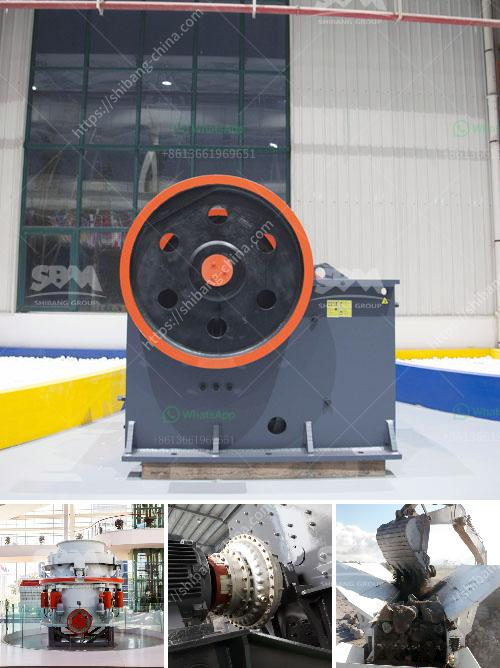

<h3>موردين مطاحن الطحن في الصين</h3>
تعد مطاحن الطحن من أهم الصناعات في الصين، حيث تحظى بشعبية كبيرة في السوق المحلية والعالمية. وبالنظر إلى حجم احتياجات مطاحن الطحن في الصين، فإن الحصول على موردين جيدين وموثوقين يعتبر أمرًا أساسيًا لضمان استمرارية العمل وتحقيق النجاح.

تتميز موردي مطاحن الطحن في الصين بالعديد من الجوانب المميزة. أولاً وقبل كل شيء، فإنهم يقدمون مجموعة واسعة من المعدات والأجهزة ذات الجودة العالية التي تلبي احتياجات مختلف مطاحن الطحن. تتضمن هذه المعدات المطاحن والمصافي والخلاطات وغيرها الكثير. وبفضل التكنولوجيا المتقدمة والهندسة المستدامة، تتميز هذه المعدات بالكفاءة والدقة في الأداء، مما يجعلها محبوبة ومطلوبة من قبل العديد من صناع مطاحن الطحن في الصين.

ثانيًا، يتمتع موردي مطاحن الطحن في الصين بسمعة طيبة في السوق. فهم يلتزمون بتقديم منتجات ذات جودة عالية وخدمة ممتازة لعملائهم. تقوم العديد من تلك الشركات بإجراء اختبارات متعددة على منتجاتها قبل تسليمها للعملاء، وذلك لضمان أداء منتجاتها بأفضل حال. كما أنهم يهتمون بتلبية احتياجات العملاء وفهم متطلباتهم بشكل جيد. كما يتميزون بسرعة الاستجابة والتسليم في الوقت المحدد، مما يجعلهم خيارًا مثاليًا لأصحاب مطاحن الطحن في الصين.

أخيرًا، يوفرون موردي مطاحن الطحن في الصين أيضًا خدمات ما بعد البيع الممتازة. بعد تسليم المعدات، يقدمون دعمًا فنيًا مستدامًا ويقومون بصيانة وتصليح المعدات عند الحاجة. وبفضل توافر قطع الغيار وموثوقية الخدمة، يمكن لصانعي المطاحن الإعتماد على هؤلاء الموردين لضمان استمرارية إنتاجهم وتشغيل مكائنهم بأفضل طريقة ممكنة.

باختصار، يلعب موردي مطاحن الطحن في الصين دورًا حاسمًا في نجاح صناعة مطاحن الطحن في البلاد. من خلال توفير معدات ذات جودة عالية، وتقديم خدمة ممتازة، وتقديم الدعم الفني المستدام، فإنهم يساهمون في تحقيق التطلعات واحتياجات صناع هذه الصناعة. وبالتالي، ينبغي على صناع مطاحن الطحن في الصين اختيار موردينهم بعناية للحصول على الجودة المطلوبة والتميز في الأداء.
<h3>Contact us</h3><ul><li><strong>Whatsapp:&nbsp;<a href="https://wa.me/8613661969651">+8613661969651</a></strong></li><li><a href="https://swt.shibang-china.com/?git&amp;zhl&amp;موردين مطاحن الطحن في الصين"><strong>Online Service(chat now)</strong></a></li></ul><h3>Related</h3><ul><li><a href='رسم لآلات غسل الرمل كسارة مطحنة.md'>رسم لآلات غسل الرمل كسارة مطحنة</a></li><li><a href='مطحنة الكرة للجبس.md'>مطحنة الكرة للجبس</a></li><li><a href='سيور ناقلة معدنية في الألواح.md'>سيور ناقلة معدنية في الألواح</a></li><li><a href='وحدة طحن الصين.md'>وحدة طحن الصين</a></li><li><a href='شركة تصنيع آلة طحن الكرة في الهند.md'>شركة تصنيع آلة طحن الكرة في الهند</a></li></ul>