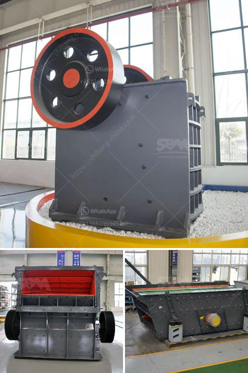

<h3>موردين معدات سحق السيليكا</h3>
تعتبر معدات سحق السيليكا أدوات حاسمة في صناعة تكسير الصخور وتكسير الحجارة ، حيث يتم استخدامها لتحويل الصخور والحجارة إلى قطع صغيرة قابلة للاستخدام في عدة تطبيقات مختلفة. وتشمل هذه التطبيقات صناعة البناء ، وصناعة الزجاج ، وصناعة السيراميك ، وصناعة البلاستيك ، إلخ. لذلك ، يلعب الموردون المتخصصون في معدات سحق السيليكا دورًا هامًا في تلبية احتياجات السوق وتوفير منتجات عالية الجودة وكفاءة الأداء.

تعتمد جودة المعدات المستخدمة في عملية سحق السيليكا على العديد من العوامل المختلفة. فمن الضروري اختيار مورد معدات موثوق يقدم منتجات متميزة وموثوقة. يجب أن تتماشى هذه المنتجات مع المعايير العالمية وتكون قادرة على التعامل مع متطلبات عملائها بدقة وفعالية.

يجب أن تقدم المعدات قدرة عالية على التحمل ومقاومة للتآكل والتآكل. يحتاج العملاء إلى معدات تصمد أمام الضغط العالي والصدمات الميكانيكية. بالإضافة إلى ذلك ، يجب أن تكون لديهم القدرة على معالجة مجموعة متنوعة من المواد ، بدءًا من الصخور الصلبة إلى الحجارة الناعمة والرملية. يجب أيضًا أن تتميز المعدات بكفاءة عالية وأن تعمل بسلاسة وباستهلاك طاقة منخفض.

علاوة على ذلك ، يجب أن يوفر المورد تركيبًا محترفًا وخدمات ما بعد البيع لضمان تشغيل سلس للمعدات وصيانتها. يمكن للموردين الجيدين تقديم دعم فني متواصل وتدريب العمال على استخدام المعدات بكفاءة وأمان.

من بين الموردين المشهورين في صناعة معدات سحق السيليكا ، تمتلك الشركات المصنعة ذات السمعة الطيبة سمة استثنائية في تقديم منتجات عالية الجودة. بالإضافة إلى ذلك ، يجب أن يتمتع المورد بتاريخ حافل من توريد المنتجات وملتزم بالابتكار المستمر وتطوير تكنولوجيا جديدة لتحسين أداء المعدات.

باختيار موردين موثوقين ومتخصصين في معدات سحق السيليكا ، يمكن للعملاء الاعتماد على تلبية احتياجاتهم الخاصة والاستفادة من منتجات فعالة وذات جودة عالية.
<h3>Contact us</h3><ul><li><strong>Whatsapp:&nbsp;<a href="https://wa.me/8613661969651">+8613661969651</a></strong></li><li><a href="https://swt.shibang-china.com/?git&amp;zhl&amp;موردين معدات سحق السيليكا"><strong>Online Service(chat now)</strong></a></li></ul><h3>Related</h3><ul><li><a href='كسارة الفك 100 طن في الساعة للبيع.md'>كسارة الفك 100 طن في الساعة للبيع</a></li><li><a href='مطاحن الكرة المستخدمة في بيرو.md'>مطاحن الكرة المستخدمة في بيرو</a></li><li><a href='آلة كسارة صخور صغيرة.md'>آلة كسارة صخور صغيرة</a></li><li><a href='تجميع مصنع التكسير.md'>تجميع مصنع التكسير</a></li><li><a href='كسارات متنقلة في قطر.md'>كسارات متنقلة في قطر</a></li></ul>