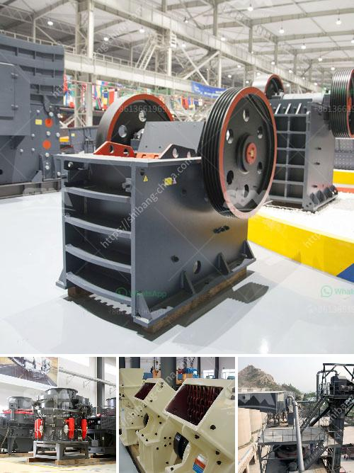

<h3>موزع كسارة في إندونيسيا</h3>
يعتبر قطاع التعدين من القطاعات الهامة في إندونيسيا، حيث يلعب دوراً حاسماً في تعزيز الاقتصاد المحلي وتوفير فرص العمل للمواطنين. ومن بين الموارد التي تستخرج في إندونيسيا بكثرة هي الحجر، وهذا هو السبب وراء ظهور العديد من شركات توزيع كسارات الحجر في البلاد.

موزع كسارة في إندونيسيا هو عبارة عن نوع من المعدات التي تستخدم لسحق مواد متنوعة مثل الحجر،الجرانيت والخرسانة، وتحويلها إلى قطع صغيرة تستخدم في البناء. تمتلك القارة الأكبر في جنوب شرق آسيا العديد من شركات توزيع الكسارات، حيث تمثل إندونيسيا وجهة رئيسية للشركات المصنعة في هذا المجال.

تتميز شركات توزيع الكسارات في إندونيسيا بتوفير مجموعة واسعة من الموديلات والأحجام، مما يتيح للمشترين فرصة اختيار الكسارة الأكثر تناسباً لاحتياجاتهم. كما تحتوي هذه الشركات على فريق من المهندسين والفنيين المؤهلين تأهيلاً عالياً، يقومون بتوجيه العملاء وتقديم الدعم الفني المطلوب.

إحدى الشركات الرائدة في مجال توزيع الكسارات في إندونيسيا هي شركة "إندوسا"، والتي توفر مجموعة متنوعة من الكسارات ذات الجودة العالية. تشمل المنتجات التي توفرها الشركة: كسارات الفك، وكسارات المخروط، وكسارات الصدم، وكسارات الأسطوانة، والعديد من الموديلات الأخرى. تلتزم شركة "إندوسا" بتقديم حلول مبتكرة وموثوقة للعملاء، مما يعزز سمعتها الجيدة وجعلها الخيار الأول للعديد من المشترين.

علاوة على ذلك، تعتبر الصيانة وخدمة ما بعد البيع أمراً حاسماً في قطاع توزيع الكسارات. يهتم الموزعون في إندونيسيا بتوفير خدمة شاملة لعملائهم بما في ذلك تجهيز وتركيب الكسارات وتدريب العمال على استخدامها بطريقة صحيحة، بالإضافة إلى تقديم الخدمات اللازمة لصيانة الكسارات وإصلاحها عند الحاجة. يتميز هؤلاء الموزعون بفريق فني متخصص يستطيع التعامل مع أي مشكلة محتملة.

بشكل عام، يعد القطاع الصناعي في إندونيسيا واعداً ومزدهراً. ويعتبر موزع كسارة في إندونيسيا من العوامل المهمة التي تدعم نمو القطاع، وتلبية احتياجات السوق المتزايدة. تعتبر الشركات في هذا القطاع من بين الشركات الرائدة في إندونيسيا، حيث تساهم في تعزيز الصناعة المحلية وخلق فرص العمل للمواطنين في البلاد.
<h3>Contact us</h3><ul><li><strong>Whatsapp:&nbsp;<a href="https://wa.me/8613661969651">+8613661969651</a></strong></li><li><a href="https://swt.shibang-china.com/?git&amp;zhl&amp;موزع كسارة في إندونيسيا"><strong>Online Service(chat now)</strong></a></li></ul><h3>Related</h3><ul><li><a href='كسارات الحجر الرخيصة.md'>كسارات الحجر الرخيصة</a></li><li><a href='مصنع صنع مسحوق الجبس.md'>مصنع صنع مسحوق الجبس</a></li><li><a href='الفارق بين الرمل ومسحوق الحجر المكسر.md'>الفارق بين الرمل ومسحوق الحجر المكسر</a></li><li><a href='كسارات الفك في جنوب أفريقيا.md'>كسارات الفك في جنوب أفريقيا</a></li><li><a href='بيع كسارة الحجر 400 طن في الساعة.md'>بيع كسارة الحجر 400 طن في الساعة</a></li></ul>