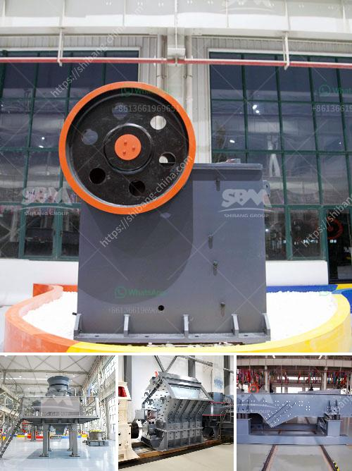

<h3>موزع كسارة مخروط في إندونيسيا</h3>
يعتبر موزع كسارة المخروط واحدًا من أهم الأدوات في صناعة التعدين في إندونيسيا. تستخدم كسارة المخروط في طحن وسحق المواد الصلبة مثل الحجر الجيري والجرانيت والبازلت والركام. وتشتهر إندونيسيا بمواردها الطبيعية الغنية وحجم صناعة التعدين الكبيرة، وهذا يعني أن هناك حاجة ماسة لموزعي كسارة المخروط لتلبية احتياجات السوق.

تعد تكلفة طحن المواد الصلبة باستخدام أدوات يدوية مكلفة وغير فعالة من حيث الوقت والجهد. ولذلك فإن استخدام موزع كسارة المخروط يُعتبر بديلاً أكثر فاعلية، حيث يمكنه طحن المواد الصلبة بسرعة وبدقة عالية. ويتم ذلك من خلال تغذية المواد الصلبة إلى فتحة الكسارة، حيث يتم طحنها بين السطح المزود بالأسنان المعدنية والسطح الداخلي للكسارة. وبفضل حركة الدوران، يتم سحق المواد الصلبة بشكل مستمر حتى تتمكن من الخروج من الفتحة بحجم أصغر.

موزع كسارة المخروط يأتي بأحجام ونماذج مختلفة. يُمكن استخدام موديلات الأحجام الصغيرة مثل الربيع المخروطي لمواد البناء الخفيفة، في حين يُمكن استخدام النماذج الكبيرة مثل الهيدروليكي المتقدم للمواد الصلبة الأكثر صعوبة الطحن. والجدير بالذكر أن الموزع يمكن أن يعمل بشكل مستقل بدون الحاجة للعمالة البشرية، مما يوفر الوقت والجهد ويقلل من تكاليف الإنتاج.

إن موزع كسارة المخروط في إندونيسيا يستخدم بشكل واسع في العديد من قطاعات التعدين. يتم استخدامه في طحن وسحق المعادن مثل الذهب والنحاس والفضة والحديد. وتتوفر أيضًا موزعات خاصة بمواقع التعدين الرئيسية في البلاد، حيث يتم استخدامها لاستخراج المواد الصلبة وتحويلها إلى الشكل المطلوب للتصنيع.

باختصار، يلعب موزع كسارة المخروط دورًا حاسمًا في صناعة التعدين في إندونيسيا. يتم استخدامه بنجاح لطحن وسحق المواد الصلبة بكفاءة عالية وبدقة. وبفضل توافر العديد من النماذج والأحجام المختلفة، يمكن استخدامه في مجموعة متنوعة من قطاعات التعدين. ويعتبر استخدام موزع كسارة المخروط بديلاً فعالًا وفعّالًا لطحن المواد الصلبة في إندونيسيا.
<h3>Contact us</h3><ul><li><strong>Whatsapp:&nbsp;<a href="https://wa.me/8613661969651">+8613661969651</a></strong></li><li><a href="https://swt.shibang-china.com/?git&amp;zhl&amp;موزع كسارة مخروط في إندونيسيا"><strong>Online Service(chat now)</strong></a></li></ul><h3>Related</h3><ul><li><a href='مطرقة فولاذية.md'>مطرقة فولاذية</a></li><li><a href='عملية تدمير صخور الحجر الجيري آلة كسارة الحجر.md'>عملية تدمير صخور الحجر الجيري آلة كسارة الحجر</a></li><li><a href='آلات سحق الركام.md'>آلات سحق الركام</a></li><li><a href='تعليم مطحنة الكرة.md'>تعليم مطحنة الكرة</a></li><li><a href='كسارة الحجر الجرانيت الهند.md'>كسارة الحجر الجرانيت الهند</a></li></ul>