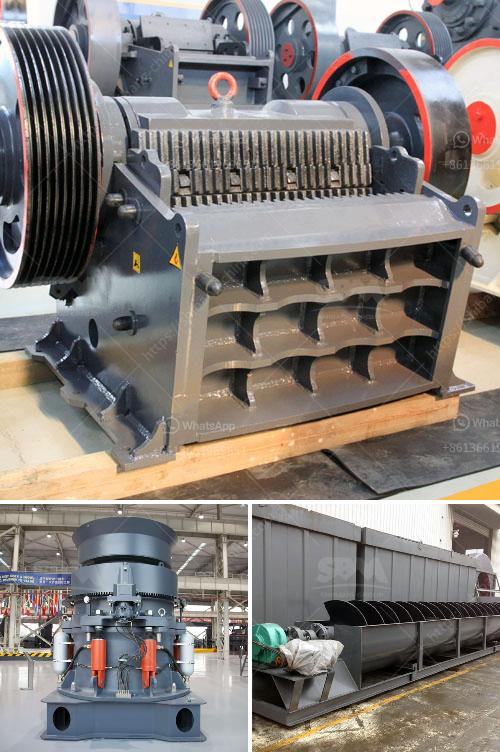

<h3>موزعون للأحزمة والناقلات في إندونيسيا</h3>
تعتبر إندونيسيا واحدة من أكبر الدول في جنوب شرق آسيا من حيث السكان والاقتصاد. ومع تطور الصناعة والتجارة في البلاد، تزايد الطلب على الأحزمة والناقلات وبالتالي ازدادت أهمية وجود موزعين محترفين في هذا المجال.

يعتبر موزعو الأحزمة والناقلات في إندونيسيا الشركاء المهمين للصناعات المختلفة في البلاد، حيث يقومون بتوريد وتوزيع هذه المنتجات الضرورية للعديد من القطاعات مثل صناعة الطيران والسيارات والنقل والتعدين والزراعة والطاقة والبناء وغيرها.

يتوفر في إندونيسيا موزعون للأحزمة والناقلات ذو خبرة وكفاءة عالية، حيث يستخدمون أحدث التقنيات والمعدات لتلبية احتياجات العملاء بأعلى مستوى من الجودة والكفاءة. تعمل هذه الشركات مع مجموعة واسعة من المصنعين والموردين المحليين والعالميين، مما يمكنها من توفير مجموعة متنوعة من الأحزمة والناقلات لتلبية احتياجات العملاء في جميع الصناعات المختلفة.

بالإضافة إلى توفير الأحزمة والناقلات، يقدم موزعون الأحزمة والناقلات في إندونيسيا أيضًا خدمات الصيانة والتركيب والتدريب على الاستخدام للعملاء. يهدفون إلى توفير حلول شاملة للعملاء ومساعدتهم في الحفاظ على عملياتهم بشكل فعال وسلس.

يوجد العديد من الموزعين الموثوق بهم في إندونيسيا الذين يتمتعون بسمعة طيبة وخدمة عملاء ممتازة. بالإضافة إلى ذلك، يلتزم معظم هؤلاء الموزعين بمبدأ الجودة والموثوقية والشفافية في التعامل.

من المهم أن تختار الشركات والصناعات في إندونيسيا موزعًا موثوقًا للأحزمة والناقلات لضمان تلبية احتياجاتهم بشكل كامل والحصول على منتجات عالية الجودة. ينبغي أن يكون الموزع قادرًا على تقديم خدمات ما بعد البيع الممتازة مثل الصيانة والدعم التقني لضمان استدامة أعمال العميل بشكل جيد.

لخلاصة القول، فإن وجود موزعين محترفين للأحزمة والناقلات في إندونيسيا ضروري لتلبية الطلب المتزايد على هذه المنتجات في البلاد. ينبغي على الشركات والصناعات الاستعانة بموزعين موثوق بهم يتمتعون بالخبرة والكفاءة لضمان تلبية احتياجاتهم والحصول على أفضل الحلول والمنتجات المتاحة.
<h3>Contact us</h3><ul><li><strong>Whatsapp:&nbsp;<a href="https://wa.me/8613661969651">+8613661969651</a></strong></li><li><a href="https://swt.shibang-china.com/?git&amp;zhl&amp;موزعون للأحزمة والناقلات في إندونيسيا"><strong>Online Service(chat now)</strong></a></li></ul><h3>Related</h3><ul><li><a href='كسارة الحجر المحمولة اللوحة المزدوجة.md'>كسارة الحجر المحمولة اللوحة المزدوجة</a></li><li><a href='مطحنة ريموند للرخام.md'>مطحنة ريموند للرخام</a></li><li><a href='مطحنة كرات عمودية في كينيا.md'>مطحنة كرات عمودية في كينيا</a></li><li><a href='سؤال حول عملية الطحن بالكرات.md'>سؤال حول عملية الطحن بالكرات</a></li><li><a href='عملية سحق الصخور في الركام.md'>عملية سحق الصخور في الركام</a></li></ul>