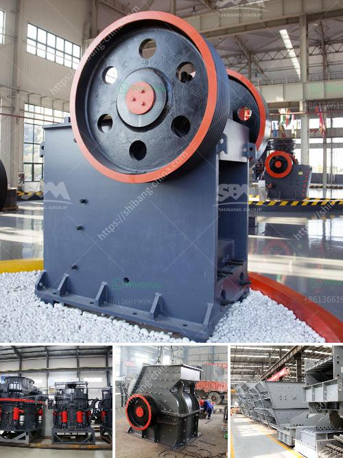

<h3>موزعون لمعدات المحاجر والتعدين في الصين</h3>
تتمتع الصين بأحد أكبر الاقتصاديات في العالم وتلعب دورًا مهمًا في صناعة المعادن والتعدين. وتعتبر مواد التعدين هي الأساس لعملية البناء والتطور الاقتصادي في الصين. ولتلبية الطلب المتزايد على المواد المعدنية، تعمل موزعون لمعدات المحاجر والتعدين في الصين على توفير المعدات والخدمات المختلفة للشركات التعدينية.

تقوم شركات الموزعين بتوفير مجموعة متنوعة من المعدات التي تستخدم في عمليات التعدين، بما في ذلك الحفارات والجرافات والشاحنات الثقيلة والكسارات والمطاحن والآلات الأخرى المستخدمة في تفتيت وتكسير المواد الخام. وتتميز المعدات الموزعة بأنها مبتكرة وتستخدم تقنيات حديثة لتحسين كفاءة العمليات وزيادة الإنتاجية.

تعتبر الصين مصدرًا رئيسيًا للعديد من المعادن مثل الفحم والحديد والنحاس والزنك والذهب والفضة، ويعزز الإنتاج المحلي لهذه المعادن الاعتماد الذاتي للصين عن الواردات الخارجية. ولذلك، يلعب دور الموزعين في توفير المعدات اللازمة لعمليات التعدين دورًا مهمًا في تحقيق هذا الهدف.

بالإضافة إلى توفير المعدات، يقوم موزعون لمعدات المحاجر والتعدين في الصين بتقديم خدمات تقنية وصيانة للشركات التعدينية. يعمل فريق الصيانة على توفير الدعم الفني والإصلاح للمعدات المتعطلة، ويقدمون التوجيه والتوصيات للشركات حول ترقية وتحسين العمليات.

وتستفيد الشركات التعدينية في الصين بشكل كبير من تعاونها مع موزعين المعدات، حيث يمكنها الحصول على معدات عالية الجودة ومتطورة، مما يساعدها على زيادة إنتاجية المناجم وتقليل التكاليف وتحسين السلامة.

باختصار، يلعب موزعون لمعدات المحاجر والتعدين في الصين دورًا حيويًا في تلبية الطلب على المعادن وتعزيز التنمية الاقتصادية. من خلال توفير المعدات والخدمات المتخصصة، يساهمون في تعزيز الإنتاجية والجودة لدى الشركات التعدينية، مما يسهم في تعزيز التنمية الاقتصادية للصين.
<h3>Contact us</h3><ul><li><strong>Whatsapp:&nbsp;<a href="https://wa.me/8613661969651">+8613661969651</a></strong></li><li><a href="https://swt.shibang-china.com/?git&amp;zhl&amp;موزعون لمعدات المحاجر والتعدين في الصين"><strong>Online Service(chat now)</strong></a></li></ul><h3>Related</h3><ul><li><a href='مصنع غسيل الرمال بسعة 50 طن في اليوم.md'>مصنع غسيل الرمال بسعة 50 طن في اليوم</a></li><li><a href='معدات ترقية خام الحديد.md'>معدات ترقية خام الحديد</a></li><li><a href='آلة تصنيع الكرة الجبسية.md'>آلة تصنيع الكرة الجبسية</a></li><li><a href='كسارة محمولة تريمان.md'>كسارة محمولة تريمان</a></li><li><a href='مطاحن الكرة حديد الصهر الهند.md'>مطاحن الكرة حديد الصهر الهند</a></li></ul>