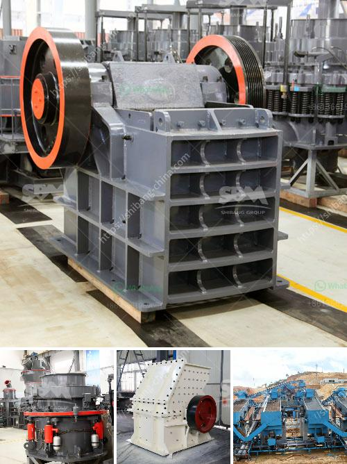

<h3>موقع إنتاج مطحنة المطرقة في نيجيريا</h3>
مطحنة المطرقة هي معدة تستخدم في عملية طحن الحبوب والمحاصيل الزراعية الأخرى. يعتبر إنتاج مطحنة المطرقة في نيجيريا من الصناعات المزدهرة في البلاد، حيث تعتبر صناعة مهمة في دعم القطاع الزراعي وتلبية احتياجات السوق المحلية والعالمية.

توفر مطاحن المطرقة في نيجيريا فرص عمل مهمة للكثير من العمال المحليين، كما تعتبر فرصة للشباب الراغبين في تأسيس أعمالهم الخاصة وزيادة الإنتاج الزراعي في البلاد. وتعمل هذه المطاحن على طحن المحاصيل الزراعية مثل الأعلاف والقمح والأرز والذرة والفول السوداني والفول السوداني وغيرها. تتميز مطاحن المطرقة بجودتها العالية وكفاءتها في طحن المحاصيل بشكل سريع وفعال.

تستخدم مطاحن المطرقة في نيجيريا أحدث التقنيات والآلات الحديثة لضمان أعلى جودة للمنتجات. وتعتمد هذه المطاحن على آلية تعمل بمروحة هوائية تقوم بتفريغ محتوى الطاحونة بسرعة ويسر، مما يحسن كفاءة الإنتاج ويقلل من التكلفة.

وتعد مطاحن المطرقة في نيجيريا جزءًا من استثمارات القطاع الزراعي المتنامي في البلاد. فهي تلبي الاحتياجات المحلية للمواد الغذائية والمعونة في البلاد، وتسهم في تعزيز اقتصاد البلاد من خلال توفير فرص عمل وزيادة الإنتاج والتصدير.

على الرغم من الإنجازات التي تحققت في مجال مطحنة المطرقة في نيجيريا، إلا أن هناك تحديات تواجه هذه الصناعة. تشمل هذه التحديات نقص التكنولوجيا المتقدمة، وارتفاع تكلفة الآلات المستخدمة، ونقص الموظفين المؤهلين، وعدم وجود إجراءات رقابية قوية في الصناعة. ومع ذلك، فإن هذه التحديات قد تعتبر فرصًا للنمو والتطوير في المستقبل.

باختصار، يعد إنتاج مطحنة المطرقة في نيجيريا من الصناعات الحيوية والمزدهرة في البلاد. توفر هذه الصناعة فرص عمل مهمة وزيادة الإنتاج الزراعي في البلاد. على الرغم من التحديات التي تواجهها، فإن هذه الصناعة تتطور بسرعة وتعد فرصة جيدة للاستثمار في قطاع الإنتاج والتصدير الزراعي في نيجيريا.
<h3>Contact us</h3><ul><li><strong>Whatsapp:&nbsp;<a href="https://wa.me/8613661969651">+8613661969651</a></strong></li><li><a href="https://swt.shibang-china.com/?git&amp;zhl&amp;موقع إنتاج مطحنة المطرقة في نيجيريا"><strong>Online Service(chat now)</strong></a></li></ul><h3>Related</h3><ul><li><a href='مطحنة صخرة الرخام.md'>مطحنة صخرة الرخام</a></li><li><a href='مطحنة عمودية للكالسيوم.md'>مطحنة عمودية للكالسيوم</a></li><li><a href='مصنع معالجة الذهب آلة كسارة الحجر التركية.md'>مصنع معالجة الذهب آلة كسارة الحجر التركية</a></li><li><a href='بيع الكسارات في ماليزيا.md'>بيع الكسارات في ماليزيا</a></li><li><a href='مطحنة تعدين.md'>مطحنة تعدين</a></li></ul>